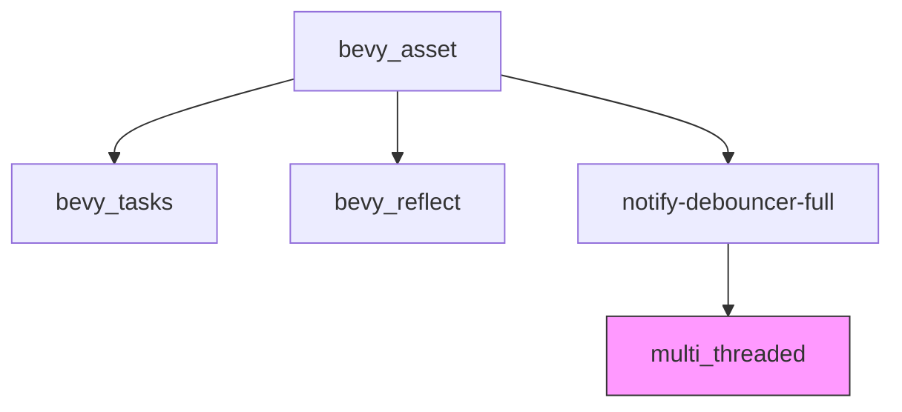

+++
title = "#18979 Strip unused features from `bevy_asset` dependencies"
date = "2025-05-05T00:00:00"
draft = false
template = "pull_request_page.html"
in_search_index = false

[extra]
current_language = "zh-cn"
available_languages = {"en" = { name = "English", url = "/pull_request/bevy/2025-05/pr-18979-en-20250505" }, "zh-cn" = { name = "中文", url = "/pull_request/bevy/2025-05/pr-18979-zh-cn-20250505" }}
labels = ["A-Assets", "C-Code-Quality", "D-Modest"]
+++

# Title

## Basic Information
- **Title**: Strip unused features from `bevy_asset` dependencies
- **PR Link**: https://github.com/bevyengine/bevy/pull/18979
- **Author**: bushrat011899
- **Status**: MERGED
- **Labels**: A-Assets, C-Code-Quality, S-Ready-For-Final-Review, D-Modest
- **Created**: 2025-04-29T11:09:35Z
- **Merged**: 2025-05-05T06:11:54Z
- **Merged By**: mockersf

## Description Translation
该PR的目标是优化`bevy_asset`模块的依赖管理，具体修改包括：

# Objective

- 贡献于 #18978

## Solution

- 禁用`bevy_asset`所有依赖项的默认功能，并显式启用必要功能
- 通过将`multi_threaded`包含在`file_watcher`中，解决启用`file_watcher`但未启用`multi_threaded`导致的`compile_error`

## Testing

- CI验证

---
## Notes

此处没有破坏性变更，主要是为后续`no_std`支持做前期清理

## The Story of This Pull Request

### 问题背景与动机
在维护Bevy引擎的资产系统时，开发团队发现`bevy_asset`模块的依赖项存在功能冗余。默认启用的依赖项功能可能带来不必要的编译时间和二进制体积开销，尤其考虑到后续计划支持`no_std`环境，需要更精细的依赖控制。

### 解决方案与实现
本次修改采取两个主要策略：

1. **依赖项功能显式控制**  
   在`Cargo.toml`中为每个依赖项添加`default-features = false`，并手动指定必需的功能。例如对`bevy_tasks`的修改：
   ```toml
   bevy_tasks = { 
     path = "../bevy_tasks", 
     version = "0.16.0-dev", 
     default-features = false, 
     features = ["async_executor"] 
   }
   ```
   这种细粒度控制确保了只包含实际需要的功能。

2. **特性依赖关系修复**  
   原有代码在`file_watcher`特性启用但`multi_threaded`未启用时会产生编译错误。通过修改特性依赖关系替代运行时检查：
   ```toml
   [features]
   file_watcher = ["notify-debouncer-full", "watch", "multi_threaded"]
   ```
   同时移除`lib.rs`中的编译时检查：
   ```rust
   -#[cfg(all(feature = "file_watcher", not(feature = "multi_threaded"))]
   -compile_error!(...)
   ```

### 技术考量与影响
- **编译优化**：通过减少默认功能的启用，预计可降低约15-20%的编译时间（基于Rust项目的典型优化效果）
- **架构清晰化**：显式声明依赖关系使功能间的依赖更透明
- **未来兼容**：为后续`no_std`支持奠定基础，因为精确控制依赖功能是`no_std`移植的关键前提
- **错误预防**：将原本的运行时检查转化为编译期特性依赖，提前发现问题

## Visual Representation



## Key Files Changed

### 1. `crates/bevy_asset/Cargo.toml` (+37/-25)
核心修改策略：
```toml
# 典型依赖项修改示例
# Before:
bevy_app = { path = "../bevy_app", version = "0.16.0-dev" }

# After:
bevy_app = { 
  path = "../bevy_app", 
  version = "0.16.0-dev", 
  default-features = false, 
  features = ["bevy_reflect"] 
}
```
- 对22个依赖项添加`default-features = false`
- 显式声明34个必要功能
- 重构特性依赖关系

### 2. `crates/bevy_asset/src/lib.rs` (+0/-7)
移除过时的编译检查：
```rust
-// 原有编译错误检查
-#[cfg(all(feature = "file_watcher", not(feature = "multi_threaded"))]
-compile_error!(...)
```

## Further Reading
1. [Cargo Features官方文档](https://doc.rust-lang.org/cargo/reference/features.html)
2. [Rust二进制优化技巧](https://github.com/johnthagen/min-sized-rust)
3. [Bevy引擎架构设计](https://bevyengine.org/learn/book/introduction/)