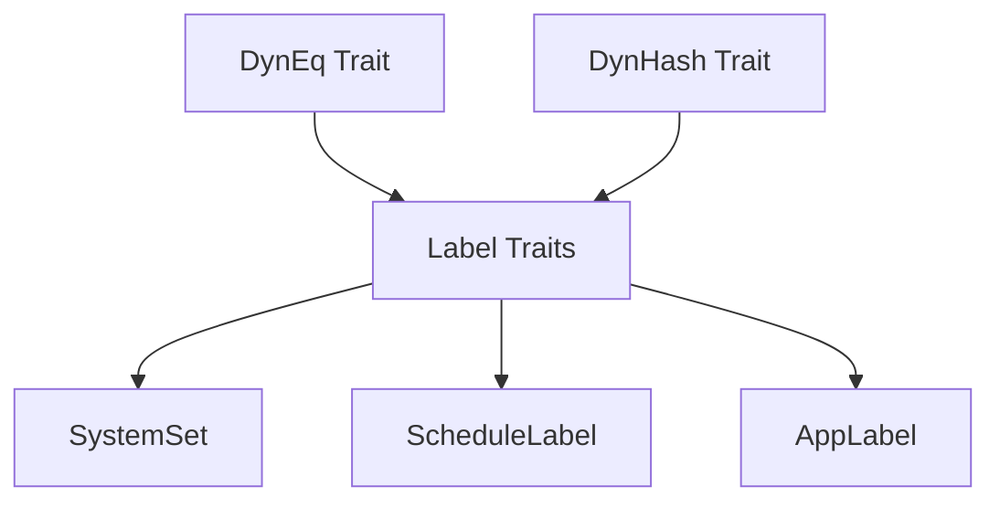

+++
title = "#18984 Remove upcasting methods + Cleanup interned label code"
date = "2025-05-26T00:00:00"
draft = false
template = "pull_request_page.html"
in_search_index = true

[taxonomies]
list_display = ["show"]

[extra]
current_language = "en"
available_languages = {"en" = { name = "English", url = "/pull_request/bevy/2025-05/pr-18984-en-20250526" }, "zh-cn" = { name = "中文", url = "/pull_request/bevy/2025-05/pr-18984-zh-cn-20250526" }}
labels = ["A-ECS", "C-Code-Quality", "D-Straightforward"]
+++

# Remove upcasting methods + Cleanup interned label code

## Basic Information
- **Title**: Remove upcasting methods + Cleanup interned label code
- **PR Link**: https://github.com/bevyengine/bevy/pull/18984
- **Author**: tim-blackbird
- **Status**: MERGED
- **Labels**: A-ECS, C-Code-Quality, S-Ready-For-Final-Review, M-Needs-Migration-Guide, D-Straightforward
- **Created**: 2025-04-29T16:05:54Z
- **Merged**: 2025-05-26T15:56:48Z
- **Merged By**: alice-i-cecile

## Description Translation
Hiya!

# Objective

- Remove upcasting methods that are no longer necessary since Rust 1.86. 
- Cleanup the interned label code.
 
## Notes
- I didn't try to remove the upcasting methods from `bevy_reflect`, as there appears to be some complexity related to remote type reflection.
- There are likely some other upcasting methods floating around.

## Testing
I ran the `breakout` example to check that the hashing/eq implementations of the labels are still correct.

## The Story of This Pull Request

This PR addresses two main technical debt items in Bevy's ECS implementation through targeted refactoring enabled by Rust version upgrades and trait system improvements.

**The Problem and Context**
1. **Obsolete Upcasting Methods**: The existing label system contained manual upcasting methods (`as_any` and `as_dyn_eq`) to work around limitations in Rust's trait object handling. These were required for proper type comparison and hashing of trait objects like `dyn SystemSet`.

2. **Redundant Label Boilerplate**: The `define_label!` macro and its derived implementations contained repetitive code for type casting and hashing that could be simplified with modern Rust features.

**The Solution Approach**
With Rust 1.86's improved trait object handling:
1. Remove manual upcasting methods where direct downcasting via `dyn Any` became possible
2. Simplify trait bounds by making `DynEq` and `DynHash` super traits of label traits
3. Leverage Rust's native type ID comparisons for label equality checks

**The Implementation**
Key changes in `crates/bevy_ecs/src/label.rs`:
```rust
// Before: Manual upcasting
fn dyn_eq(&self, other: &dyn DynEq) -> bool {
    if let Some(other) = other.as_any().downcast_ref::<T>() {
        return self == other;
    }
    false
}

// After: Direct downcast
fn dyn_eq(&self, other: &dyn DynEq) -> bool {
    if let Some(other) = (other as &dyn Any).downcast_ref::<T>() {
        return self == other;
    }
    false
}
```

The macro system was refactored to generate cleaner code:
```rust
// Before: Separate dyn_eq handling
fn as_dyn_eq(&self) -> &dyn DynEq {
    self
}

// After: Direct trait bound
pub trait ScheduleLabel: Send + Sync + DynEq + DynHash {
    // Simplified interface
}
```

**Technical Insights**
1. **Trait Object Improvements**: Rust 1.86 allows more ergonomic downcasting through `dyn Any` without intermediate upcasting methods
2. **Trait Composition**: Making `DynEq` and `DynHash` super traits of label traits enabled removal of manual forwarding methods
3. **Pointer Comparisons**: Added direct pointer equality checks for interned labels using `ptr::addr_eq`

**The Impact**
- **Code Simplification**: Removed 34 lines from `label.rs` alone
- **Performance**: Eliminated virtual calls for type casting operations
- **Maintainability**: Reduced macro-generated boilerplate
- **Future Proofing**: Aligns with Rust's evolving trait object capabilities

## Visual Representation



## Key Files Changed

1. `crates/bevy_ecs/src/label.rs` (+5/-34)
```rust
// Removed methods from DynEq/DynHash traits
- fn as_any(&self) -> &dyn Any;
- fn as_dyn_eq(&self) -> &dyn DynEq;

// Simplified trait bounds
+ pub trait ScheduleLabel: Send + Sync + DynEq + DynHash {
- pub trait ScheduleLabel: 'static + Send + Sync + Debug {
```

2. `crates/bevy_ecs/src/system/system_param.rs` (+3/-17)
```rust
// Simplified dyn param handling
- trait DynParamState: Sync + Send {
+ trait DynParamState: Sync + Send + Any {
```

3. `crates/bevy_macro_utils/src/label.rs` (+0/-11)
```rust
// Removed dyn_eq_path from macro generation
- derive_label(input, "RenderLabel", &trait_path, &dyn_eq_path)
+ derive_label(input, "RenderLabel", &trait_path)
```

## Further Reading
- [Rust 1.86 Release Notes](https://blog.rust-lang.org/2025/04/25/Rust-1.86.0.html)
- [Trait Object Upcasting RFC](https://github.com/rust-lang/rfcs/pull/3324)
- [Bevy ECS Labels Documentation](https://bevyengine.org/learn/book/ecs/labels/)