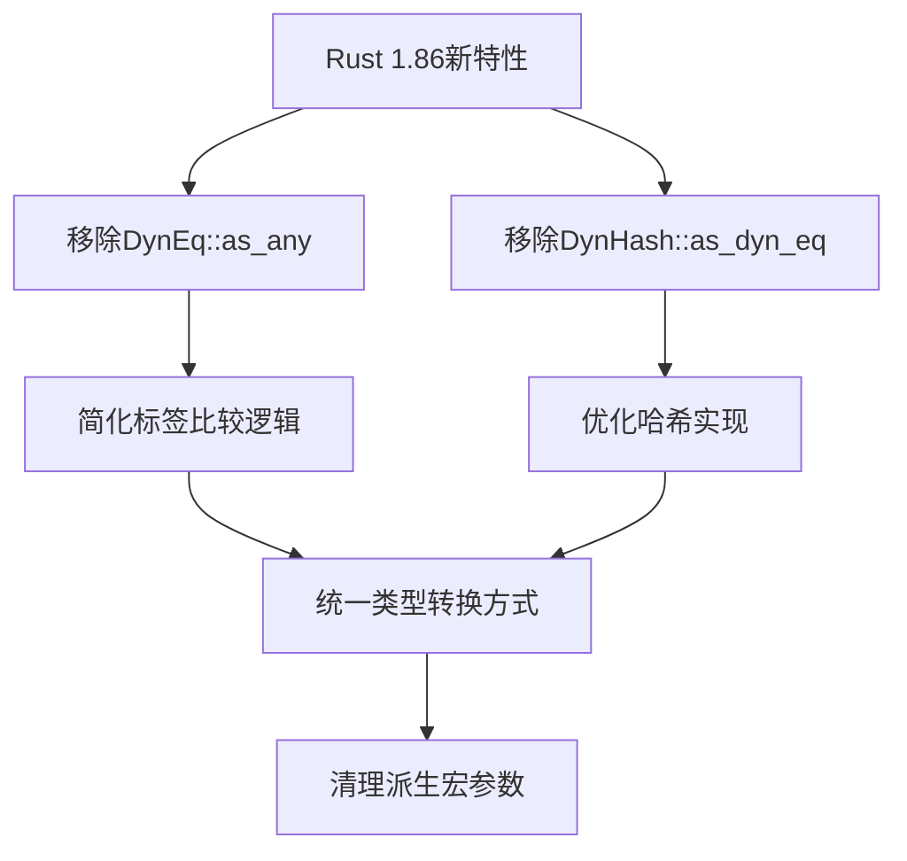

+++
title = "#18984 Remove upcasting methods + Cleanup interned label code"
date = "2025-05-26T00:00:00"
draft = false
template = "pull_request_page.html"
in_search_index = false

[extra]
current_language = "zh-cn"
available_languages = {"en" = { name = "English", url = "/pull_request/bevy/2025-05/pr-18984-en-20250526" }, "zh-cn" = { name = "中文", url = "/pull_request/bevy/2025-05/pr-18984-zh-cn-20250526" }}
labels = ["A-ECS", "C-Code-Quality", "D-Straightforward"]
+++

# Remove upcasting methods + Cleanup interned label code

## Basic Information
- **Title**: Remove upcasting methods + Cleanup interned label code
- **PR Link**: https://github.com/bevyengine/bevy/pull/18984
- **Author**: tim-blackbird
- **Status**: MERGED
- **Labels**: A-ECS, C-Code-Quality, S-Ready-For-Final-Review, M-Needs-Migration-Guide, D-Straightforward
- **Created**: 2025-04-29T16:05:54Z
- **Merged**: 2025-05-26T15:56:48Z
- **Merged By**: alice-i-cecile

## Description Translation
这个PR主要完成两个技术目标：
1. 移除Rust 1.86版本后不再需要的向上转型(upcasting)方法
2. 清理标签(label)类型的内部实现代码

注意事项：
- 未修改`bevy_reflect`中的相关方法，因其涉及远程类型反射的复杂性
- 保留了其他可能的向上转型方法待后续处理
- 通过`breakout`示例验证了标签的哈希/相等实现正确性

## The Story of This Pull Request

### 问题背景与技术债务
在Bevy的ECS系统中，标签系统（如ScheduleLabel、SystemSet等）通过`DynEq`和`DynHash` trait实现类型擦除后的比较和哈希。原始实现存在以下技术债务：

1. **冗余的转换方法**：`DynEq::as_any`和`DynHash::as_dyn_eq`方法用于类型转换，但随着Rust 1.86的类型系统改进，这些方法变得冗余
2. **复杂的trait继承**：标签trait需要手动继承`DynEq`和`DynHash`，导致派生宏需要生成额外代码

### 解决方案与实现
通过三个主要技术点实现代码简化：

1. **利用Rust新版本特性**：
```rust
// Before:
fn dyn_eq(&self, other: &dyn DynEq) -> bool {
    if let Some(other) = other.as_any().downcast_ref::<T>() {
        // ...
    }
}

// After:
fn dyn_eq(&self, other: &dyn DynEq) -> bool {
    if let Some(other) = (other as &dyn Any).downcast_ref::<T>() {
        // ...
    }
}
```
通过直接使用`dyn Any`的类型转换能力，移除了`as_any`方法

2. **简化标签trait定义**：
```rust
// 修改后的宏定义
macro_rules! define_label {
    ($label_trait_name:ident) => {
        pub trait $label_trait_name: Send + Sync + DynEq + DynHash {
            // 移除as_dyn_eq和dyn_hash方法
            fn dyn_clone(&self) -> Box<dyn $label_trait_name>;
        }
    }
}
```
3. **重构派生宏**：
```rust
// 修改前派生宏需要处理DynEq路径
derive_label(input, "AppLabel", &trait_path, &dyn_eq_path)

// 修改后简化参数
derive_label(input, "AppLabel", &trait_path)
```

### 技术影响与改进
1. **代码量减少**：`label.rs`文件减少34行代码，`system_param.rs`减少17行
2. **类型系统更安全**：移除手动类型转换方法，降低运行时错误风险
3. **更好的可维护性**：简化标签类型的派生宏实现，减少生成代码量

## Visual Representation



## Key Files Changed

### `crates/bevy_ecs/src/label.rs` (+5/-34)
1. **修改内容**：
   - 移除`DynEq::as_any`和`DynHash::as_dyn_eq`方法
   - 优化`dyn_eq`实现逻辑
   - 简化标签trait约束

2. **代码示例**：
```rust
// Before:
impl<T> DynEq for T {
    fn as_any(&self) -> &dyn Any { self }
    fn dyn_eq(&self, other: &dyn DynEq) -> bool {
        if let Some(other) = other.as_any().downcast_ref::<T>() {
            return self == other;
        }
        false
    }
}

// After:
impl<T> DynEq for T {
    fn dyn_eq(&self, other: &dyn DynEq) -> bool {
        if let Some(other) = (other as &dyn Any).downcast_ref::<T>() {
            return self == other;
        }
        false
    }
}
```

### `crates/bevy_ecs/src/system/system_param.rs` (+3/-17)
1. **修改内容**：
   - 移除`DynParamState::as_any_mut`方法
   - 直接使用`Any::as_mut`进行类型转换

2. **代码示例**：
```rust
// 修改后的参数获取逻辑
unsafe { 
    DynSystemParam::new(
        state.0.as_mut(),  // 使用Any的as_mut方法
        world,
        system_meta.clone(),
        change_tick,
    )
}
```

## Further Reading
1. [Rust 1.86 Release Notes](https://blog.rust-lang.org/2025/04/25/Rust-1.86.0.html) - 了解新版本类型系统改进
2. [Bevy ECS Labels Documentation](https://bevyengine.org/learn/book/ecs/labels/) - 官方标签系统文档
3. [Type Erasure in Rust](https://doc.rust-lang.org/nomicon/erase.html) - 理解类型擦除实现原理