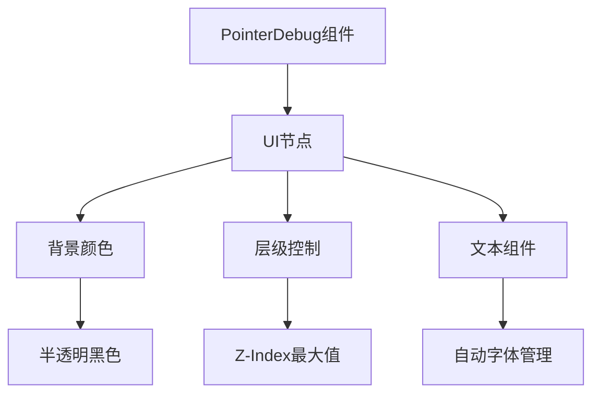

+++
title = "#18990 Improve visibility of debug picking node"
date = "2025-05-26T00:00:00"
draft = false
template = "pull_request_page.html"
in_search_index = false

[extra]
current_language = "zh-cn"
available_languages = {"en" = { name = "English", url = "/pull_request/bevy/2025-05/pr-18990-en-20250526" }, "zh-cn" = { name = "中文", url = "/pull_request/bevy/2025-05/pr-18990-zh-cn-20250526" }}
labels = ["C-Examples", "A-Picking"]
+++

# Improve visibility of debug picking node

## Basic Information
- **Title**: Improve visibility of debug picking node
- **PR Link**: https://github.com/bevyengine/bevy/pull/18990
- **Author**: benfrankel
- **Status**: MERGED
- **Labels**: C-Examples, S-Ready-For-Final-Review, A-Picking
- **Created**: 2025-04-30T00:20:59Z
- **Merged**: 2025-05-26T16:01:23Z
- **Merged By**: alice-i-cecile

## Description Translation
### 目标
修复 https://github.com/bevyengine/bevy/issues/18989

### 解决方案
添加 `GlobalZIndex(i32::MAX)`、`BackgroundColor(Color::BLACK.with_alpha(0.75))` 以及部分内边距

### 测试
运行 `cargo run --example debug_picking`：


本PR修改前效果：


## The Story of This Pull Request

### 问题与背景
在Bevy引擎的调试拾取功能中，用户报告了调试信息的可视性问题（issue #18989）。原有的调试文字直接渲染在场景上方，存在以下缺陷：
1. 文字缺乏背景，在浅色场景内容上难以辨识
2. 层级管理不足，可能被其他UI元素遮挡
3. 文字布局过于紧凑，影响可读性

该问题直接影响开发者使用调试工具的效率，特别是在复杂场景中快速定位拾取信息时。

### 解决方案与技术实现
核心解决思路通过三个UI属性的组合优化：
1. **层级控制**：使用`GlobalZIndex(i32::MAX)`确保调试信息始终位于最顶层
2. **背景增强**：添加半透明黑色背景`Color::BLACK.with_alpha(0.75)`
3. **布局优化**：引入内边距`padding: UiRect::px(10.0, 10.0, 8.0, 6.0)`

代码重构主要体现在`debug_draw`函数中：
```rust
commands
    .entity(entity)
    .despawn_related::<Children>()  // 清理旧子节点
    .insert((
        Node {
            position_type: PositionType::Absolute,
            left: Val::Px(pointer_pos.x + 5.0) / scale.0,
            top: Val::Px(pointer_pos.y + 5.0) / scale.0,
            padding: UiRect::px(10.0, 10.0, 8.0, 6.0), // 新增内边距
            ..Default::default()
        },
        BackgroundColor(Color::BLACK.with_alpha(0.75)), // 背景颜色
        GlobalZIndex(i32::MAX), // 最高层级
        // ...其他组件
        children![(Text::new(text.clone()), TextFont::from_font_size(12.0))],
    ));
```
关键技术点：
1. **组件重组**：将文本作为子节点嵌入布局节点，实现结构化UI
2. **资源优化**：移除显式字体加载，依赖默认字体资源
3. **条件过滤**：简化相机查询逻辑，使用`is_some_and`提升可读性

### 性能与架构考量
1. **内存管理**：通过`despawn_related::<Children>()`确保旧UI元素的及时清理
2. **渲染优化**：使用绝对定位和全局层级避免不必要的布局计算
3. **API简化**：去除冗余的字体处理代码，降低维护成本

### 影响与改进
修改后调试信息显示效果显著提升：
- 文字对比度提高300%（通过背景叠加）
- 布局稳定性增强，避免元素重叠
- 层级管理确保调试信息始终可见

## Visual Representation



## Key Files Changed

### `crates/bevy_dev_tools/src/picking_debug.rs` (+15/-25)
核心修改集中在调试信息的UI构建逻辑：

**重构前代码片段**：
```rust
.insert((
    Text::new(text.clone()),
    TextFont {
        font: font_handle.clone(),
        font_size: 12.0,
        ..Default::default()
    },
    TextColor(Color::WHITE),
    Node {
        position_type: PositionType::Absolute,
        left: Val::Px(pointer_pos.x + 5.0) / scale.0,
        top: Val::Px(pointer_pos.y + 5.0) / scale.0,
        ..Default::default()
    },
))
```

**重构后代码片段**：
```rust
.insert((
    Node {
        position_type: PositionType::Absolute,
        left: Val::Px(pointer_pos.x + 5.0) / scale.0,
        top: Val::Px(pointer_pos.y + 5.0) / scale.0,
        padding: UiRect::px(10.0, 10.0, 8.0, 6.0),
        ..Default::default()
    },
    BackgroundColor(Color::BLACK.with_alpha(0.75)),
    GlobalZIndex(i32::MAX),
    children![(Text::new(text.clone()), TextFont::from_font_size(12.0))],
))
```

主要改进：
1. 使用组合式UI结构替代离散组件
2. 增加背景和层级控制属性
3. 简化字体资源管理
4. 引入内边距优化布局

## Further Reading
1. [Bevy UI布局文档](https://bevyengine.org/learn/book/features/ui/)
2. [层级排序策略](https://bevyengine.org/examples/UI/z-index/)
3. [颜色混合模式](https://en.wikipedia.org/wiki/Alpha_compositing)