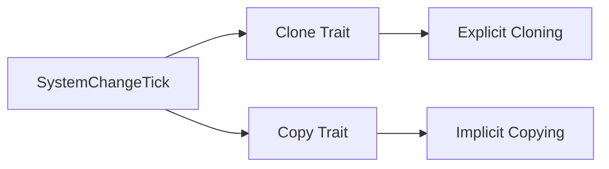

+++
title = "#18991 Make SystemChangeTick Clone"
date = "2025-05-26T00:00:00"
draft = false
template = "pull_request_page.html"
in_search_index = true

[taxonomies]
list_display = ["show"]

[extra]
current_language = "en"
available_languages = {"en" = { name = "English", url = "/pull_request/bevy/2025-05/pr-18991-en-20250526" }, "zh-cn" = { name = "中文", url = "/pull_request/bevy/2025-05/pr-18991-zh-cn-20250526" }}
labels = ["D-Trivial", "A-ECS"]
+++

# Title: Make SystemChangeTick Clone

## Basic Information
- **Title**: Make SystemChangeTick Clone
- **PR Link**: https://github.com/bevyengine/bevy/pull/18991
- **Author**: cBournhonesque
- **Status**: MERGED
- **Labels**: D-Trivial, A-ECS, S-Ready-For-Final-Review
- **Created**: 2025-04-30T00:21:00Z
- **Merged**: 2025-05-26T16:02:52Z
- **Merged By**: alice-i-cecile

## Description Translation
# Objective

It can be useful to store the `SystemChangeTick` for a given System. I wanted to copy them but I noticed that it doesn't implement Clone.

## The Story of This Pull Request

The need arose when a developer working with Bevy's ECS system wanted to store `SystemChangeTick` instances for later use or comparison. `SystemChangeTick` is crucial for change detection in systems, tracking two important values:
- `last_run`: The tick count from the previous system execution
- `this_run`: The current tick count

The core problem was straightforward: while trying to copy these ticks for diagnostic or tracking purposes, the developer discovered the struct didn't implement `Clone`. This prevented simple duplication of the tick data through conventional means like `.clone()` or assignment.

The solution was surgically precise. The implementation modified the derive macro for `SystemChangeTick` to include both `Clone` and `Copy` traits:

```rust
#[derive(Debug, Clone, Copy)]
pub struct SystemChangeTick {
    last_run: Tick,
    this_run: Tick,
}
```

This change works because:
1. The underlying `Tick` type (used by both fields) already implements `Copy`
2. Adding `Clone` is safe as it's automatically derived for types containing `Clone` fields
3. `Copy` derivation follows naturally since the struct contains only `Copy` fields

The technical decision to include both traits was intentional:
- `Clone` enables explicit cloning when needed
- `Copy` allows implicit copying through simple assignment
- Both traits work together to provide flexibility without runtime cost

From an architectural perspective, this change maintains all existing invariants of the ECS system while expanding usability. Since `SystemChangeTick` is a simple data container without ownership semantics, adding copy semantics doesn't introduce any risks of misuse.

## Visual Representation



## Key Files Changed

**crates/bevy_ecs/src/system/system_param.rs** (+1/-1)
```rust
// Before:
#[derive(Debug)]
pub struct SystemChangeTick {
    last_run: Tick,
    this_run: Tick,
}

// After:
#[derive(Debug, Clone, Copy)]
pub struct SystemChangeTick {
    last_run: Tick,
    this_run: Tick,
}
```

This single-line change enables cloning and copying of system change ticks while maintaining all existing functionality. The modification directly addresses the core issue by adding the missing trait implementations.

## Further Reading

1. [Rust Clone trait documentation](https://doc.rust-lang.org/std/clone/trait.Clone.html)
2. [Rust Copy trait documentation](https://doc.rust-lang.org/std/marker/trait.Copy.html)
3. [Bevy ECS Change Detection Guide](https://bevy-cheatbook.github.io/programming/change-detection.html)

# Full Code Diff
```diff
diff --git a/crates/bevy_ecs/src/system/system_param.rs b/crates/bevy_ecs/src/system/system_param.rs
index 7a16c485196b3..e0daca9f2469d 100644
--- a/crates/bevy_ecs/src/system/system_param.rs
+++ b/crates/bevy_ecs/src/system/system_param.rs
@@ -1872,7 +1872,7 @@ unsafe impl<'a> SystemParam for &'a Bundles {
 /// Component change ticks that are more recent than `last_run` will be detected by the system.
 /// Those can be read by calling [`last_changed`](crate::change_detection::DetectChanges::last_changed)
 /// on a [`Mut<T>`](crate::change_detection::Mut) or [`ResMut<T>`](ResMut).
-#[derive(Debug)]
+#[derive(Debug, Clone, Copy)]
 pub struct SystemChangeTick {
     last_run: Tick,
     this_run: Tick,
```