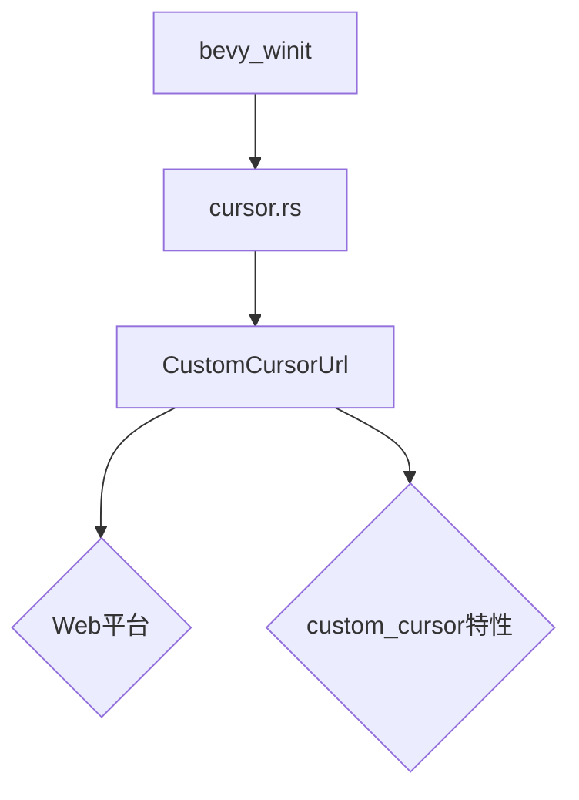

+++
title = "#19006 Expose CustomCursorUrl"
date = "2025-05-06T00:00:00"
draft = false
template = "pull_request_page.html"
in_search_index = false

[extra]
current_language = "zh-cn"
available_languages = {"en" = { name = "English", url = "/pull_request/bevy/2025-05/pr-19006-en-20250506" }, "zh-cn" = { name = "中文", url = "/pull_request/bevy/2025-05/pr-19006-zh-cn-20250506" }}
labels = ["C-Bug", "D-Trivial", "A-Windowing"]
+++

# Expose CustomCursorUrl

## Basic Information
- **Title**: Expose CustomCursorUrl
- **PR Link**: https://github.com/bevyengine/bevy/pull/19006
- **Author**: UkoeHB
- **Status**: MERGED
- **Labels**: C-Bug, D-Trivial, A-Windowing, S-Ready-For-Final-Review
- **Created**: 2025-05-01T03:54:33Z
- **Merged**: 2025-05-06T05:42:52Z
- **Merged By**: alice-i-cecile

## Description Translation
`CustomCursorUrl` 目前不可访问。

### 解决方案
将 `CustomCursorUrl` 公开暴露。

## The Story of This Pull Request

### 问题背景与约束
在 Bevy 引擎的窗口管理模块中，存在一个特定于 WebAssembly 平台的自定义光标功能。核心类型 `CustomCursorUrl` 原本没有正确暴露给外部使用者，导致开发者无法在 Web 环境下通过 URL 方式自定义光标。这个访问性缺陷直接影响了框架在 Web 平台的扩展能力。

### 技术解决方案
通过条件编译指令，在满足特定平台和特性组合时公开导出该类型。这个改动涉及：
1. 添加针对 wasm 平台的编译条件判断
2. 在正确的作用域内使用 `pub use` 导出类型
3. 保持桌面端和其他平台的现有行为不变

### 实现细节分析
关键修改位于窗口系统的光标处理模块，通过新增条件编译块实现精准的类型暴露：

```rust
#[cfg(all(
    feature = "custom_cursor",
    target_family = "wasm",
    target_os = "unknown"
))]
pub use crate::custom_cursor::CustomCursorUrl;
```
这个编译条件组合确保：
- 仅在启用 `custom_cursor` 特性时生效
- 仅针对 WebAssembly 目标平台（通过 `target_family = "wasm"` 判断）
- 排除其他可能的操作系统目标（`target_os = "unknown"`）

### 技术决策考量
1. **平台特定实现**：保持 Web 平台与桌面端实现解耦，避免类型污染
2. **条件编译**：使用精细的条件判断确保不会影响其他平台的编译结果
3. **最小化暴露**：仅公开必要的类型，保持接口简洁

### 影响与改进
1. 使 Web 开发者能够通过标准方式设置自定义光标
2. 完善了 Bevy 在 Web 平台的功能完整性
3. 修复了 API 暴露不全导致的开发障碍

## Visual Representation



## Key Files Changed

### `crates/bevy_winit/src/cursor.rs` (+7/-0)
1. **修改说明**：新增条件编译导出语句，暴露 Web 平台专用的光标 URL 类型
2. **代码片段**：
```rust
#[cfg(all(
    feature = "custom_cursor",
    target_family = "wasm",
    target_os = "unknown"
))]
pub use crate::custom_cursor::CustomCursorUrl;
```
3. **关联性**：这是实现类型暴露的核心修改，直接解决 API 不可访问问题

## Further Reading
- [Bevy 窗口系统文档](https://docs.rs/bevy_winit/latest/bevy_winit/)
- [Rust 条件编译指南](https://doc.rust-lang.org/reference/conditional-compilation.html)
- [Web 自定义光标规范](https://developer.mozilla.org/en-US/docs/Web/CSS/cursor)