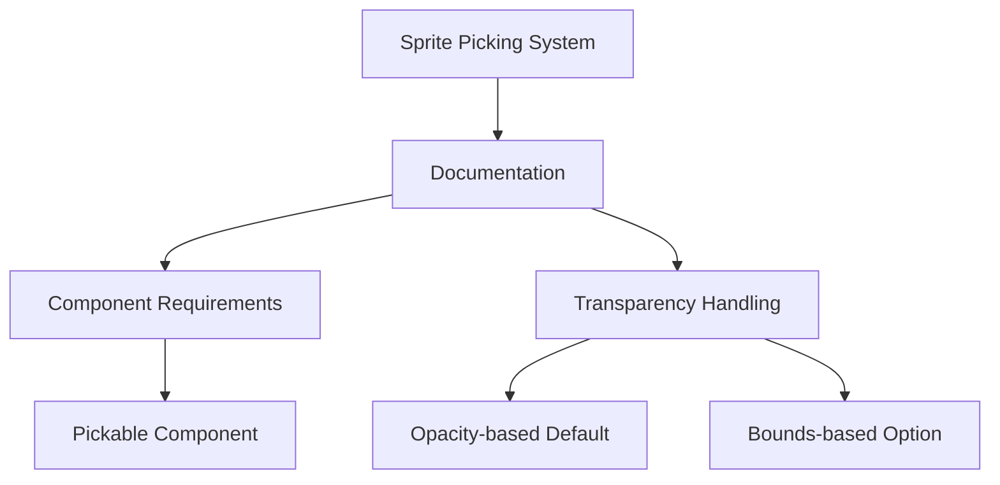

+++
title = "#19016 Sprite picking docs fix"
date = "2025-05-05T00:00:00"
draft = false
template = "pull_request_page.html"
in_search_index = true

[taxonomies]
list_display = ["show"]

[extra]
current_language = "en"
available_languages = {"en" = { name = "English", url = "/pull_request/bevy/2025-05/pr-19016-en-20250505" }, "zh-cn" = { name = "中文", url = "/pull_request/bevy/2025-05/pr-19016-zh-cn-20250505" }}
labels = ["C-Docs", "D-Trivial"]
+++

# Sprite picking docs fix

## Basic Information
- **Title**: Sprite picking docs fix
- **PR Link**: https://github.com/bevyengine/bevy/pull/19016
- **Author**: akimakinai
- **Status**: MERGED
- **Labels**: C-Docs, D-Trivial, S-Ready-For-Final-Review
- **Created**: 2025-05-01T18:34:44Z
- **Merged**: 2025-05-05T18:03:10Z
- **Merged By**: mockersf

## Description Translation
# Objective

- Docs in sprite picking plugin / example contain outdated information.

References:
- Sprite picking now always require `Picking` - #17842
- Transparency pass-through added - #16388

## Solution

- Fix the docs.

## The Story of This Pull Request

The PR addresses documentation inaccuracies in Bevy's sprite picking system that accumulated after two significant changes to the engine's picking mechanics. Prior to these changes, the documentation incorrectly described sprite picking behavior regarding component requirements and transparency handling.

The core issue stemmed from PR #17842 which made the `Picking` component mandatory for all pickable entities, and PR #16388 which introduced alpha-based pixel filtering. These changes rendered existing documentation misleading in two key aspects:
1. The system no longer worked without explicit `Picking` components
2. The default behavior switched from bounds-based picking to opacity-based pixel detection

The documentation updates focus on three main corrections:
1. Clarifying the default opacity-based picking behavior
2. Explicitly stating the `Pickable` component requirement
3. Updating example code comments to reflect current behavior

In `picking_backend.rs`, the module-level documentation was rewritten to emphasize the new default behavior. Where it previously stated that "partially transparent sprite is pickable even in its transparent areas," it now clearly explains:
```rust
//! By default, picking for sprites is based on pixel opacity.
//! A sprite is picked only when a pointer is over an opaque pixel.
//! Alternatively, you can configure picking to be based on sprite bounds.
```

The example file `sprite_picking.rs` received similar treatment, replacing a comment about bounds-based picking with:
```rust
//! By default, the sprite picking backend considers a sprite only when a pointer is over an opaque pixel.
```

These changes address potential confusion for developers working with semi-transparent sprites. The documentation now properly guides users to either:
1. Rely on the default opacity-based picking for precise interaction
2. Explicitly configure bounds-based picking through `SpritePickingSettings` when needed

The PR also clarifies runtime configuration options in `SpritePickingSettings`, adding explicit documentation about default values and component requirements:
```rust
/// Regardless of this setting, only sprites marked with [`Pickable`] will be considered.
```

These documentation updates maintain consistency with Bevy's current picking architecture while preserving backward compatibility for existing configurations. The changes help prevent common pitfalls such as:
- Unexpected pick events on transparent sprite regions
- Missing `Pickable` components leading to non-functional picking
- Confusion between camera marker requirements and entity marker requirements

## Visual Representation



## Key Files Changed

1. `crates/bevy_sprite/src/picking_backend.rs` (+8/-4)
```rust
// Before:
//! Picking is done based on sprite bounds, not visible pixels.
//! This means a partially transparent sprite is pickable even in its transparent areas.

// After:
//! By default, picking for sprites is based on pixel opacity.
//! A sprite is picked only when a pointer is over an opaque pixel.
//! Alternatively, you can configure picking to be based on sprite bounds.

// Added clarification:
/// Regardless of this setting, only sprites marked with [`Pickable`] will be considered.
```

2. `examples/picking/sprite_picking.rs` (+2/-2)
```rust
// Before:
//! Demonstrates picking for sprites and sprite atlases. The picking backend only tests against the
//! sprite bounds, so the sprite atlas can be picked by clicking on its transparent areas.

// After:
//! Demonstrates picking for sprites and sprite atlases.
//! By default, the sprite picking backend considers a sprite only when a pointer is over an opaque pixel.
```

## Further Reading
- [Bevy Picking Plugin Documentation](https://github.com/bevyengine/bevy/tree/main/crates/bevy_picking)
- [Alpha Masking in Computer Graphics](https://en.wikipedia.org/wiki/Alpha_compositing)
- [Entity Component System Pattern](https://en.wikipedia.org/wiki/Entity_component_system)