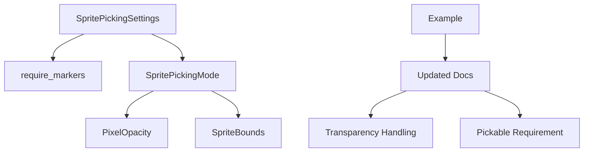

+++
title = "#19016 Sprite picking docs fix"
date = "2025-05-05T00:00:00"
draft = false
template = "pull_request_page.html"
in_search_index = false

[extra]
current_language = "zh-cn"
available_languages = {"en" = { name = "English", url = "/pull_request/bevy/2025-05/pr-19016-en-20250505" }, "zh-cn" = { name = "中文", url = "/pull_request/bevy/2025-05/pr-19016-zh-cn-20250505" }}
labels = ["C-Docs", "D-Trivial"]
+++

# Sprite picking docs fix

## Basic Information
- **Title**: Sprite picking docs fix
- **PR Link**: https://github.com/bevyengine/bevy/pull/19016
- **Author**: akimakinai
- **Status**: MERGED
- **Labels**: C-Docs, D-Trivial, S-Ready-For-Final-Review
- **Created**: 2025-05-01T18:34:44Z
- **Merged**: 2025-05-05T18:03:10Z
- **Merged By**: mockersf

## Description Translation
该PR目标更新精灵拾取插件和示例中的过时文档。主要修正内容包括：
- 反映#17842引入的`Pickable`组件强制要求
- 体现#16388增加的透明度穿透处理
解决方案为直接修正文档描述。

## The Story of This Pull Request

### 问题背景与上下文
Bevy引擎的精灵拾取系统经历了两项重要变更：
1. #16388（2023年合并）引入了透明度穿透处理，将精灵拾取逻辑从基于包围盒改为默认基于像素透明度
2. #17842（2024年合并）强制要求使用`Pickable`组件进行实体拾取配置

然而相关文档未及时更新，导致：
- 模块级文档仍描述旧的包围盒检测方式
- 示例代码注释与当前实际行为不符
- 配置参数说明缺少默认值等关键信息

这会给开发者带来理解偏差，可能错误配置拾取系统。

### 解决方案与实现
通过精准修改文档注释和示例说明来反映当前实现：

**1. 核心模块文档更新**
```rust
// Before:
//! Picking is done based on sprite bounds, not visible pixels.
//! This means a partially transparent sprite is pickable even in its transparent areas.

// After:
//! By default, picking for sprites is based on pixel opacity.
//! A sprite is picked only when a pointer is over an opaque pixel.
//! Alternatively, you can configure picking to be based on sprite bounds.
```
此项修改明确默认行为从包围盒检测改为像素透明度检测，同时说明替代方案。

**2. 配置参数说明增强**
```rust
// Before:
/// When set to `true` sprite picking will only consider cameras marked with
/// [`SpritePickingCamera`].

// After:
/// When set to `true` sprite picking will only consider cameras marked with
/// [`SpritePickingCamera`]. Defaults to `false`.
/// Regardless of this setting, only sprites marked with [`Pickable`] will be considered.
```
增加默认值说明和`Pickable`组件强制要求，反映#17842的变更。

**3. 示例代码注释修正**
```rust
// Before:
//! The picking backend only tests against the sprite bounds

// After:
//! By default, the sprite picking backend considers a sprite only when a pointer is over an opaque pixel.
```
使示例说明与实际像素检测行为保持一致。

### 技术影响与启示
1. **文档同步的重要性**：核心算法变更后必须及时更新配套文档
2. **默认行为显式说明**：通过`Defaults to`明确配置参数的默认值
3. **组件依赖关系**：强调`Pickable`组件的强制要求，避免使用遗漏
4. **向后兼容处理**：保留包围盒检测模式作为可配置选项（通过`SpritePickingMode`）

## Visual Representation



## Key Files Changed

### `crates/bevy_sprite/src/picking_backend.rs` (+8/-4)
**修改说明**：
1. 修正模块级文档，准确描述默认拾取行为
2. 增强配置参数文档，明确默认值和组件依赖

**关键代码对比**：
```rust
// 修改前模块文档
//! Picking is done based on sprite bounds...transparent areas.

// 修改后模块文档
//! By default, picking for sprites is based on pixel opacity...
//! Alternatively, you can configure picking to be based on sprite bounds.
```

### `examples/picking/sprite_picking.rs` (+2/-2)
**修改说明**：
更新示例注释以匹配实际像素检测行为

**关键代码对比**：
```rust
// 修改前示例注释
//! ...picking backend only tests against the sprite bounds...

// 修改后示例注释
//! By default, the sprite picking backend considers...over an opaque pixel.
```

## Further Reading
1. [Bevy Picking System 官方文档](https://bevyengine.org/learn/book/features/picking/)
2. [#16388 透明度处理PR](https://github.com/bevyengine/bevy/pull/16388)
3. [#17842 Pickable组件强制要求PR](https://github.com/bevyengine/bevy/pull/17842)