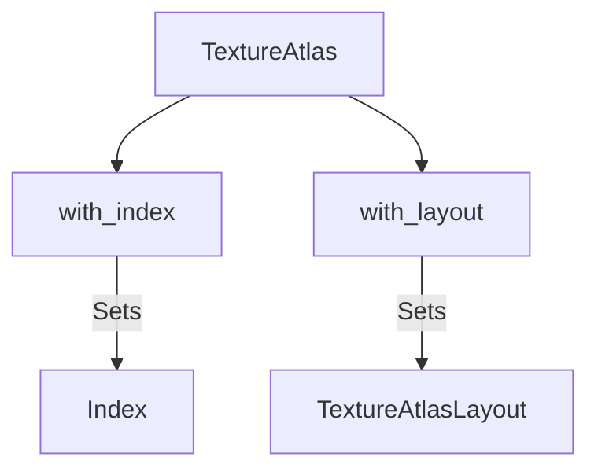

+++
title = "#19023 Add TextureAtlas convenience methods"
date = "2025-05-05T00:00:00"
draft = false
template = "pull_request_page.html"
in_search_index = true

[taxonomies]
list_display = ["show"]

[extra]
current_language = "en"
available_languages = {"en" = { name = "English", url = "/pull_request/bevy/2025-05/pr-19023-en-20250505" }, "zh-cn" = { name = "中文", url = "/pull_request/bevy/2025-05/pr-19023-zh-cn-20250505" }}
labels = ["C-Feature", "A-Rendering", "C-Usability", "D-Straightforward"]
+++

# Add TextureAtlas convenience methods

## Basic Information
- **Title**: Add TextureAtlas convenience methods
- **PR Link**: https://github.com/bevyengine/bevy/pull/19023
- **Author**: mnmaita
- **Status**: MERGED
- **Labels**: C-Feature, A-Rendering, C-Usability, S-Ready-For-Final-Review, D-Straightforward
- **Created**: 2025-05-02T00:43:04Z
- **Merged**: 2025-05-04T08:29:24Z
- **Merged By**: mockersf

## Description Translation
# Objective

- Add a few useful methods to `TextureAtlas`.

## Solution

- Added `TextureAtlas::with_index()`.
- Added `TextureAtlas::with_layout()`.

## Testing

- CI checks.

## The Story of This Pull Request

The PR addresses a common usability pain point when working with Bevy's sprite system. The `TextureAtlas` struct, which combines a texture layout handle with an index to identify specific sub-textures, previously required manual field manipulation when modifying these properties. Developers needed to either construct new struct instances or mutate existing ones directly, which could lead to verbose and less readable code.

The solution introduces two builder-style methods following Rust's fluent interface pattern:
1. `with_index()` allows changing the texture index
2. `with_layout()` enables swapping the atlas layout handle

These methods return modified `TextureAtlas` instances, enabling method chaining while maintaining immutability. The implementation is intentionally minimal - each method takes ownership of `self`, modifies the relevant field, and returns the modified struct. This approach aligns with Rust's ownership system and avoids unnecessary cloning.

```rust
pub fn with_index(mut self, index: usize) -> Self {
    self.index = index;
    self
}

pub fn with_layout(mut self, layout: Handle<TextureAtlasLayout>) -> Self {
    self.layout = layout;
    self
}
```

The changes improve ergonomics for common operations like:
- Creating multiple sprites from the same atlas layout
- Reusing atlas configurations with different indices
- Swapping texture layouts while maintaining other properties

These additions maintain backward compatibility while providing clearer intent compared to direct field access. The implementation avoids any runtime overhead as the methods simply reorganize existing data without introducing new computations.

## Visual Representation



## Key Files Changed

### `crates/bevy_image/src/texture_atlas.rs` (+12/-0)
Added two builder methods to enable fluent configuration of TextureAtlas instances:

```rust
// Before: Manual struct modification required
let mut atlas = TextureAtlas::default();
atlas.index = 5;
atlas.layout = new_layout;

// After: Fluent interface
let atlas = TextureAtlas::default()
    .with_index(5)
    .with_layout(new_layout);
```

The changes:
1. Implement `with_index` to modify texture index
2. Implement `with_layout` to change atlas layout handle
3. Maintain existing constructor patterns while adding new configuration options

## Further Reading
- Rust Builder Pattern: https://doc.rust-lang.org/1.0.0/style/ownership/builders.html
- Bevy Sprites Documentation: https://bevyengine.org/learn/book/next/2d/sprites
- Fluent Interface Design: https://martinfowler.com/bliki/FluentInterface.html