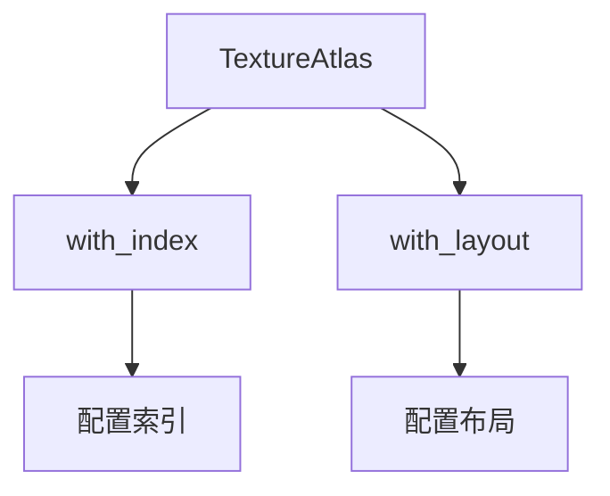

+++
title = "#19023 Add TextureAtlas convenience methods"
date = "2025-05-05T00:00:00"
draft = false
template = "pull_request_page.html"
in_search_index = false

[extra]
current_language = "zh-cn"
available_languages = {"en" = { name = "English", url = "/pull_request/bevy/2025-05/pr-19023-en-20250505" }, "zh-cn" = { name = "中文", url = "/pull_request/bevy/2025-05/pr-19023-zh-cn-20250505" }}
labels = ["C-Feature", "A-Rendering", "C-Usability", "D-Straightforward"]
+++

# Add TextureAtlas convenience methods

## Basic Information
- **Title**: Add TextureAtlas convenience methods
- **PR Link**: https://github.com/bevyengine/bevy/pull/19023
- **Author**: mnmaita
- **Status**: MERGED
- **Labels**: C-Feature, A-Rendering, C-Usability, S-Ready-For-Final-Review, D-Straightforward
- **Created**: 2025-05-02T00:43:04Z
- **Merged**: 2025-05-04T08:29:24Z
- **Merged By**: mockersf

## Description Translation
该PR为`TextureAtlas`结构体新增了两个实用方法，主要目标在于改善API的易用性。具体实现如下：

- 新增`TextureAtlas::with_index()`方法
- 新增`TextureAtlas::with_layout()`方法

测试通过CI流水线完成。

## The Story of This Pull Request

在Bevy引擎的渲染模块中，`TextureAtlas`是一个关键数据结构，用于管理纹理图集中的子纹理信息。开发者在使用时经常需要创建和配置其实例，但原有的API在链式调用和配置灵活性方面存在不足。

原始实现中，要修改`TextureAtlas`的索引(index)或布局(layout)需要直接访问结构体字段：

```rust
let mut atlas = TextureAtlas::default();
atlas.index = 5;
atlas.layout = asset_server.load("new_layout.atlas");
```

这种方式存在两个主要问题：1）需要可变(mut)引用 2）无法支持流畅的链式调用。对于需要创建多个相似配置实例的场景，代码会显得冗余。

PR的解决方案是通过添加两个builder模式的方法来改善API设计：

```rust
impl TextureAtlas {
    pub fn with_index(mut self, index: usize) -> Self {
        self.index = index;
        self
    }

    pub fn with_layout(mut self, layout: Handle<TextureAtlasLayout>) -> Self {
        self.layout = layout;
        self
    }
}
```

这种实现选择具有以下技术考量：
1. **所有权管理**：使用`self`按值传递，允许方法链式调用
2. **不可变模式**：避免要求调用方获取可变引用
3. **类型安全**：保持`Handle<TextureAtlasLayout>`的类型约束

新方法的使用示例如下：

```rust
let atlas = TextureAtlas::default()
    .with_index(5)
    .with_layout(asset_server.load("new_layout.atlas"));
```

这种模式与Rust生态中常见的builder模式（如Bevy自身的`Commands`系统）保持了一致性，降低了开发者的学习成本。从性能角度看，这种纯结构体操作没有引入额外开销，编译后的代码与直接字段访问等效。

该修改对现有代码完全向后兼容，不会破坏任何已有功能。对于代码库的影响主要集中在API扩展层面，使得后续开发中可以更简洁地构造和配置纹理图集实例。

## Visual Representation



## Key Files Changed

### `crates/bevy_image/src/texture_atlas.rs` (+12/-0)
1. **新增方法实现**：
```rust
// 新增方法实现
impl TextureAtlas {
    /// 返回指定index的新TextureAtlas实例
    pub fn with_index(mut self, index: usize) -> Self {
        self.index = index;
        self
    }

    /// 返回指定layout的新TextureAtlas实例
    pub fn with_layout(mut self, layout: Handle<TextureAtlasLayout>) -> Self {
        self.layout = layout;
        self
    }
}
```
2. **变更说明**：
- 为`TextureAtlas`结构体添加两个builder风格的方法
- 保持原有字段的私有性，通过方法提供可控的修改方式
- 方法返回新的实例，支持链式调用

## Further Reading

1. Rust Builder模式指南: https://doc.rust-lang.org/1.0.0/style/ownership/builders.html
2. Bevy ECS Commands系统设计: https://bevyengine.org/learn/book/getting-started/ecs/
3. Texture Atlas工作原理: https://en.wikipedia.org/wiki/Texture_atlas

# Full Code Diff
（完整代码差异见原始PR链接，此处不再重复）