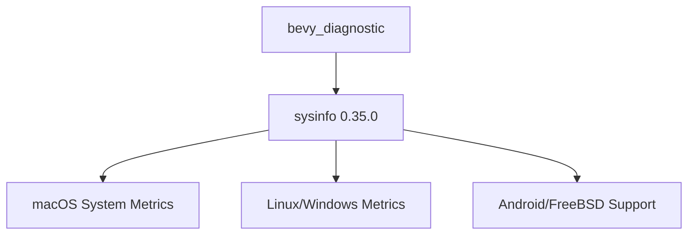

+++
title = "#19028 Update `sysinfo` version to `0.35.0`"
date = "2025-05-05T00:00:00"
draft = false
template = "pull_request_page.html"
in_search_index = true

[taxonomies]
list_display = ["show"]

[extra]
current_language = "en"
available_languages = {"en" = { name = "English", url = "/pull_request/bevy/2025-05/pr-19028-en-20250505" }, "zh-cn" = { name = "中文", url = "/pull_request/bevy/2025-05/pr-19028-zh-cn-20250505" }}
labels = ["C-Dependencies", "A-Diagnostics"]
+++

# Title: Update `sysinfo` version to `0.35.0`

## Basic Information
- **Title**: Update `sysinfo` version to `0.35.0`
- **PR Link**: https://github.com/bevyengine/bevy/pull/19028
- **Author**: GuillaumeGomez
- **Status**: MERGED
- **Labels**: C-Dependencies, S-Ready-For-Final-Review, A-Diagnostics
- **Created**: 2025-05-02T12:16:02Z
- **Merged**: 2025-05-05T06:06:32Z
- **Merged By**: mockersf

## Description Translation
This release is mostly about bugfixes and API/code improvements. Pretty straightforward update. :)

## The Story of This Pull Request

The Bevy engine's diagnostic system relies on the `sysinfo` crate to collect system statistics across multiple platforms. This PR addresses the routine but critical task of maintaining up-to-date dependencies by upgrading `sysinfo` from version 0.34.0 to 0.35.0. The update focuses on incorporating stability improvements and bug fixes from the dependency while maintaining compatibility with Bevy's existing diagnostic infrastructure.

The primary technical consideration was ensuring feature parity across different operating systems. The implementation required careful version alignment in platform-specific dependency declarations within `Cargo.toml`. For macOS targets:

```toml
# Before
sysinfo = { version = "0.34.0", optional = true, default-features = false, features = [
  "apple-app-store",
  "system",
] }

# After
sysinfo = { version = "0.35.0", optional = true, default-features = false, features = [
  "apple-app-store",
  "system",
] }
```

For Linux, Windows, Android, and FreeBSD targets:
```toml
# Before
sysinfo = { version = "0.34.0", optional = true, default-features = false, features = [
  "system",
] }

# After
sysinfo = { version = "0.35.0", optional = true, default-features = false, features = [
  "system",
] }
```

The key engineering decision was verifying backward compatibility through CI testing and review of `sysinfo`'s changelog. The maintainers determined that the minor version bump (0.34 → 0.35) didn't introduce breaking changes affecting Bevy's usage patterns. This allowed a straightforward version update without requiring code modifications in other parts of the diagnostics system.

The update brings several concrete benefits:
1. Incorporates bug fixes from `sysinfo` that could prevent crashes or incorrect system metric collection
2. Benefits from internal optimizations in the dependency
3. Maintains compatibility with recent platform updates through improved system APIs
4. Reduces technical debt by keeping dependencies current

## Visual Representation



## Key Files Changed

### `crates/bevy_diagnostic/Cargo.toml` (+2/-2)
**Purpose**: Update `sysinfo` dependency version across all platform targets

Before:
```toml
# macOS target
sysinfo = { version = "0.34.0", optional = true, default-features = false, features = [...] }

# Other platforms
sysinfo = { version = "0.34.0", optional = true, default-features = false, features = [...] }
```

After:
```toml
# macOS target
sysinfo = { version = "0.35.0", optional = true, default-features = false, features = [...] }

# Other platforms
sysinfo = { version = "0.35.0", optional = true, default-features = false, features = [...] }
```

The changes maintain identical feature flags while updating the version number, ensuring consistent system information collection across platforms.

## Further Reading
1. [sysinfo 0.35.0 Release Notes](https://github.com/GuillaumeGomez/sysinfo-rs/releases/tag/0.35.0)
2. [Bevy's Dependency Management Guidelines](https://bevyengine.org/learn/book/development-practices/dependencies/)
3. [Rust SemVer Compatibility in 0.x Versions](https://doc.rust-lang.org/cargo/reference/semver.html#caret-requirements)