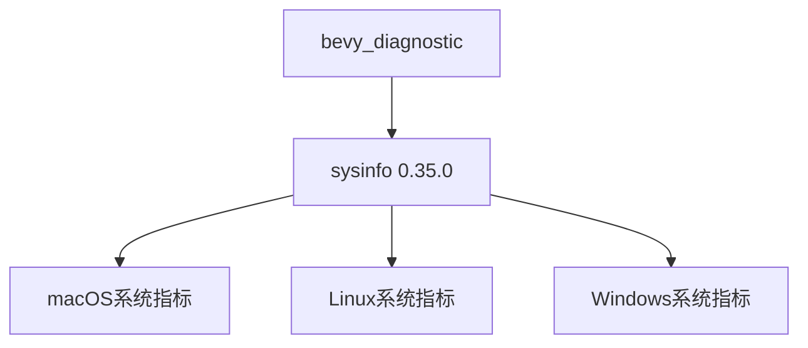

+++
title = "#19028 Update `sysinfo` version to `0.35.0`"
date = "2025-05-05T00:00:00"
draft = false
template = "pull_request_page.html"
in_search_index = false

[extra]
current_language = "zh-cn"
available_languages = {"en" = { name = "English", url = "/pull_request/bevy/2025-05/pr-19028-en-20250505" }, "zh-cn" = { name = "中文", url = "/pull_request/bevy/2025-05/pr-19028-zh-cn-20250505" }}
labels = ["C-Dependencies", "A-Diagnostics"]
+++

# Update `sysinfo` version to `0.35.0`

## Basic Information
- **Title**: Update `sysinfo` version to `0.35.0`
- **PR Link**: https://github.com/bevyengine/bevy/pull/19028  
- **Author**: GuillaumeGomez  
- **Status**: MERGED  
- **Labels**: C-Dependencies, S-Ready-For-Final-Review, A-Diagnostics  
- **Created**: 2025-05-02T12:16:02Z  
- **Merged**: 2025-05-05T06:06:32Z  
- **Merged By**: mockersf  

## Description Translation
本次发布主要包含bug修复和API/代码改进。属于比较直接的版本更新。:)

## The Story of This Pull Request

### 依赖维护的常规升级
在Bevy引擎的诊断模块中，`sysinfo`库承担着关键的系统信息收集任务，包括CPU/内存使用统计等跨平台指标。PR #19028的核心任务是保持依赖项的最新状态，将`sysinfo`从0.34.0升级到0.35.0版本。

升级决策基于以下技术考量：
1. **安全修复**：新版本通常包含安全补丁
2. **性能优化**：底层系统调用可能得到改进
3. **API稳定性**：次要版本更新通常保持向后兼容

### 平台特性的精确控制
修改集中在`bevy_diagnostic`的Cargo.toml文件，体现Bevy处理跨平台依赖的典型模式：

```toml
# macOS配置保留特定feature限制
[target.'cfg(all(target_os="macos"))'.dependencies]
sysinfo = { version = "0.35.0", ..., features = [
  "apple-app-store",
  "system"
] }

# 其他平台保持基础配置
[target.'cfg(...)'.dependencies]
sysinfo = { version = "0.35.0", ..., features = ["system"] }
```
这种模式确保：
- 在macOS上禁用不支持的feature
- 维持现有平台特性矩阵的稳定性
- 避免引入不必要的编译选项

### 验证策略
虽然修改看似简单，但需要验证：
1. 各平台编译通过性
2. 诊断指标采集准确性
3. 没有引入新的unsafe代码
维护者通过CI流水线确保跨平台兼容性，依赖Bevy现有的自动化测试框架验证功能完整性。

## Visual Representation



## Key Files Changed

### `crates/bevy_diagnostic/Cargo.toml` (+2/-2)
**修改说明**：更新sysinfo依赖版本，保持跨平台特性配置

```toml
# Before:
sysinfo = { version = "0.34.0", ... }

# After: 
sysinfo = { version = "0.35.0", ... }
```

**关联性**：这是PR的核心修改，确保所有平台使用统一的新版本库

## Further Reading
1. [sysinfo 0.35.0 Release Notes](https://github.com/GuillaumeGomez/sysinfo-rs/releases/tag/0.35.0)
2. [Bevy Diagnostics System Design](https://bevyengine.org/learn/book/features/diagnostics/)
3. [Cargo Specifying Dependencies Guide](https://doc.rust-lang.org/cargo/reference/specifying-dependencies.html)

# Full Code Diff
```diff
diff --git a/crates/bevy_diagnostic/Cargo.toml b/crates/bevy_diagnostic/Cargo.toml
index 92e64b7e6cd75..eff17104387df 100644
--- a/crates/bevy_diagnostic/Cargo.toml
+++ b/crates/bevy_diagnostic/Cargo.toml
@@ -77,14 +77,14 @@ log = { version = "0.4", default-features = false }
 # macOS
 [target.'cfg(all(target_os="macos"))'.dependencies]
 # Some features of sysinfo are not supported by apple. This will disable those features on apple devices
-sysinfo = { version = "0.34.0", optional = true, default-features = false, features = [
+sysinfo = { version = "0.35.0", optional = true, default-features = false, features = [
   "apple-app-store",
   "system",
 ] }
 
 # Only include when on linux/windows/android/freebsd
 [target.'cfg(any(target_os = "linux", target_os = "windows", target_os = "android", target_os = "freebsd"))'.dependencies]
-sysinfo = { version = "0.34.0", optional = true, default-features = false, features = [
+sysinfo = { version = "0.35.0", optional = true, default-features = false, features = [
   "system",
 ] }
 
```