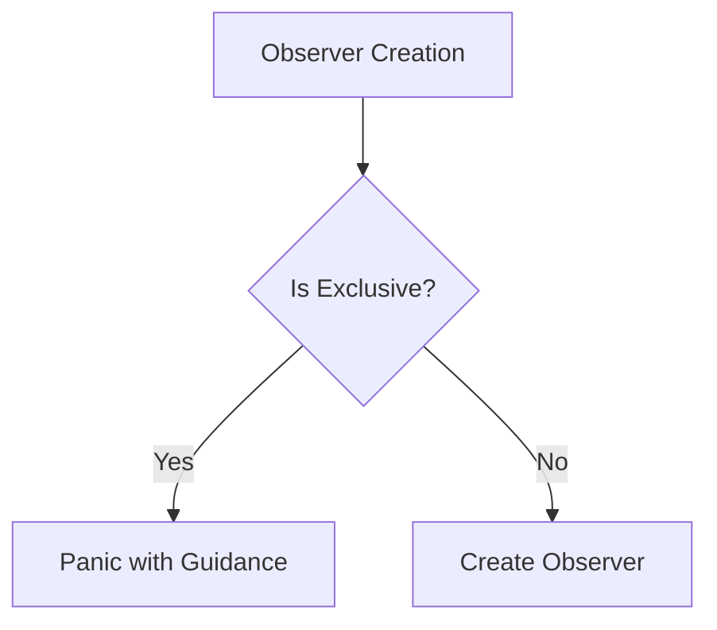

+++
title = "#19033 Prevent exclusive systems from being used as observers"
date = "2025-05-05T00:00:00"
draft = false
template = "pull_request_page.html"
in_search_index = true

[taxonomies]
list_display = ["show"]

[extra]
current_language = "en"
available_languages = {"en" = { name = "English", url = "/pull_request/bevy/2025-05/pr-19033-en-20250505" }, "zh-cn" = { name = "中文", url = "/pull_request/bevy/2025-05/pr-19033-zh-cn-20250505" }}
labels = ["C-Bug", "A-ECS", "P-Unsound"]
+++

# Prevent exclusive systems from being used as observers

## Basic Information
- **Title**: Prevent exclusive systems from being used as observers
- **PR Link**: https://github.com/bevyengine/bevy/pull/19033
- **Author**: chescock
- **Status**: MERGED
- **Labels**: C-Bug, A-ECS, S-Ready-For-Final-Review, P-Unsound, X-Uncontroversial
- **Created**: 2025-05-02T16:34:26Z
- **Merged**: 2025-05-05T18:07:11Z
- **Merged By**: mockersf

## Description Translation
The original description is already in English, so it is preserved as-is:

# Objective

Prevent using exclusive systems as observers. Allowing them is unsound, because observers are only expected to have `DeferredWorld` access, and the observer infrastructure will keep pointers that are invalidated by the creation of `&mut World`.

See https://github.com/bevyengine/bevy/actions/runs/14778342801/job/41491517847?pr=19011 for a MIRI failure in a recent PR caused by an exclusive system being used as an observer in a test.

## Solution

Have `Observer::new` panic if `System::is_exclusive()` is true. Document that method, and methods that call it, as panicking.

(It should be possible to express this in the type system so that the calls won't even compile, but I did not want to attempt that.)

## Testing

Added a unit test that calls `World::add_observer` with an exclusive system.

## The Story of This Pull Request

### The Problem and Context
The Bevy ECS system allows creating observers - systems that react to specific events. However, a fundamental safety issue existed when developers attempted to use exclusive systems (those requiring `&mut World` access) as observers. This combination created undefined behavior because:

1. Observer infrastructure maintains internal pointers to world data
2. Exclusive systems obtain mutable world access, potentially invalidating those pointers
3. MIRI (Memory-safe Rust Instrumentation) detected this as unsound memory access

This manifested in CI failures like the one shown in the PR's MIRI report. The core issue was that exclusive systems could bypass the safety guarantees provided by `DeferredWorld` (which defers structural changes) and `Commands` (which queues changes).

### The Solution Approach
The fix needed to prevent exclusive systems from being used as observers while maintaining API compatibility. The chosen approach:

1. Add runtime checks in observer creation code
2. Provide clear error messages guiding developers to safe alternatives
3. Document the panic behavior in relevant methods
4. Add test coverage to verify enforcement

The implementation intentionally used runtime checks rather than type system prevention due to implementation complexity, though the PR author noted this as a potential future improvement.

### The Implementation
The core safety check was added in `Observer::new`:

```rust
// crates/bevy_ecs/src/observer/runner.rs
pub fn new<E: Event, B: Bundle, M, I: IntoObserverSystem<E, B, M>>(system: I) -> Self {
    let system = Box::new(IntoObserverSystem::into_system(system));
    assert!(
        !system.is_exclusive(),
        concat!(
            "Exclusive system `{}` may not be used as observer.\n",
            "Instead of `&mut World`, use either `DeferredWorld`... or `Commands`..."
        ),
        system.name()
    );
    // ... rest of constructor
}
```

Key implementation details:
1. Converts input to a system using `into_system`
2. Checks `is_exclusive()` flag on the system
3. Panics with guidance if check fails

Documentation updates ensured developers would understand the new constraints:

```rust
// crates/bevy_ecs/src/world/entity_ref.rs
/// # Panics
///
/// If the entity has been despawned while this `EntityWorldMut` is still alive.
///
/// Panics if the given system is an exclusive system.
```

A test case was added to verify enforcement:

```rust
#[test]
#[should_panic(expected = "Exclusive system ... may not be used as observer")]
fn exclusive_system_cannot_be_observer() {
    fn system(_: Trigger<TriggerEvent>, _world: &mut World) {}
    let mut world = World::default();
    world.add_observer(system);
}
```

### Technical Insights
1. **Safety Through Runtime Checks**: While compile-time prevention would be ideal, runtime checks provided immediate safety without major type system changes
2. **Error Guidance**: The panic message directs developers to appropriate alternatives:
   - `DeferredWorld` for non-structural changes
   - `Commands` for structural changes
3. **API Boundary Enforcement**: Multiple entry points (World, Commands, EntityWorldMut) received consistent documentation updates

### The Impact
1. **Memory Safety**: Eliminates a class of undefined behavior in observer systems
2. **Developer Experience**: Clear error messages help developers migrate existing code
3. **System Architecture**: Enforces proper separation between observation and mutation responsibilities

## Visual Representation



## Key Files Changed

1. `crates/bevy_ecs/src/observer/runner.rs` (+24/-1)
- Added runtime check and panic for exclusive systems
- Implemented test case for validation
```rust
// Key addition
assert!(!system.is_exclusive(), ...);
```

2. `release-content/migration-guides/observers_may_not_be_exclusive.md` (+8/-0)
- Created migration guide explaining breaking change
```markdown
Exclusive systems may no longer be used as observers...
Instead use DeferredWorld or Commands
```

3. `crates/bevy_ecs/src/observer/mod.rs` (+4/-0)
- Documented panic behavior in public API
```rust
/// # Panics
/// Panics if the given system is an exclusive system
```

4. `crates/bevy_ecs/src/system/commands/mod.rs` (+4/-0)
- Propagated documentation to command API
```rust
/// # Panics
/// Panics if the given system is an exclusive system
```

5. `crates/bevy_ecs/src/world/entity_ref.rs` (+2/-0)
- Documented panic in entity observer method
```rust
/// Panics if the given system is an exclusive system
```

## Further Reading
- [Bevy ECS Observer System Documentation](https://bevyengine.org/learn/book/ecs/observer/)
- [Rust MIRI Explanation](https://github.com/rust-lang/miri)
- [System Exclusion in ECS Patterns](https://www.amethyst.rs/book/concepts/system/exclusive.html)