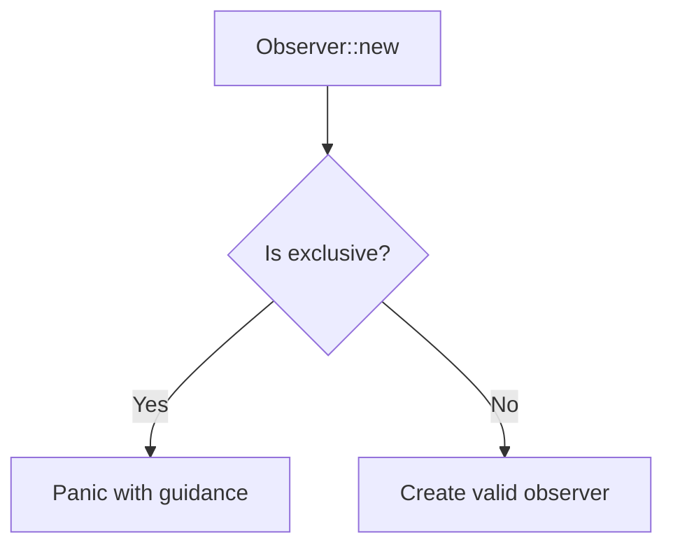

+++
title = "#19033 Prevent exclusive systems from being used as observers"
date = "2025-05-05T00:00:00"
draft = false
template = "pull_request_page.html"
in_search_index = false

[extra]
current_language = "zh-cn"
available_languages = {"en" = { name = "English", url = "/pull_request/bevy/2025-05/pr-19033-en-20250505" }, "zh-cn" = { name = "中文", url = "/pull_request/bevy/2025-05/pr-19033-zh-cn-20250505" }}
+++

# 防止将独占系统用作观察者的技术分析报告

## 基本信息
- **标题**: Prevent exclusive systems from being used as observers
- **PR链接**: https://github.com/bevyengine/bevy/pull/19033
- **作者**: chescock
- **状态**: 已合并
- **标签**: C-Bug, A-ECS, S-Ready-For-Final-Review, P-Unsound, X-Uncontroversial
- **创建时间**: 2025-05-02T16:34:26Z
- **合并时间**: 2025-05-05T18:07:11Z
- **合并者**: mockersf

## 描述翻译
### 目标
防止将独占系统（exclusive systems）用作观察者。允许这种情况存在是不安全的，因为观察者预期只能访问`DeferredWorld`，而观察者基础设施会持有因创建`&mut World`而失效的指针。

参考最近PR中的MIRI失败案例：https://github.com/bevyengine/bevy/actions/runs/14778342801/job/41491517847?pr=19011

### 解决方案
在`Observer::new`方法中，当`System::is_exclusive()`返回true时触发panic。在相关方法的文档中明确说明此panic行为。

（理论上可以通过类型系统在编译期阻止此类调用，但本次未采用该方案。）

### 测试
新增单元测试验证使用独占系统调用`World::add_observer`的情况。

## 代码变更故事

### 问题与背景
Bevy的ECS系统设计中，观察者（Observer）机制需要保证`DeferredWorld`的安全访问。当开发者错误地将需要`&mut World`访问的独占系统注册为观察者时，会导致内存安全问题——观察者基础设施持有的指针可能因独占系统的写操作而失效。

这个问题在PR #19011的CI测试中被MIRI检测到，表现为内存不安全操作。根本原因在于现有实现未对观察者类型进行正确约束。

### 解决方案与实现
核心解决思路是在运行时增加类型检查，阻止独占系统被注册为观察者。具体实现分为三个层次：

1. **运行时断言**：在`Observer::new`构造器中添加assert!检查
```rust
// crates/bevy_ecs/src/observer/runner.rs
assert!(
    !system.is_exclusive(),
    concat!(
        "Exclusive system `{}` may not be used as observer.\n",
        "Instead of `&mut World`, use either `DeferredWorld` if you do not need structural changes, or `Commands` if you do."
    ),
    system.name()
);
```

2. **文档更新**：在所有相关接口添加panic文档说明
```rust
// crates/bevy_ecs/src/observer/mod.rs
/// # Panics
///
/// Panics if the given system is an exclusive system.
```

3. **测试覆盖**：新增单元测试验证异常场景
```rust
#[test]
#[should_panic(...)]
fn exclusive_system_cannot_be_observer() {
    fn system(_: Trigger<TriggerEvent>, _world: &mut World) {}
    let mut world = World::default();
    world.add_observer(system);
}
```

### 技术考量
选择运行时检查而非编译期约束的主要权衡因素：
1. 现有类型系统难以表达复杂的系统类型约束
2. 需要保持API的向后兼容性
3. 错误场景属于开发者误用，适合通过panic快速暴露问题

替代方案建议使用`DeferredWorld`进行非结构性变更，或通过`Commands`进行结构性操作，这两种方式都能保证内存安全。

### 影响分析
1. **内存安全**：从根本上消除了因错误使用观察者导致的内存安全问题
2. **开发者体验**：明确的panic信息指导正确用法
3. **兼容性**：需要更新现有错误使用观察者的代码
4. **运行时开销**：增加一次is_exclusive检查，属于轻量级操作

## 可视化关系


## 关键文件变更

### crates/bevy_ecs/src/observer/runner.rs (+24/-1)
```rust
// 新增断言检查
assert!(
    !system.is_exclusive(),
    // 错误提示信息
    // ...
);

// 新增测试用例
#[test]
#[should_panic(...)]
fn exclusive_system_cannot_be_observer() { ... }
```

### release-content/migration-guides/observers_may_not_be_exclusive.md (+8/-0)
```markdown
---
title: Exclusive systems may not be used as observers
---

解释不兼容变更原因和迁移方案，建议使用DeferredWorld或Commands替代
```

### crates/bevy_ecs/src/observer/mod.rs (+4/-0)
```rust
/// # Panics
/// Panics if the given system is an exclusive system.
```

## 延伸阅读
1. [Bevy ECS观察者机制文档](https://bevyengine.org/learn/ecs/observers/)
2. [DeferredWorld与Commands的区别](https://bevy-cheatbook.github.io/programming/deferred-vs-immediate.html)
3. [Rust内存安全原则](https://doc.rust-lang.org/nomicon/meet-safe-and-unsafe.html)