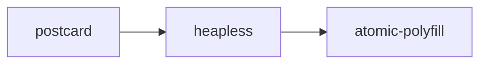

+++
title = "#19038 Ignore RUSTSEC-2023-0089 until postcard is updated"
date = "2025-05-05T00:00:00"
draft = false
template = "pull_request_page.html"
in_search_index = true

[taxonomies]
list_display = ["show"]

[extra]
current_language = "en"
available_languages = {"en" = { name = "English", url = "/pull_request/bevy/2025-05/pr-19038-en-20250505" }, "zh-cn" = { name = "中文", url = "/pull_request/bevy/2025-05/pr-19038-zh-cn-20250505" }}
labels = ["A-Build-System", "C-Dependencies"]
+++

# Title

## Basic Information
- **Title**: Ignore RUSTSEC-2023-0089 until postcard is updated
- **PR Link**: https://github.com/bevyengine/bevy/pull/19038
- **Author**: Zeophlite
- **Status**: MERGED
- **Labels**: A-Build-System, C-Dependencies, S-Ready-For-Final-Review
- **Created**: 2025-05-03T06:49:27Z
- **Merged**: 2025-05-05T06:10:12Z
- **Merged By**: mockersf

## Description Translation
# Objective

- CI fails due to `atomic-polyfill` being unmaintained

## Solution

- Dependency chain of `postcard -> heapless -> atomic-polyfill` .  `heapless` is updated.  `postcard` has not yet.
- See https://github.com/jamesmunns/postcard/issues/223
- Ignore the advisory for now

## Testing

- CI with this PR

## The Story of This Pull Request

The PR addresses a CI failure caused by Rust security advisory RUSTSEC-2023-0089 regarding the unmaintained atomic-polyfill crate. The failure originated from Bevy's dependency chain: postcard → heapless → atomic-polyfill. While heapless had already updated its dependency, postcard had not yet incorporated this update, leaving the vulnerable dependency in Bevy's build chain.

The maintainers faced a common dependency management challenge - transient dependencies blocking CI pipelines. They needed to balance security requirements with development velocity. The chosen solution temporarily adds an exception to Bevy's security checks while tracking the upstream resolution in postcard.

The implementation modifies Bevy's dependency verification configuration (deny.toml) to ignore the specific advisory. This temporary measure allows CI to pass while waiting for postcard to update its heapless dependency. The comment explicitly documents the dependency chain and links to the open postcard issue for future reference.

This approach demonstrates pragmatic handling of transient dependency issues in large Rust projects. It maintains development momentum while ensuring the exception is explicitly tracked and temporary. The solution required understanding multiple layers of dependencies and coordinating with upstream maintainers through the linked postcard issue.

## Visual Representation



## Key Files Changed

- `deny.toml` (+3/-0)

```toml
# File: deny.toml
# Before:
ignore = [
  # ... existing entries
  "RUSTSEC-2024-0436",
]

# After:
ignore = [
  # ... existing entries
  "RUSTSEC-2024-0436",
  # unmaintained: postcard -> heapless -> atomic-polyfill
  # See https://github.com/jamesmunns/postcard/issues/223
  "RUSTSEC-2023-0089",
]
```

This change adds a temporary exception for the security advisory while documenting the dependency chain and linking to the upstream issue tracking the resolution.

## Further Reading

- Rust Security Advisory Database: https://rustsec.org/
- cargo-deny documentation: https://embarkstudios.github.io/cargo-deny/
- Postcard issue tracking the dependency update: https://github.com/jamesmunns/postcard/issues/223