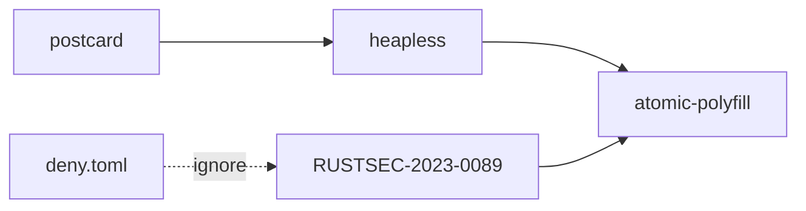

+++
title = "#19038 Ignore RUSTSEC-2023-0089 until postcard is updated"
date = "2025-05-05T00:00:00"
draft = false
template = "pull_request_page.html"
in_search_index = false

[extra]
current_language = "zh-cn"
available_languages = {"en" = { name = "English", url = "/pull_request/bevy/2025-05/pr-19038-en-20250505" }, "zh-cn" = { name = "中文", url = "/pull_request/bevy/2025-05/pr-19038-zh-cn-20250505" }}
labels = ["A-Build-System", "C-Dependencies"]
+++

# Ignore RUSTSEC-2023-0089 until postcard is updated

## Basic Information
- **Title**: Ignore RUSTSEC-2023-0089 until postcard is updated  
- **PR Link**: https://github.com/bevyengine/bevy/pull/19038  
- **Author**: Zeophlite  
- **Status**: MERGED  
- **Labels**: A-Build-System, C-Dependencies, S-Ready-For-Final-Review  
- **Created**: 2025-05-03T06:49:27Z  
- **Merged**: 2025-05-05T06:10:12Z  
- **Merged By**: mockersf  

## Description Translation
### 目标
- 由于`atomic-polyfill`不再维护导致CI失败

### 解决方案
- 依赖链：`postcard -> heapless -> atomic-polyfill`。`heapless`已更新，但`postcard`尚未更新
- 参见 https://github.com/jamesmunns/postcard/issues/223
- 暂时忽略该安全警告

### 测试
- 使用本PR进行CI测试

## The Story of This Pull Request

### 问题背景与上下文
Bevy引擎的持续集成（CI）流程因Rust安全公告RUSTSEC-2023-0089失败。该安全公告指出`atomic-polyfill`库已不再维护，而该库通过`postcard -> heapless -> atomic-polyfill`的依赖链被间接引入项目。尽管上游`heapless`已更新解决此问题，但关键依赖`postcard`尚未发布新版本包含此修复。

### 解决方案选择
开发团队面临两个选择：
1. 等待`postcard`发布新版本
2. 临时忽略该安全警告

考虑到：
- `postcard`是多个Rust生态项目的核心序列化库
- 直接修改依赖版本可能破坏现有功能
- CI失败阻塞其他开发流程

最终决定采用临时忽略方案，在Rust安全检查配置中添加例外，同时跟踪上游进展。

### 具体实现
在项目安全审查配置文件`deny.toml`中添加例外规则：

```toml
# File: deny.toml
ignore = [
  # ...已有例外
  # unmaintained: postcard -> heapless -> atomic-polyfill
  # See https://github.com/jamesmunns/postcard/issues/223
  "RUSTSEC-2023-0089",
]
```

该修改：
1. 明确标注忽略原因
2. 关联上游issue跟踪链接
3. 保持现有其他安全规则不变

### 技术考量
1. **依赖链管理**：现代Rust项目常见深层依赖问题，需要精确识别依赖路径
2. **安全策略平衡**：在安全警告与构建可用性之间取得平衡
3. **临时措施记录**：通过代码注释明确临时方案的性质和跟踪信息

### 影响与后续计划
- 立即恢复CI的正常运行
- 减少对下游开发者的影响
- 计划在postcard发布1.0.5+版本后移除该例外
- 建立依赖更新监控机制

## Visual Representation



## Key Files Changed

### `deny.toml` (+3/-0)
1. **修改说明**：添加RUSTSEC-2023-0089安全警告例外
2. **代码变更**：
```toml
# Before:
ignore = [
  # ...其他例外
]

# After:
ignore = [
  # ...其他例外
  # unmaintained: postcard -> heapless -> atomic-polyfill
  # See https://github.com/jamesmunns/postcard/issues/223
  "RUSTSEC-2023-0089",
]
```
3. **关联性**：这是本PR的核心修改，通过配置调整解决构建失败问题

## Further Reading
1. [Rust安全公告系统](https://rustsec.org/)
2. [Cargo deny文档](https://embarkstudios.github.io/cargo-deny/)
3. [Semantic版本控制规范](https://semver.org/lang/zh-CN/)
4. [Postcard项目issue跟踪](https://github.com/jamesmunns/postcard/issues/223)

# Full Code Diff
```diff
diff --git a/deny.toml b/deny.toml
index 7d76c70de023c..d22efdf153a41 100644
--- a/deny.toml
+++ b/deny.toml
@@ -8,6 +8,9 @@ ignore = [
   # See: https://rustsec.org/advisories/RUSTSEC-2024-0436
   # Bevy relies on this in multiple indirect ways, so ignoring it is the only feasible current solution
   "RUSTSEC-2024-0436",
+  # unmaintained: postcard -> heapless -> atomic-polyfill
+  # See https://github.com/jamesmunns/postcard/issues/223
+  "RUSTSEC-2023-0089",
 ]
 
 [licenses]
```