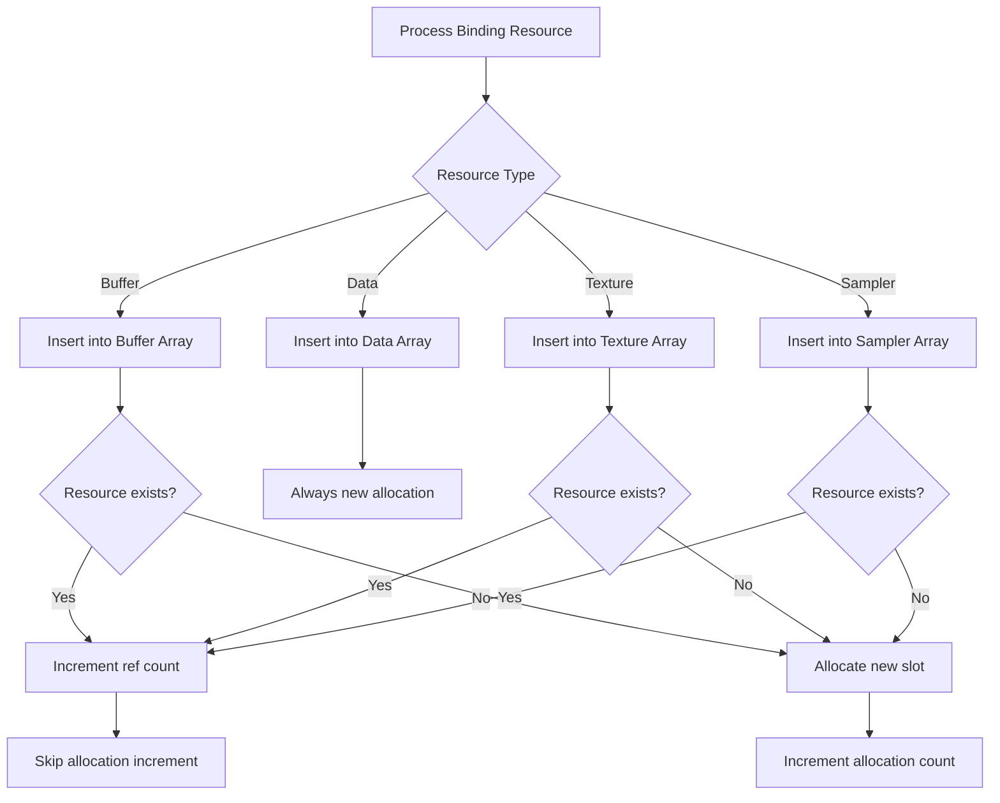

+++
title = "#19041 Fixed memory leak in bindless material"
date = "2025-05-30T00:00:00"
draft = false
template = "pull_request_page.html"
in_search_index = true

[taxonomies]
list_display = ["show"]

[extra]
current_language = "en"
available_languages = {"en" = { name = "English", url = "/pull_request/bevy/2025-05/pr-19041-en-20250530" }, "zh-cn" = { name = "中文", url = "/pull_request/bevy/2025-05/pr-19041-zh-cn-20250530" }}
labels = ["C-Bug", "A-Rendering"]
+++

## Fixed memory leak in bindless material

### Basic Information
- **Title**: Fixed memory leak in bindless material
- **PR Link**: https://github.com/bevyengine/bevy/pull/19041
- **Author**: SarthakSingh31
- **Status**: MERGED
- **Labels**: C-Bug, A-Rendering, S-Ready-For-Final-Review
- **Created**: 2025-05-03T10:47:45Z
- **Merged**: 2025-05-30T19:56:34Z
- **Merged By**: alice-i-cecile

## Description Translation
# Objective

Fixed #19035. Fixed #18882. It consisted of two different bugs:
- The allocations where being incremented even when a Data binding was created.
- The ref counting on the binding was broken.

## Solution

- Stopped incrementing the allocations when a data binding was created.
- Rewrote the ref counting code to more reliably track the ref count.

## Testing

Tested my fix for 10 minutes with the `examples/3d/animated_material.rs` example. I changed the example to spawn 51x51 meshes instead of 3x3 meshes to heighten the effects of the bug.

My branch: (After 10 minutes of running the modified example)
GPU: 172 MB
CPU: ~700 MB

Main branch: (After 2 minutes of running the modified example, my computer started to stutter so I had to end it early)
GPU: 376 MB
CPU: ~1300 MB

## The Story of This Pull Request

The PR addresses two distinct memory leak issues in Bevy's bindless material system. The first problem occurred when the system incorrectly incremented allocation counters for data bindings. Unlike other resource types, data bindings shouldn't trigger allocation increments because they're unique and can't be deduplicated. The second issue stemmed from broken reference counting logic, where the system failed to properly track resource reuse, causing resources to leak over time.

To solve these issues, the author restructured the resource insertion logic. For data bindings, they modified the code to skip allocation counting entirely. For reference counting, they rewrote the insertion mechanism to properly handle duplicate resource references by incrementing ref counts when encountering existing resources rather than creating new allocations.

The implementation shifts from a two-pass approach (check existing then insert) to a unified insertion flow. The key insight was to handle reference counting directly within the insertion method by checking if a resource already exists in the `resource_to_slot` hash map. If found, the implementation increments the existing binding's ref count rather than creating a new slot. This approach eliminated the need for separate pre-existing resource tracking and fixed the reference counting inaccuracies.

For data bindings, the author added explicit handling to ensure they're never treated as duplicates. The code now panics if a duplicate data binding is detected, as this violates the expected behavior of unique data bindings. This strict check helps catch logic errors during development.

Performance validation was conducted using a modified version of the `animated_material` example. By increasing the mesh count from 3x3 to 51x51, the test amplified memory pressure and clearly demonstrated the leak. Results showed significant memory reduction: after 10 minutes, GPU memory usage dropped to 172 MB (compared to 376 MB on main branch after just 2 minutes) and CPU memory to ~700 MB (vs ~1300 MB).

These changes improve memory efficiency in scenes using bindless materials, particularly those with many repeated resources. The refactoring also simplifies the resource insertion logic by consolidating reference counting into the `insert` method, making the code more maintainable.

## Visual Representation



## Key Files Changed

### `crates/bevy_pbr/src/material_bind_groups.rs`
This file contains the core logic for managing bindless material resources. The changes fix two memory leaks: incorrect allocation counting for data bindings and broken reference counting.

**Key changes in resource processing:**
```rust
// Before:
for (bindless_index, owned_binding_resource) in binding_resources.drain(..) {
    let bindless_index = BindlessIndex(bindless_index);
    // Large block handling pre-existing resources...
    if let Some(pre_existing_resource_slot) = ... {
        // Increment ref count and continue
    }
    
    // Insert new resource
    match owned_binding_resource { ... }
    
    // Always increment allocation count
    self.allocated_resource_count += 1;
}

// After:
for (bindless_index, owned_binding_resource) in binding_resources.drain(..) {
    let bindless_index = BindlessIndex(bindless_index);
    let pre_existing_slot = ...;

    let increment_allocated_resource_count = match owned_binding_resource {
        OwnedBindingResource::Buffer(buffer) => {
            // ... insertion logic ...
            // Returns true only for new allocations
        }
        OwnedBindingResource::Data(data) => {
            // ... insertion logic ...
            false // Never increment for data bindings
        }
        // ... other resource types ...
    };

    if increment_allocated_resource_count {
        self.allocated_resource_count += 1;
    }
}
```

**Key changes in insertion method:**
```rust
// Before:
fn insert(&mut self, binding_resource_id: BindingResourceId, resource: R) -> u32 {
    let slot = self.free_slots.pop().unwrap_or(self.len);
    self.resource_to_slot.insert(binding_resource_id, slot);
    
    // ... setup new binding ...
    self.len += 1;
    slot
}

// After:
fn insert(&mut self, binding_resource_id: BindingResourceId, resource: R) -> u32 {
    match self.resource_to_slot.entry(binding_resource_id) {
        Entry::Occupied(o) => {
            let slot = *o.get();
            // Increment existing binding's ref count
            self.bindings[slot as usize].as_mut().unwrap().ref_count += 1;
            slot
        }
        Entry::Vacant(v) => {
            let slot = self.free_slots.pop().unwrap_or(self.len);
            v.insert(slot);
            // ... setup new binding ...
            self.len += 1;
            slot
        }
    }
}
```

## Further Reading
- [Bevy Bindless Design Discussion](https://github.com/bevyengine/bevy/discussions/11488) - Context on Bevy's bindless implementation
- [Reference Counting Basics](https://en.wikipedia.org/wiki/Reference_counting) - Fundamental memory management technique
- [WGSL Bindless Resources](https://gpuweb.github.io/gpuweb/wgsl/#resource-interface) - Shader-level bindless concepts
- [Rust HashMap Entries](https://doc.rust-lang.org/std/collections/hash_map/struct.HashMap.html#method.entry) - API used for efficient insert-or-update operations