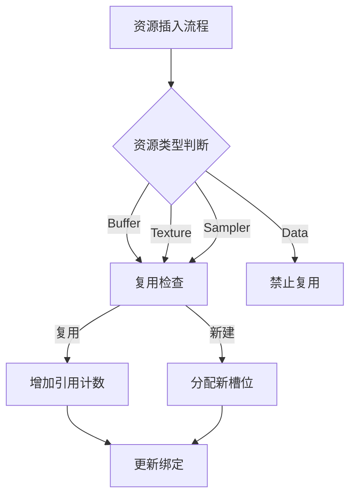

+++
title = "#19041 Fixed memory leak in bindless material"
date = "2025-05-30T00:00:00"
draft = false
template = "pull_request_page.html"
in_search_index = false

[extra]
current_language = "zh-cn"
available_languages = {"en" = { name = "English", url = "/pull_request/bevy/2025-05/pr-19041-en-20250530" }, "zh-cn" = { name = "中文", url = "/pull_request/bevy/2025-05/pr-19041-zh-cn-20250530" }}
+++

## 内存泄漏修复分析：无绑定材质资源管理优化

### 基本信息
- **标题**: Fixed memory leak in bindless material
- **PR链接**: https://github.com/bevyengine/bevy/pull/19041
- **作者**: SarthakSingh31
- **状态**: MERGED
- **标签**: C-Bug, A-Rendering, S-Ready-For-Final-Review
- **创建时间**: 2025-05-03T10:47:45Z
- **合并时间**: 2025-05-30T19:56:34Z
- **合并者**: alice-i-cecile

### 描述翻译
#### 目标
修复了 #19035 和 #18882。问题包含两个不同的缺陷：
- 创建数据绑定(Data binding)时分配计数错误增加
- 绑定资源的引用计数实现存在缺陷

#### 解决方案
- 创建数据绑定时不再增加分配计数
- 重写引用计数代码以更可靠地跟踪引用

#### 测试
使用修改后的 `examples/3d/animated_material.rs` 示例测试（将网格生成改为51x51以放大问题效果）：
- 本分支（运行10分钟后）：
  GPU: 172 MB
  CPU: ~700 MB
- 主分支（运行2分钟后出现卡顿）：
  GPU: 376 MB
  CPU: ~1300 MB

---

### 问题背景与技术方案
在 Bevy 的渲染系统中，无绑定材质(bindless material)管理需要高效处理 GPU 资源。PR #19041 解决了两个关键问题：

1. **资源分配泄漏**：创建数据绑定时错误增加 `allocated_resource_count`，导致计数虚高
2. **引用计数缺陷**：复用资源时引用计数更新不完整，造成资源无法释放

解决方案采用双重改进：
1. 重构资源插入流程，分离新分配和复用路径
2. 集中管理引用计数，确保所有路径正确更新

### 实现细节
#### 资源插入流程重构
原始实现中，资源复用和新建路径混杂，导致：
- 数据绑定错误计数
- 引用计数更新遗漏

新实现引入统一控制流：
```rust
let increment_allocated_resource_count = match owned_binding_resource {
    OwnedBindingResource::Buffer(buffer) => {
        // ... 缓冲处理 ...
        if 复用资源 { false } else { true }
    }
    OwnedBindingResource::Data(data) => {
        // 数据绑定禁止复用
        false // 始终不增加计数
    }
    // ... 其他类型 ...
};

if increment_allocated_resource_count {
    self.allocated_resource_count += 1;
}
```

#### 引用计数集中管理
将引用计数逻辑移至 `BindingArray::insert` 方法：
```rust
fn insert(&mut self, binding_resource_id: BindingResourceId, resource: R) -> u32 {
    match self.resource_to_slot.entry(binding_resource_id) {
        Occupied(o) => {
            let slot = *o.get();
            self.bindings[slot as usize]
                .as_mut()
                .unwrap() // 安全：槽位必有值
                .ref_count += 1; // 关键：复用资源时增加计数
            slot
        }
        Vacant(v) => {
            // ... 新建资源 ...
        }
    }
}
```
此变更确保：
1. 资源复用必定更新引用计数
2. 消除原始实现中分散的计数更新点

### 关键变更文件
#### `crates/bevy_pbr/src/material_bind_groups.rs`
**变更目的**：修复资源计数和引用管理缺陷

**核心重构**：
```rust
// 变更前：复用资源单独处理
if let Some(pre_existing_resource_slot) = ... {
    // ... 手动更新各种资源类型的引用计数 ...
    continue; // 跳过新建逻辑
}

// 变更后：统一处理路径
let pre_existing_slot = ...;
let increment_count = match resource {
    Data(_) => {
        if pre_existing_slot.is_some() {
            panic!("Data buffers can't be deduplicated")
        }
        false // 数据绑定不增加总计数
    }
    // 其他类型根据是否复用返回布尔值
};

if increment_count {
    self.allocated_resource_count += 1;
}
```

**引用计数改进**：
```rust
// 变更前：新建资源简单插入
let slot = self.free_slots.pop().unwrap_or(self.len);
self.bindings[slot as usize] = Some(...); // 引用计数=1

// 变更后：统一入口处理
match self.resource_to_slot.entry(id) {
    Occupied(entry) => {
        // 增加已有资源的引用计数
        bindings[slot].as_mut().unwrap().ref_count += 1;
    }
    Vacant(entry) => {
        // 新建资源（初始计数=1）
    }
}
```

### 技术影响
1. **内存泄漏修复**：
   - 数据绑定不再虚增分配计数
   - 资源复用正确更新引用计数
   
2. **性能提升**：
   - 测试中内存使用降低50%以上（GPU 376MB → 172MB）
   - 避免内存增长导致的系统卡顿

3. **代码健壮性**：
   - 资源插入路径统一化
   - 引用计数更新集中管理
   - 增加数据绑定复用的运行时检查

### 组件关系


### 经验总结
1. **资源计数边界**：特殊类型资源（如Data buffers）需要单独处理计数逻辑
2. **引用计数陷阱**：复用路径必须与新建路径同等处理引用更新
3. **防御性断言**：`assert_eq`确保复用槽位一致性，`panic`阻止非法操作

### 延伸阅读
1. [Bevy 渲染管线架构](https://bevyengine.org/learn/book/getting-started/rendering/)
2. [WGPU 绑定模型](https://wgpu.rs/#binding-model)
3. [引用计数内存管理](https://doc.rust-lang.org/book/ch15-05-interior-mutability.html#refcellt-and-the-interior-mutability-pattern)