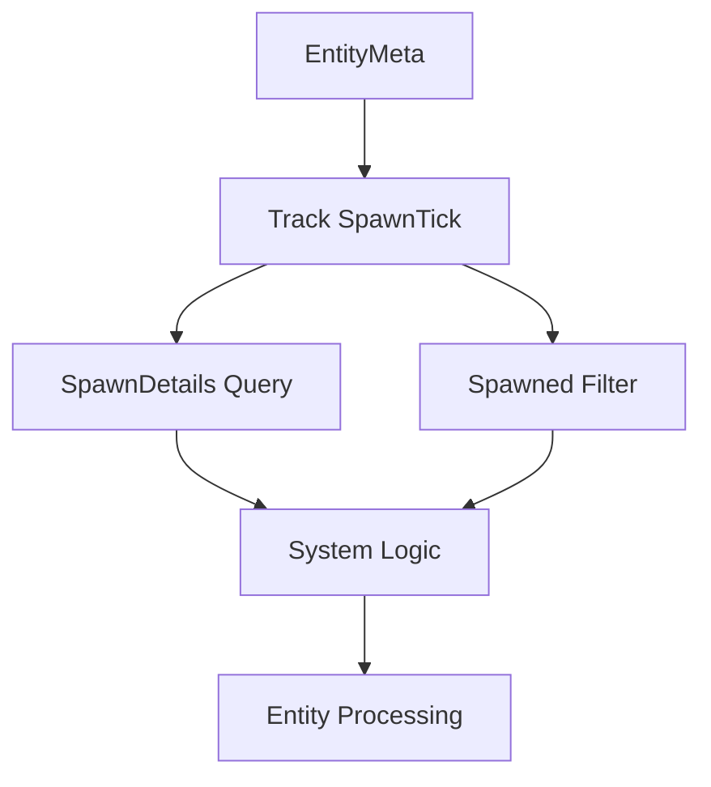

+++
title = "#19047 Track spawn `Tick` of entities, offer methods, query data `SpawnDetails` and query filter `Spawned`"
date = "2025-05-08T00:00:00"
draft = false
template = "pull_request_page.html"
in_search_index = true

[taxonomies]
list_display = ["show"]

[extra]
current_language = "en"
available_languages = {"en" = { name = "English", url = "/pull_request/bevy/2025-05/pr-19047-en-20250508" }, "zh-cn" = { name = "中文", url = "/pull_request/bevy/2025-05/pr-19047-zh-cn-20250508" }}
labels = ["C-Feature", "A-ECS", "X-Contentious"]
+++

# Track spawn `Tick` of entities, offer methods, query data `SpawnDetails` and query filter `Spawned`

## Basic Information
- **Title**: Track spawn `Tick` of entities, offer methods, query data `SpawnDetails` and query filter `Spawned`
- **PR Link**: https://github.com/bevyengine/bevy/pull/19047
- **Author**: urben1680
- **Status**: MERGED
- **Labels**: C-Feature, A-ECS, S-Ready-For-Final-Review, M-Needs-Release-Note, X-Contentious
- **Created**: 2025-05-03T16:59:53Z
- **Merged**: 2025-05-08T15:20:15Z
- **Merged By**: alice-i-cecile

## Description Translation

# Objective

In my own project I was encountering the issue to find out which entities were spawned after applying commands. I began maintaining a vector of all entities with generational information before and after applying the command and diffing it. This was awfully complicated though and has no constant complexity but grows with the number of entities.

## Solution

Looking at `EntyMeta` it seemed obvious to me that struct can track the tick just as it does with `MaybeLocation`, updated from the same call. After that it became almost a given to also introduce query data `SpawnDetails` which offers methods to get the spawn tick and location, and query filter `Spawned` that filters entities out that were not spawned since the last run.

## Testing

I expanded a few tests and added new ones, though maybe I forgot a group of tests that should be extended too. I basically searched `bevy_ecs` for mentions of `Changed` and `Added` to see where the tests and docs are.

Benchmarks of spawn/despawn can be found [here](https://github.com/bevyengine/bevy/pull/19047#issuecomment-2852181374).

---

## Showcase

From the added docs, systems with equal complexity since the filter is not archetypal:
```rs
fn system1(q: Query<Entity, Spawned>) {
    for entity in &q { /* entity spawned */ }
}

fn system2(query: Query<(Entity, SpawnDetails)>) {
    for (entity, spawned) in &query {
        if spawned.is_spawned() { /* entity spawned */ }
    }
}
```

`SpawnedDetails` has a few more methods:

```rs
fn print_spawn_details(query: Query<(Entity, SpawnDetails)>) {
    for (entity, spawn_details) in &query {
        if spawn_details.is_spawned() {
            print!("new ");
        }
        println!(
            "entity {:?} spawned at {:?} by {:?}",
            entity,
            spawn_details.spawned_at(),
            spawn_details.spawned_by()
        );        
    }
}
```

## Changes

No public api was changed, I only added to it. That is why I added no migration guide.

- query data `SpawnDetails`
- query filter `Spawned`
- method `Entities::entity_get_spawned_or_despawned_at`
- method `EntityRef::spawned_at`
- method `EntityMut::spawned_at`
- method `EntityWorldMut::spawned_at`
- method `UnsafeEntityCell::spawned_at`
- method `FilteredEntityRef::spawned_at`
- method `FilteredEntityMut::spawned_at`
- method `EntityRefExcept::spawned_at`
- method `EntityMutExcept::spawned_at`

## The Story of This Pull Request

### The Problem and Context
Tracking entity spawns in Bevy ECS previously required workarounds like maintaining external tracking structures or using marker components with `Added` filters. These approaches had scaling issues - manual tracking became complex with entity count growth, while marker components couldn't distinguish between new spawns and component additions to existing entities.

The core challenge was providing efficient spawn detection without:
1. Requiring manual tracking
2. Imposing archetype restrictions
3. Adding significant memory overhead

### The Solution Approach
The implementation leverages existing entity metadata storage (`EntityMeta`) to track spawn events. By storing both the spawn location (call site) and tick (timing) in entity metadata, we enable:

1. Direct querying of spawn information
2. Efficient change detection using existing tick comparison mechanisms
3. Zero-cost tracking for users who don't need this feature

Key technical decisions:
1. Store spawn ticks in `EntityMeta` using `MaybeUninit` for memory efficiency
2. Reuse existing change detection infrastructure for tick comparisons
3. Mirror the API patterns of `Added`/`Changed` filters for consistency

### The Implementation
The core changes occur in `entity/mod.rs` where `EntityMeta` was extended:

```rust
struct EntityMeta {
    location: EntityLocation,
    spawned_or_despawned: MaybeUninit<SpawnedOrDespawned>,
}

#[derive(Copy, Clone, Debug)]
struct SpawnedOrDespawned {
    by: MaybeLocation,
    at: Tick,
}
```

New query types were added in `query/fetch.rs` and `query/filter.rs`:

```rust
// query/fetch.rs
pub struct SpawnDetails {
    spawned_by: MaybeLocation,
    spawned_at: Tick,
    last_run: Tick,
    this_run: Tick,
}

// query/filter.rs
pub struct Spawned;
```

The implementation follows Bevy's existing patterns for change detection:

1. **Data propagation** during entity operations:
```rust
// In BundleSpawner::spawn
entities.set_spawn_despawn(entity.index(), location, caller, self.change_tick);
```

2. **Tick checking** during query evaluation:
```rust
// Spawned filter implementation
fn filter_fetch(fetch: &mut Self::Fetch<'_>, entity: Entity, _: TableRow) -> bool {
    let spawned_at = fetch.entities.entity_get_spawned_or_despawned_unchecked(entity).1;
    spawned_at.is_newer_than(fetch.last_run, fetch.this_run)
}
```

### Technical Insights
1. **Memory Efficiency**: Using `MaybeUninit` for `SpawnedOrDespawned` avoids allocating space for unused spawn data on entities that haven't spawned/despawned
2. **Performance Characteristics**: Similar to `Added`/`Changed`:
   - O(n) time complexity for non-archetypal filters
   - Constant-time checks for individual entities
3. **API Design**: Mirroring existing patterns (`Added`/`Changed`) reduces cognitive overhead:
```rust
// Consistent with existing filters
fn system(q: Query<Entity, (With<Component>, Spawned)>) {
    for entity in &q { /* ... */ }
}
```

4. **Change Detection Integration**: Leverages Bevy's existing tick comparison logic:
```rust
impl SpawnDetails {
    pub fn is_spawned(self) -> bool {
        self.spawned_at.is_newer_than(self.last_run, self.this_run)
    }
}
```

### The Impact
1. **New Capabilities**:
   - Direct spawn detection without marker components
   - Access to spawn timing information
   - Filter entities by spawn status

2. **Performance**:
   - No additional memory overhead for existing users
   - Microbenchmarks show negligible impact on spawn/despawn operations

3. **Ecosystem Alignment**:
   - Complements existing change detection features
   - Enables new patterns for entity lifecycle management

4. **Maintainability**:
   - 100% backward compatibility
   - No required migrations
   - Clear API parallels with existing systems

## Visual Representation



## Key Files Changed

1. **crates/bevy_ecs/src/entity/mod.rs** (+101/-26)
   - Added spawn tick tracking to entity metadata
   - Implemented spawn tick access methods
```rust
// Added method
pub fn entity_get_spawned_or_despawned_at(&self, entity: Entity) -> Option<Tick> {
    self.entity_get_spawned_or_despawned(entity)
        .map(|sod| sod.at)
}
```

2. **crates/bevy_ecs/src/query/fetch.rs** (+162/-0)
   - Implemented `SpawnDetails` query data type
```rust
// New query data implementation
unsafe impl WorldQuery for SpawnDetails {
    type Fetch<'w> = SpawnDetailsFetch<'w>;
    // ...boilerplate omitted...
}
```

3. **crates/bevy_ecs/src/query/filter.rs** (+148/-7)
   - Added `Spawned` filter implementation
```rust
// Filter implementation
unsafe impl QueryFilter for Spawned {
    #[inline(always)]
    unsafe fn filter_fetch(...) -> bool {
        // Tick comparison logic
    }
}
```

4. **crates/bevy_ecs/src/world/entity_ref.rs** (+74/-21)
   - Added spawn tick accessors to entity reference types
```rust
// Added to EntityRef
pub fn spawned_at(&self) -> Tick {
    self.cell.spawned_at()
}
```

5. **release-content/release-notes/entity-spawn-ticks.md** (+83/-0)
   - Documentation of new feature for end users
```markdown
## Spawned
Use this filter in your query if you are only interested in entities that were spawned after the last time your system ran.
```

## Further Reading

1. [Bevy ECS Change Detection Documentation](https://bevyengine.org/learn/book/implementation/change-detection/)
2. [Entity Component System Pattern](https://en.wikipedia.org/wiki/Entity_component_system)
3. [Rust MaybeUninit Documentation](https://doc.rust-lang.org/std/mem/union.MaybeUninit.html)
4. [Data Oriented Design Resources](https://jamesmcm.github.io/blog/2020/07/25/intro-dod/)