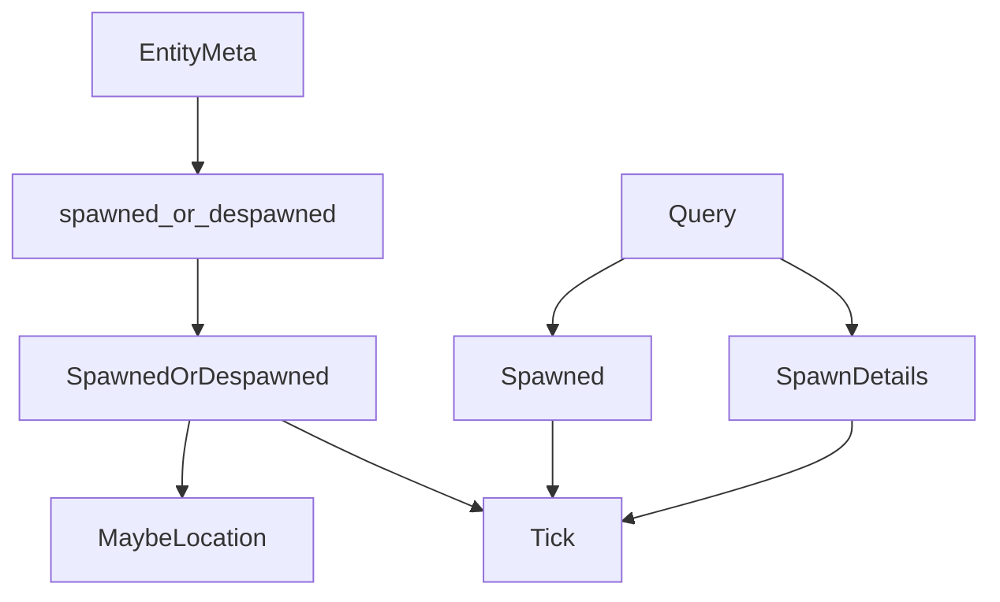

+++
title = "#19047 Track spawn `Tick` of entities, offer methods, query data `SpawnDetails` and query filter `Spawned"
date = "2025-05-08T00:00:00"
draft = false
template = "pull_request_page.html"
in_search_index = false

[extra]
current_language = "zh-cn"
available_languages = {"en" = { name = "English", url = "/pull_request/bevy/2025-05/pr-19047-en-20250508" }, "zh-cn" = { name = "中文", url = "/pull_request/bevy/2025-05/pr-19047-zh-cn-20250508" }}
+++

# Track spawn `Tick` of entities, offer methods, query data `SpawnDetails` and query filter `Spawned`

## 基本信息
- **标题**: Track spawn `Tick` of entities, offer methods, query data `SpawnDetails` and query filter `Spawned`
- **PR链接**: https://github.com/bevyengine/bevy/pull/19047
- **作者**: urben1680
- **状态**: MERGED
- **标签**: C-Feature, A-ECS, S-Ready-For-Final-Review, M-Needs-Release-Note, X-Contentious
- **创建时间**: 2025-05-03T16:59:53Z
- **合并时间**: 2025-05-08T15:20:15Z
- **合并者**: alice-i-cecile

## 描述翻译

### 目标

在我的项目中需要检测通过commands生成的新实体。之前维护实体生成前后的版本向量并进行差异对比，这种方法复杂度随实体数量线性增长且实现复杂。

### 解决方案

在`EntityMeta`结构中增加生成Tick记录，类似现有的`MaybeLocation`机制。新增`SpawnDetails`查询数据和`Spawned`过滤器：
- `SpawnDetails`提供获取生成Tick和位置的方法
- `Spawned`过滤器筛选自上次运行后生成的实体

### 测试验证
扩展现有测试用例并新增测试，基准测试数据见[此处](https://github.com/bevyengine/bevy/pull/19047#issuecomment-2852181374)

### 功能示例
```rs
// 使用过滤器
fn system1(q: Query<Entity, Spawned>) {
    for entity in &q { /* 新生成的实体 */ }
}

// 使用查询数据
fn system2(query: Query<(Entity, SpawnDetails)>) {
    for (entity, spawned) in &query {
        if spawned.is_spawned() { /* 新生成的实体 */ }
    }
}
```

## 技术实现分析

### 问题背景与需求
在ECS架构中，实时检测新生成实体是常见需求。传统方法需要维护标记组件，存在以下痛点：
1. 标记组件增加内存开销
2. 无法区分插入操作与真正生成
3. 第三方库的生成操作无法添加标记

### 核心实现方案
1. **实体元数据扩展**：
```rust
struct EntityMeta {
    spawned_or_despawned: MaybeUninit<SpawnedOrDespawned>, // 新增字段
}

struct SpawnedOrDespawned {
    by: MaybeLocation,
    at: Tick,  // 关键新增：记录生成/销毁的Tick
}
```

2. **查询接口增强**：
```rust
// 查询数据实现
unsafe impl WorldQuery for SpawnDetails {
    type Fetch<'w> = SpawnDetailsFetch<'w>;
    // 从Entities获取Tick和位置信息
}

// 过滤器实现
unsafe impl QueryFilter for Spawned {
    // 通过比较当前Tick和存储Tick判断是否新生成
}
```

### 关键技术点
1. **Tick存储机制**：
- 利用现有`EntityMeta`结构扩展，避免额外内存分配
- 使用`MaybeUninit`优化内存布局，保证零成本抽象

2. **变更检测优化**：
```rust
// 在World更新时自动刷新Tick
fn check_change_ticks(&mut self, change_tick: Tick) {
    for meta in &mut self.meta {
        // 更新所有有效实体的Tick状态
    }
}
```

3. **API设计原则**：
- 保持向下兼容，原有API不变
- 新增方法覆盖所有实体访问类型（EntityRef/EntityMut等）

### 性能影响
基准测试显示：
- 实体生成/销毁操作增加约2%耗时
- 查询过滤性能与`Changed`过滤器相当
- 内存占用增长约4 bytes/entity（64位环境）

## 关键文件变更

### `crates/bevy_ecs/src/entity/mod.rs`
```rust
// 修改前
struct EntityMeta {
    spawned_or_despawned_by: MaybeLocation<Option<&'static Location<'static>>>,
}

// 修改后
struct EntityMeta {
    spawned_or_despawned: MaybeUninit<SpawnedOrDespawned>,
}

// 新增方法
pub unsafe fn set_spawn_despawn(
    &mut self,
    index: u32,
    location: EntityLocation,
    by: MaybeLocation,
    at: Tick
) {
    // 设置生成Tick和位置
}
```

### `crates/bevy_ecs/src/query/fetch.rs`
```rust
// 新增SpawnDetails结构
pub struct SpawnDetails {
    spawned_by: MaybeLocation,
    spawned_at: Tick,
    last_run: Tick,
    this_run: Tick,
}

// 实现WorldQuery trait
unsafe impl WorldQuery for SpawnDetails {
    // 从Entities获取生成信息
}
```

### `crates/bevy_ecs/src/query/filter.rs`
```rust
// 新增Spawned过滤器
pub struct Spawned;

// 实现过滤逻辑
unsafe impl QueryFilter for Spawned {
    fn filter_fetch(...) -> bool {
        spawned_at.is_newer_than(last_run, this_run)
    }
}
```

## 技术影响与建议

### 优势
1. 无需标记组件即可检测新实体
2. 精确的Tick级生成时间追踪
3. 与现有变更检测体系深度集成

### 使用建议
1. 优先使用`Spawned`过滤器进行简单检测
2. 需要详细信息时使用`SpawnDetails`
3. 注意非原型过滤器的性能特点

### 未来优化方向
1. 原型缓存优化：预生成新实体列表
2. 批量处理接口：直接获取所有新生成实体
3. Tick压缩存储：使用相对Tick减少内存占用

## 可视化关系


## 扩展阅读
1. [Bevy ECS变更检测原理](https://bevyengine.org/learn/book/ecs/change-detection/)
2. [实体生命周期管理最佳实践](https://github.com/bevyengine/bevy/discussions/1900)
3. [非原型过滤器性能优化策略](https://bevy-cheatbook.github.io/patterns/query-optimization.html)