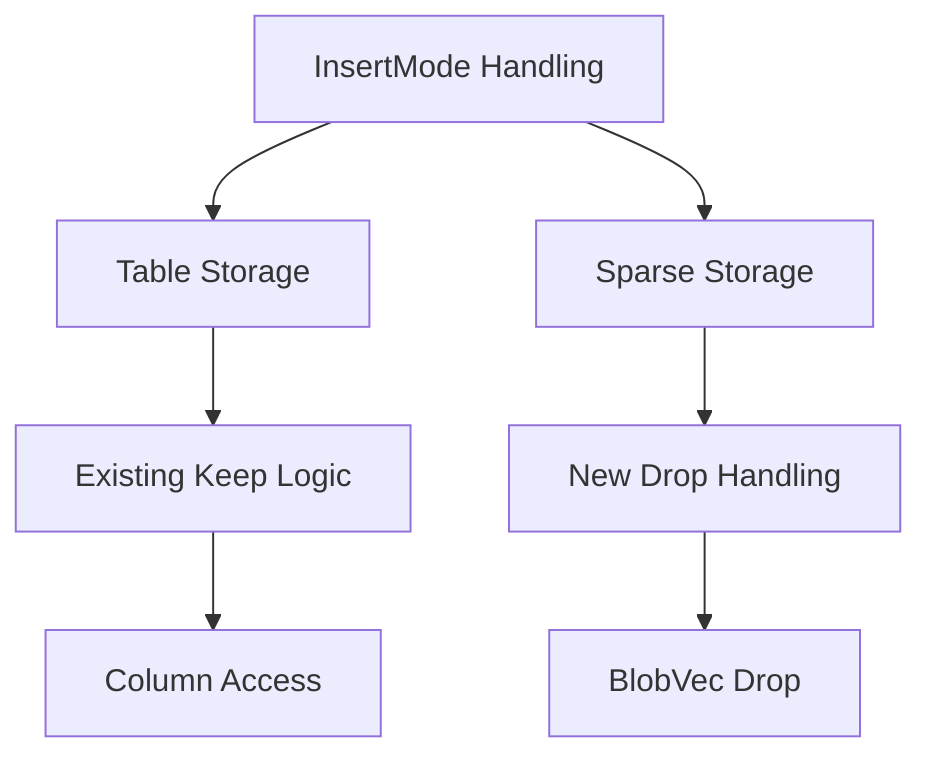

+++
title = "#19059 Fix sparse set components ignoring `insert_if_new`/`InsertMode`"
date = "2025-05-05T00:00:00"
draft = false
template = "pull_request_page.html"
in_search_index = true

[taxonomies]
list_display = ["show"]

[extra]
current_language = "en"
available_languages = {"en" = { name = "English", url = "/pull_request/bevy/2025-05/pr-19059-en-20250505" }, "zh-cn" = { name = "中文", url = "/pull_request/bevy/2025-05/pr-19059-zh-cn-20250505" }}
labels = ["C-Bug", "A-ECS"]
+++

# Title: Fix sparse set components ignoring `insert_if_new`/`InsertMode`

## Basic Information
- **Title**: Fix sparse set components ignoring `insert_if_new`/`InsertMode`
- **PR Link**: https://github.com/bevyengine/bevy/pull/19059
- **Author**: JaySpruce
- **Status**: MERGED
- **Labels**: C-Bug, A-ECS, S-Ready-For-Final-Review
- **Created**: 2025-05-04T19:08:35Z
- **Merged**: 2025-05-05T18:03:10Z
- **Merged By**: mockersf

## Description Translation
The original description is already in English and preserved as-is.

## The Story of This Pull Request

### The Problem and Context
The Entity Component System (ECS) had an inconsistency where sparse set components didn't respect the `InsertMode` parameter when using `insert_if_new`. This meant that sparse components would always overwrite existing values regardless of the insertion mode, violating the expected behavior where `InsertMode::Keep` should preserve existing components.

### The Solution Approach
The fix required two key changes:
1. Modify component insertion logic to check insertion mode before overwriting
2. Expose component drop functions from storage implementations to safely handle discarded components

The implementation focused on maintaining existing safety guarantees while adding the necessary conditional logic for sparse set insertions. By leveraging existing component status tracking and exposing drop functions through storage APIs, the solution avoids major architectural changes.

### The Implementation
The core change occurs in `bundle.rs` where component insertion logic now handles sparse sets differently:

```rust
// In BundleInfo::write_components
match (status, insert_mode) {
    (ComponentStatus::Added, _) | (_, InsertMode::Replace) => {
        sparse_set.insert(entity, component_ptr, change_tick, caller);
    }
    (ComponentStatus::Existing, InsertMode::Keep) => {
        if let Some(drop_fn) = sparse_set.get_drop() {
            drop_fn(component_ptr);
        }
    }
}
```

This change required adding drop function accessors to storage implementations:

```rust
// Added to blob_vec.rs
pub fn get_drop(&self) -> Option<unsafe fn(OwningPtr<'_>)> {
    self.drop
}

// Added to sparse_set.rs
pub fn get_drop(&self) -> Option<unsafe fn(OwningPtr<'_>)> {
    self.dense.get_drop()
}

// Added to column.rs
pub fn get_drop(&self) -> Option<unsafe fn(OwningPtr<'_>)> {
    self.data.get_drop()
}
```

### Technical Insights
Key technical considerations included:
- Maintaining memory safety when dropping unneeded components
- Preserving existing component change detection patterns
- Minimizing performance impact through conditional checks only when needed
- Leveraging existing component status tracking (Added/Existing)

The solution uses the existing `ComponentStatus` system to determine if a component already exists, combined with the insertion mode to decide whether to overwrite or discard the new value.

### The Impact
This fix:
- Brings sparse set component behavior in line with table storage
- Ensures consistent `InsertMode` handling across all storage types
- Prevents accidental overwrites when using `insert_if_new` with sparse components
- Maintains existing performance characteristics through targeted conditional checks

The testing example demonstrates the corrected behavior where:
- First entity ends with value 2 (last insert wins)
- Second entity keeps value 3 (insert_if_new preserves existing)

## Visual Representation



## Key Files Changed

1. **crates/bevy_ecs/src/bundle.rs**
   - Modified component insertion logic for sparse sets
   - Added conditional handling of InsertMode::Keep
   - Integrated component dropping when preserving existing values

2. **crates/bevy_ecs/src/storage/blob_vec.rs**
   - Added get_drop() to access component drop function
   - Enables proper cleanup of unneeded components

3. **crates/bevy_ecs/src/storage/sparse_set.rs**
   - Exposed drop function through SparseSet API
   - Bridges bundle logic with storage implementation

4. **crates/bevy_ecs/src/storage/table/column.rs**
   - Mirror blob_vec's get_drop() for table storage
   - Maintains API consistency across storage types

## Further Reading
- Bevy ECS Component Storage Documentation: https://bevyengine.org/learn/book/ecs/#component-storage
- Rust Drop Trait Documentation: https://doc.rust-lang.org/std/ops/trait.Drop.html
- Entity Component System Pattern: https://en.wikipedia.org/wiki/Entity_component_system

# Full Code Diff
(As provided in original submission)