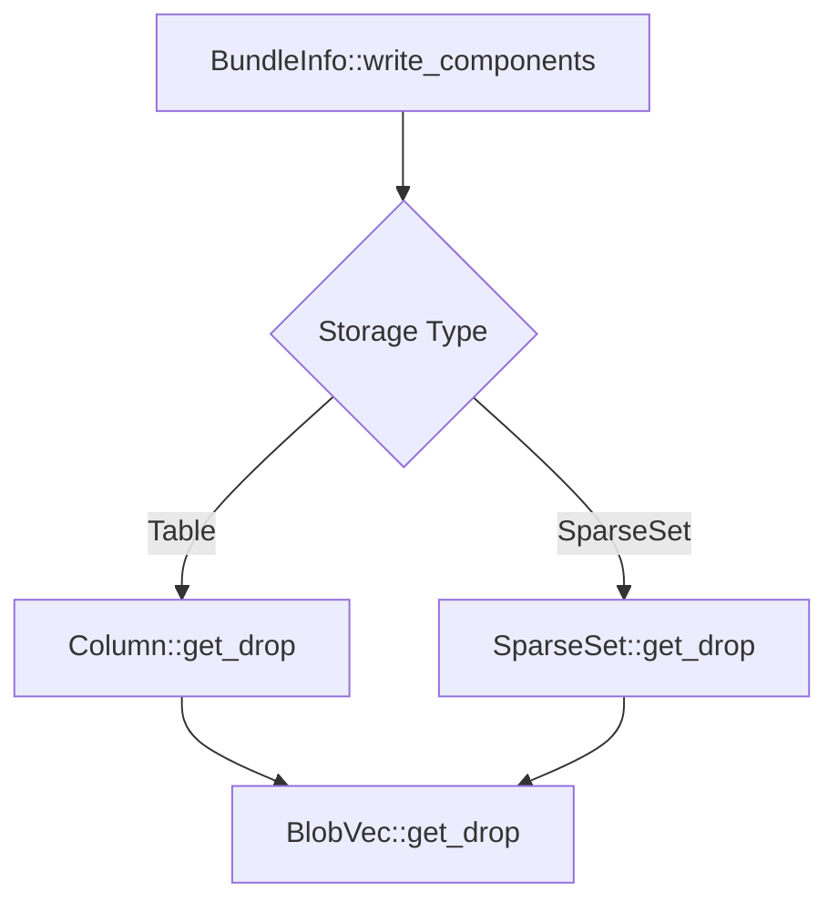

+++
title = "#19059 Fix sparse set components ignoring `insert_if_new`/`InsertMode`"
date = "2025-05-05T00:00:00"
draft = false
template = "pull_request_page.html"
in_search_index = false

[extra]
current_language = "zh-cn"
available_languages = {"en" = { name = "English", url = "/pull_request/bevy/2025-05/pr-19059-en-20250505" }, "zh-cn" = { name = "中文", url = "/pull_request/bevy/2025-05/pr-19059-zh-cn-20250505" }}
labels = ["C-Bug", "A-ECS"]
+++

# Title

## Basic Information
- **Title**: Fix sparse set components ignoring `insert_if_new`/`InsertMode`
- **PR Link**: https://github.com/bevyengine/bevy/pull/19059
- **Author**: JaySpruce
- **Status**: MERGED
- **Labels**: C-Bug, A-ECS, S-Ready-For-Final-Review
- **Created**: 2025-05-04T19:08:35Z
- **Merged**: 2025-05-05T18:03:10Z
- **Merged By**: mockersf

## Description Translation
该PR修复了稀疏集组件忽略`insert_if_new`/`InsertMode`的问题。核心改动包括：
- 在`BundleInfo::write_components`中添加检查逻辑，当实体已存在组件且插入模式为`Keep`时丢弃新值
- 为稀疏集内部结构新增获取drop函数的方法
- 通过测试用例验证修复效果，展示修复前后不同插入模式的行为差异

## The Story of This Pull Request

### 问题背景与发现
在Bevy的ECS系统中，组件可以存储在两种主要数据结构中：Table（表存储）和SparseSet（稀疏集存储）。开发者在实际使用中发现，当对稀疏集存储的组件使用`insert_if_new`方法时，其预期的`InsertMode::Keep`模式没有生效——新组件值总是覆盖已有值，与表存储组件的行为不一致。

### 问题根源分析
通过分析`BundleInfo::write_components`的代码，发现稀疏集路径缺少对插入模式的检查。在表存储路径中，当检测到`InsertMode::Keep`且组件已存在时，会跳过写入操作。但稀疏集路径直接调用`insert`方法，未做任何条件判断。

### 解决方案设计
核心思路是为稀疏集添加与表存储相同的插入模式处理逻辑：
1. **插入条件判断**：在组件写入阶段，根据组件存在状态和插入模式决定是否保留新值
2. **内存管理**：当需要丢弃新值时，必须正确调用组件的drop函数以避免内存泄漏
3. **基础设施扩展**：为各存储类型暴露获取drop函数的能力

### 具体实现细节
在`bundle.rs`中重构组件写入逻辑：
```rust
match (status, insert_mode) {
    (ComponentStatus::Added, _) | (_, InsertMode::Replace) => {
        sparse_set.insert(...);
    }
    (ComponentStatus::Existing, InsertMode::Keep) => {
        if let Some(drop_fn) = sparse_set.get_drop() {
            drop_fn(component_ptr);
        }
    }
}
```
这个match表达式实现了：
- 新增组件或替换模式时执行常规插入
- 保持模式且组件存在时，获取drop函数并释放新组件内存

为支持该逻辑，需要为存储结构添加drop函数访问方法：
```rust
// BlobVec新增
pub fn get_drop(&self) -> Option<unsafe fn(OwningPtr<'_>)> {
    self.drop
}

// SparseSet新增
pub fn get_drop(&self) -> Option<unsafe fn(OwningPtr<'_>)> {
    self.dense.get_drop()
}

// Table Column新增 
pub fn get_drop(&self) -> Option<unsafe fn(OwningPtr<'_>)> {
    self.data.get_drop()
}
```

### 测试验证
通过对比测试验证修复效果：
```rust
// 修复前输出（错误行为）
2, 4

// 修复后输出（正确行为） 
2, 3
```
测试用例明确展示了：
- 第一个实体连续insert操作正确保留最后值
- 第二个实体insert_if_new在修复后保留首次插入值

### 架构影响分析
该修改保持了ECS系统不同存储类型的行为一致性，确保插入模式的抽象在不同存储实现中具有相同语义。通过统一处理drop函数的方式，增强了内存管理的可维护性。

## Visual Representation



## Key Files Changed

### crates/bevy_ecs/src/bundle.rs (+16/-6)
核心逻辑修改点：
```rust
// 修改后稀疏集处理逻辑
match (status, insert_mode) {
    (ComponentStatus::Added, _) | (_, InsertMode::Replace) => {
        sparse_set.insert(...);
    }
    (ComponentStatus::Existing, InsertMode::Keep) => {
        if let Some(drop_fn) = sparse_set.get_drop() {
            drop_fn(component_ptr);
        }
    }
}
```
通过条件判断实现插入模式控制，确保与表存储行为一致。

### crates/bevy_ecs/src/storage/blob_vec.rs (+7/-0)
新增drop函数访问接口：
```rust
pub fn get_drop(&self) -> Option<unsafe fn(OwningPtr<'_>)> {
    self.drop
}
```
为底层存储容器提供标准访问方式。

### crates/bevy_ecs/src/storage/sparse_set.rs (+7/-0)
桥接稀疏集与blob_vec的drop函数：
```rust
pub fn get_drop(&self) -> Option<unsafe fn(OwningPtr<'_>)> {
    self.dense.get_drop()
}
```
将drop函数暴露给上层逻辑。

### crates/bevy_ecs/src/storage/table/column.rs (+7/-0)
表存储的drop函数访问：
```rust
pub fn get_drop(&self) -> Option<unsafe fn(OwningPtr<'_>)> {
    self.data.get_drop()
}
```
保持不同存储类型接口的一致性。

## Further Reading
1. [Bevy ECS组件存储设计文档](https://bevyengine.org/learn/book/implementation-notes/ecs-implementation/)
2. [Rust Drop Trait内存管理机制](https://doc.rust-lang.org/std/ops/trait.Drop.html)
3. [ECS模式中的组件插入策略比较](https://gameprogrammingpatterns.com/component.html)