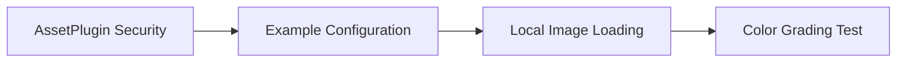

+++
title = "#19061 Fix tonemapping example when using a local image"
date = "2025-05-05T00:00:00"
draft = false
template = "pull_request_page.html"
in_search_index = true

[taxonomies]
list_display = ["show"]

[extra]
current_language = "en"
available_languages = {"en" = { name = "English", url = "/pull_request/bevy/2025-05/pr-19061-en-20250505" }, "zh-cn" = { name = "中文", url = "/pull_request/bevy/2025-05/pr-19061-zh-cn-20250505" }}
labels = ["C-Bug", "A-Rendering", "C-Examples", "A-Assets"]
+++

# Title: Fix tonemapping example when using a local image

## Basic Information
- **Title**: Fix tonemapping example when using a local image
- **PR Link**: https://github.com/bevyengine/bevy/pull/19061
- **Author**: mcobzarenco
- **Status**: MERGED
- **Labels**: C-Bug, A-Rendering, C-Examples, A-Assets, S-Ready-For-Final-Review
- **Created**: 2025-05-04T19:57:53Z
- **Merged**: 2025-05-05T18:03:10Z
- **Merged By**: mockersf

## Description Translation
The original description is in English and preserved as-is:

# Objective

- The tonemapping example allows using a local image to try out different color grading. However, using a local file stopped working when we added the `UnapprovedPathMode` setting to the assets plugin.

## Solution

- Set `unapproved_path_mode: UnapprovedPathMode::Allow` in the example

## Testing

- I tried out the example with local images, previously it would fail saying it's an untrusted path.

## The Story of This Pull Request

The tonemapping example faced a regression after Bevy introduced stricter asset path security measures. When the engine added `UnapprovedPathMode` to the AssetPlugin, it defaulted to blocking untrusted paths as a security precaution. This broke the example's intended functionality of testing with arbitrary local images through drag-and-drop.

The core issue stemmed from the example's need to load assets from user-specified paths while the new security system required explicit approval. The fix required modifying the example's plugin configuration to temporarily relax this restriction without affecting the engine's default security posture.

The implementation specifically targeted the example's setup code where the AssetPlugin is configured. By setting `unapproved_path_mode: UnapprovedPathMode::Allow`, the example regained its ability to load local images while maintaining security defaults for regular applications. This targeted approach demonstrates how to safely override security settings for specific use cases without compromising system-wide protections.

The key code change shows how to customize plugin settings while preserving other defaults:

```rust
DefaultPlugins.set(AssetPlugin {
    unapproved_path_mode: UnapprovedPathMode::Allow,
    ..default()
})
```

This pattern uses Rust's struct update syntax to maintain other AssetPlugin defaults while overriding the security setting. The change affects only the example's execution context, leaving the engine's core behavior intact.

## Visual Representation



## Key Files Changed

**File**: `examples/3d/tonemapping.rs` (+7/-1)

Before:
```rust
DefaultPlugins,
```

After:
```rust
DefaultPlugins.set(AssetPlugin {
    // We enable loading assets from arbitrary filesystem paths as this example allows
    // drag and dropping a local image for color grading
    unapproved_path_mode: UnapprovedPathMode::Allow,
    ..default()
}),
```

The modification demonstrates proper configuration of asset security settings for example code requiring flexible file access. The comment explicitly documents the reason for overriding the default security policy.

## Further Reading

- Bevy Asset System Documentation: https://bevyengine.org/learn/book/assets/
- Rust Struct Update Syntax: https://doc.rust-lang.org/book/ch05-01-defining-structs.html#creating-instances-from-other-instances-with-struct-update-syntax
- Bevy Security Best Practices: https://bevyengine.org/learn/security-best-practices/

# Full Code Diff
```diff
diff --git a/examples/3d/tonemapping.rs b/examples/3d/tonemapping.rs
index 2fb671c0f6d9a..66b7d76ce950f 100644
--- a/examples/3d/tonemapping.rs
+++ b/examples/3d/tonemapping.rs
@@ -1,6 +1,7 @@
 //! This examples compares Tonemapping options
 
 use bevy::{
+    asset::UnapprovedPathMode,
     core_pipeline::tonemapping::Tonemapping,
     pbr::CascadeShadowConfigBuilder,
     platform::collections::HashMap,
@@ -19,7 +20,12 @@ const SHADER_ASSET_PATH: &str = "shaders/tonemapping_test_patterns.wgsl";
 fn main() {
     App::new()
         .add_plugins((
-            DefaultPlugins,
+            DefaultPlugins.set(AssetPlugin {
+                // We enable loading assets from arbitrary filesystem paths as this example allows
+                // drag and dropping a local image for color grading
+                unapproved_path_mode: UnapprovedPathMode::Allow,
+                ..default()
+            }),
             MaterialPlugin::<ColorGradientMaterial>::default(),
         ))
         .insert_resource(CameraTransform(
```