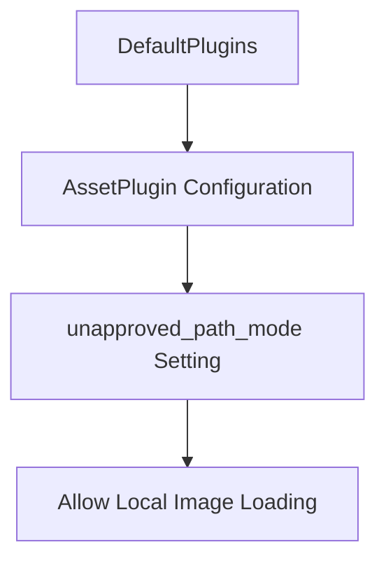

+++
title = "#19061 Fix tonemapping example when using a local image"
date = "2025-05-05T00:00:00"
draft = false
template = "pull_request_page.html"
in_search_index = false

[extra]
current_language = "zh-cn"
available_languages = {"en" = { name = "English", url = "/pull_request/bevy/2025-05/pr-19061-en-20250505" }, "zh-cn" = { name = "中文", url = "/pull_request/bevy/2025-05/pr-19061-zh-cn-20250505" }}
labels = ["C-Bug", "A-Rendering", "C-Examples", "A-Assets"]
+++

# Fix tonemapping example when using a local image

## Basic Information
- **Title**: Fix tonemapping example when using a local image
- **PR Link**: https://github.com/bevyengine/bevy/pull/19061
- **Author**: mcobzarenco
- **Status**: MERGED
- **Labels**: C-Bug, A-Rendering, C-Examples, A-Assets, S-Ready-For-Final-Review
- **Created**: 2025-05-04T19:57:53Z
- **Merged**: 2025-05-05T18:03:10Z
- **Merged By**: mockersf

## Description Translation
### 目标

- tonemapping 示例允许使用本地图片测试不同的颜色分级效果。但当我们在 assets plugin 中添加 `UnapprovedPathMode` 设置后，使用本地文件的功能失效。

### 解决方案

- 在示例中设置 `unapproved_path_mode: UnapprovedPathMode::Allow`

### 测试

- 使用本地图片测试示例，之前会报错提示路径不受信任，现在可以正常工作

## The Story of This Pull Request

这个 PR 的核心问题源于 Bevy 引擎安全机制的升级。当 assets plugin 新增了 `UnapprovedPathMode` 安全设置后，tonemapping 示例中原本允许用户拖放本地图片进行颜色分级测试的功能因路径验证失败而失效。

问题的技术根源在于 `UnapprovedPathMode` 的默认安全策略。Bevy 在 0.13 版本引入该机制后，默认会阻止从非预定路径加载资源。这种设计虽然增强了安全性，但破坏了示例项目中需要动态加载用户指定本地文件的功能。

解决方案直接而精准：在示例代码中显式配置 asset plugin，将 `unapproved_path_mode` 设置为 Allow。这种处理方式既保持了引擎默认的安全策略，又在需要灵活性的示例场景中开放了必要的权限。

具体实现时，开发者通过链式调用修改插件配置：
```rust
DefaultPlugins.set(AssetPlugin {
    unapproved_path_mode: UnapprovedPathMode::Allow,
    ..default()
})
```
这种模式保留了其他默认插件配置，仅覆盖需要调整的参数，体现了 Bevy 插件系统的灵活性。代码改动量虽小（仅 7 行新增 1 行删除），但精准解决了功能阻断问题。

该修复对用户体验有直接影响：用户现在可以继续使用示例的核心交互功能，通过拖放本地图片测试不同的 tonemapping 效果。同时保持引擎默认的安全设置，避免对其他项目产生意外影响。

## Visual Representation



## Key Files Changed

### `examples/3d/tonemapping.rs` (+7/-1)
关键修改：调整 asset plugin 配置以允许加载本地资源

代码对比：
```rust
// 修改前：
.add_plugins((
    DefaultPlugins,
    MaterialPlugin::<ColorGradientMaterial>::default(),
))

// 修改后：
.add_plugins((
    DefaultPlugins.set(AssetPlugin {
        unapproved_path_mode: UnapprovedPathMode::Allow,
        ..default()
    }),
    MaterialPlugin::<ColorGradientMaterial>::default(),
))
```
修改说明：
- 通过 `set()` 方法自定义 AssetPlugin 配置
- 保持其他默认配置 (`..default()`)
- 显式允许未批准路径的访问权限

## Further Reading

1. Bevy 官方文档 - 资源加载安全策略:  
   https://docs.rs/bevy/latest/bevy/asset/struct.AssetPlugin.html
2. UnapprovedPathMode 枚举类型文档:  
   https://docs.rs/bevy/latest/bevy/asset/enum.UnapprovedPathMode.html
3. Bevy 示例项目最佳实践:  
   https://github.com/bevyengine/bevy/blob/main/examples/README.md

# Full Code Diff
diff --git a/examples/3d/tonemapping.rs b/examples/3d/tonemapping.rs
index 2fb671c0f6d9a..66b7d76ce950f 100644
--- a/examples/3d/tonemapping.rs
+++ b/examples/3d/tonemapping.rs
@@ -1,6 +1,7 @@
 //! This examples compares Tonemapping options
 
 use bevy::{
+    asset::UnapprovedPathMode,
     core_pipeline::tonemapping::Tonemapping,
     pbr::CascadeShadowConfigBuilder,
     platform::collections::HashMap,
@@ -19,7 +20,12 @@ const SHADER_ASSET_PATH: &str = "shaders/tonemapping_test_patterns.wgsl";
 fn main() {
     App::new()
         .add_plugins((
-            DefaultPlugins,
+            DefaultPlugins.set(AssetPlugin {
+                // We enable loading assets from arbitrary filesystem paths as this example allows
+                // drag and dropping a local image for color grading
+                unapproved_path_mode: UnapprovedPathMode::Allow,
+                ..default()
+            }),
             MaterialPlugin::<ColorGradientMaterial>::default(),
         ))
         .insert_resource(CameraTransform(