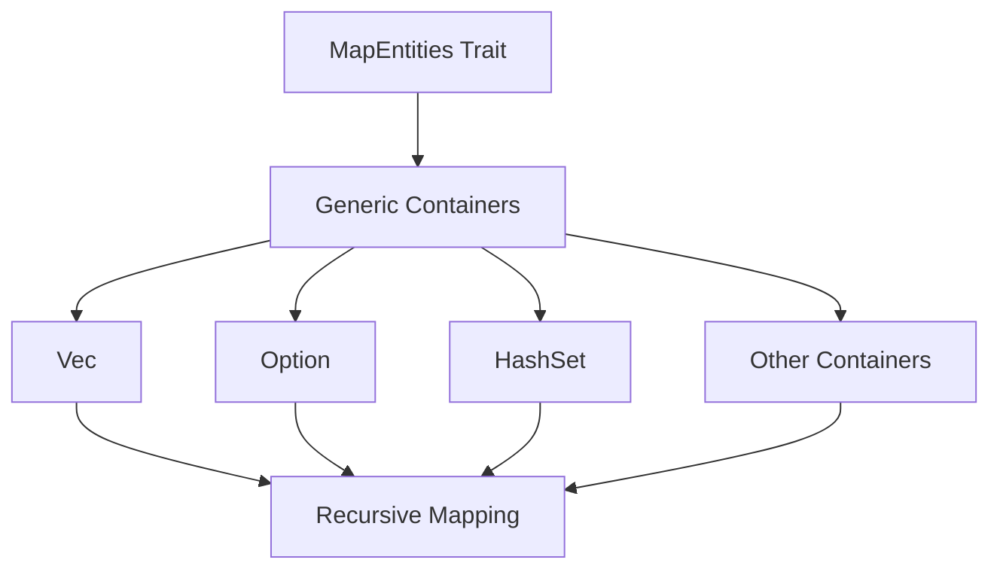

+++
title = "#19071 Implementing MapEntities for Higher-Order Types in Bevy ECS"
date = "2025-05-06T00:00:00"
draft = false
template = "pull_request_page.html"
in_search_index = true

[taxonomies]
list_display = ["show"]

[extra]
current_language = "en"
available_languages = {"en" = { name = "English", url = "/pull_request/bevy/2025-05/pr-19071-en-20250506" }, "zh-cn" = { name = "中文", url = "/pull_request/bevy/2025-05/pr-19071-zh-cn-20250506" }}
labels = ["A-ECS", "A-Networking", "D-Straightforward"]
+++

# Title: Implementing MapEntities for Higher-Order Types in Bevy ECS

## Basic Information
- **Title**: implement MapEntities for higher-order types
- **PR Link**: https://github.com/bevyengine/bevy/pull/19071
- **Author**: HanKruiger
- **Status**: MERGED
- **Labels**: A-ECS, S-Ready-For-Final-Review, A-Networking, D-Straightforward
- **Created**: 2025-05-05T11:59:23Z
- **Merged**: 2025-05-06T05:42:52Z
- **Merged By**: alice-i-cecile

## Description Translation
The original description is in English and preserved as-is:

# Objective

With the current `MapEntities` `impl`s, it is not possible to derive things like this:

```rust
#[derive(Component)]
pub struct Inventory {
  #[entities]
  slots: Vec<Option<Entity>>,
}
```

This is because `MapEntities` is only implemented for `Vec<Entity>` & `Option<Entity>`, and not arbitrary combinations of those.

It would be nice to also support those types.

## Solution

I replaced the `impl`s of the following types

- `Option<Entity>`: replaced with `Option<T>` 
- `Vec<Entity>`: replaced with `Vec<T>`
- `HashSet<Entity, S>`: replaced with `HashSet<T, S>`
  - `T` also had to be `Eq + core::hash::Hash` here. **Not sure if this is too restrictive?**
- `IndexSet<Entity, S>`: replaced with `IndexSet <T, S>`
  - `T` also had to be `Eq + core::hash::Hash` here. **Not sure if this is too restrictive?**
- `BTreeSet<Entity>`: replaced with `BTreeSet<T>`
- `VecDeque<Entity>`: replaced with `VecDeque<T>`
- `SmallVec<A: smallvec::Array<Item = Entity>>`: replaced with `SmallVec<A: smallvec::Array<Item = T>>`

(in all of the above, `T` is a generic type that implements `MapEntities` (`Entity` being one of them).)

## Testing

I did not test any of this, but extended the `Component::map_entities` doctest with an example usage of the newly supported types.

---

## Showcase

With these changes, this is now possible:

```rust
#[derive(Component)]
pub struct Inventory {
  #[entities]
  slots: Vec<Option<Entity>>,
}
```

## The Story of This Pull Request

### The Problem and Context
Bevy's ECS system requires entity references in components to be remappable through the `MapEntities` trait, particularly important for scenarios like scene loading/instantiation and networking. However, existing implementations only supported simple container types storing raw `Entity` values, not nested or generic combinations. This limitation prevented developers from using natural data structures like `Vec<Option<Entity>>` in components marked with `#[entities]`.

### The Solution Approach
The PR generalized existing `MapEntities` implementations by introducing generic type parameters. Instead of hardcoding implementations for containers of `Entity`, the author reworked them to work with any type `T: MapEntities`. This approach maintains backward compatibility while enabling nested entity mapping through composition.

Key engineering decisions included:
1. Preserving existing functionality through type parameterization
2. Handling container-specific requirements (e.g., `HashSet` needing `Eq + Hash`)
3. Maintaining performance by using in-place mutation where possible

### The Implementation
The core changes occurred in `map_entities.rs`, where implementations were generalized for various container types. For example:

```rust
// Before: Specific to Entity
impl MapEntities for Vec<Entity> {
    fn map_entities<E: EntityMapper>(&mut self, entity_mapper: &mut E) {
        for entity in self.iter_mut() {
            *entity = entity_mapper.get_mapped(*entity);
        }
    }
}

// After: Generic implementation
impl<T: MapEntities> MapEntities for Vec<T> {
    fn map_entities<E: EntityMapper>(&mut self, entity_mapper: &mut E) {
        for entities in self.iter_mut() {
            entities.map_entities(entity_mapper);
        }
    }
}
```

This pattern was consistently applied to 7 different container types, enabling recursive entity mapping through nested data structures.

### Technical Insights
The implementation leverages Rust's trait system to create composable entity mapping:
1. **Recursive Mapping**: Each container delegates to its elements' `MapEntities` implementation
2. **Trait Bounds**: Hash-based containers require `T: Eq + Hash` to maintain their invariants
3. **Zero-Cost Abstraction**: The generic approach adds no runtime overhead through monomorphization

A notable consideration was maintaining HashSet/IndexSet functionality while adding the `Eq + Hash` bounds. While Entity naturally satisfies these, this could restrict custom types not implementing these traits.

### The Impact
These changes enable more complex component structures while maintaining entity mapping functionality:
- Developers can now use nested entity containers like `Vec<Option<Entity>>`
- Improved ergonomics for networking and scene systems
- Maintains backward compatibility with existing code
- Adds ~50 lines of implementation while removing ~20 lines of redundant code

## Visual Representation



## Key Files Changed

1. `crates/bevy_ecs/src/entity/map_entities.rs` (+34/-18)
```rust
// Before: HashSet-specific implementation
impl<S: BuildHasher + Default> MapEntities for HashSet<Entity, S> {
    fn map_entities<E: EntityMapper>(&mut self, entity_mapper: &mut E) {
        *self = self.drain().map(|e| entity_mapper.get_mapped(e)).collect();
    }
}

// After: Generic implementation with trait bounds
impl<T: MapEntities + Eq + core::hash::Hash, S: BuildHasher + Default> MapEntities for HashSet<T, S> {
    fn map_entities<E: EntityMapper>(&mut self, entity_mapper: &mut E) {
        *self = self.drain().map(|mut entities| {
            entities.map_entities(entity_mapper);
            entities
        }).collect();
    }
}
```

2. `crates/bevy_ecs/src/component.rs` (+11/-0)
```rust
// Added documentation example
/// Bevy provides various implementations of [`MapEntities`], so that arbitrary combinations like these are supported with `#[entities]`:
/// 
/// ```rust
/// # use bevy_ecs::{component::Component, entity::Entity};
/// #[derive(Component)]
/// struct Inventory {
///     #[entities]
///     items: Vec<Option<Entity>>
/// }
/// ```
```

## Further Reading
1. [Bevy ECS Component Documentation](https://bevyengine.org/learn/book/ecs/components/)
2. [Rust Generics and Performance](https://doc.rust-lang.org/book/ch10-01-syntax.html)
3. [Entity Mapping in Game Engines](https://www.gamedev.net/articles/programming/general-and-gameplay-programming/understanding-entity-component-systems-part-2-r3879/)