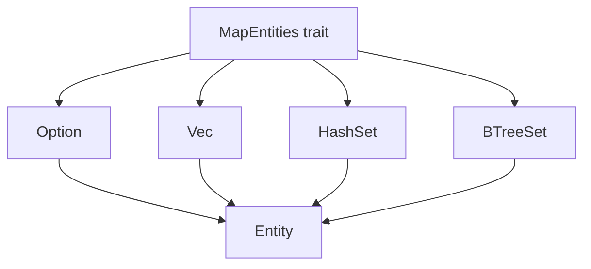

+++
title = "#19071 implement MapEntities for higher-order types"
date = "2025-05-06T00:00:00"
draft = false
template = "pull_request_page.html"
in_search_index = false

[extra]
current_language = "zh-cn"
available_languages = {"en" = { name = "English", url = "/pull_request/bevy/2025-05/pr-19071-en-20250506" }, "zh-cn" = { name = "中文", url = "/pull_request/bevy/2025-05/pr-19071-zh-cn-20250506" }}
labels = ["A-ECS", "A-Networking", "D-Straightforward"]
+++

# Title: implement MapEntities for higher-order types

## Basic Information
- **Title**: implement MapEntities for higher-order types
- **PR Link**: https://github.com/bevyengine/bevy/pull/19071
- **Author**: HanKruiger
- **Status**: MERGED
- **Labels**: A-ECS, S-Ready-For-Final-Review, A-Networking, D-Straightforward
- **Created**: 2025-05-05T11:59:23Z
- **Merged**: 2025-05-06T05:42:52Z
- **Merged By**: alice-i-cecile

## Description Translation

### 目标
当前 `MapEntities` 的实现无法支持以下派生模式：
```rust
#[derive(Component)]
pub struct Inventory {
  #[entities]
  slots: Vec<Option<Entity>>,
}
```
因为 `MapEntities` 仅针对 `Vec<Entity>` 和 `Option<Entity>` 实现，未覆盖它们的组合类型。

### 解决方案
将以下类型的实现替换为泛型版本：
- `Option<Entity>` → `Option<T>`
- `Vec<Entity>` → `Vec<T>`
- `HashSet<Entity, S>` → `HashSet<T, S>`（需 `T: Eq + Hash`）
- `IndexSet<Entity, S>` → `IndexSet<T, S>`（需 `T: Eq + Hash`）
- `BTreeSet<Entity>` → `BTreeSet<T>`
- `VecDeque<Entity>` → `VecDeque<T>`
- `SmallVec<A>` → `SmallVec<A>`（元素类型泛型化）

其中 `T` 需实现 `MapEntities` trait。

### 测试验证
扩展了 `Component::map_entities` 的文档测试，新增组合类型的使用示例。

## The Story of This Pull Request

### 问题背景
在 Bevy ECS 中，`MapEntities` trait 负责实体 ID 的映射（常用于场景序列化/反序列化或网络同步）。原实现仅支持简单容器类型直接包含 `Entity` 的情况，无法处理嵌套结构如 `Vec<Option<Entity>>`。这限制了组件设计的灵活性，导致开发者无法直接使用组合类型来建模复杂数据结构。

### 解决方案选择
通过将具体类型实现改为泛型实现，使容器类型能够自动适配任意实现 `MapEntities` 的元素类型。关键决策点包括：
1. **泛型参数约束**：要求容器元素类型必须实现 `MapEntities`
2. **数据结构兼容性**：为 `HashSet`/`IndexSet` 保留哈希特性要求（`Eq + Hash`）
3. **递归映射**：通过迭代器遍历容器元素并递归调用 `map_entities`

### 实现细节
在 `map_entities.rs` 中重构了多个容器类型的实现方式。以 `Vec<T>` 为例：
```rust
// 修改前：仅支持 Entity 类型
impl MapEntities for Vec<Entity> {
    fn map_entities<E: EntityMapper>(&mut self, entity_mapper: &mut E) {
        for entity in self.iter_mut() {
            *entity = entity_mapper.get_mapped(*entity);
        }
    }
}

// 修改后：支持任意实现 MapEntities 的类型
impl<T: MapEntities> MapEntities for Vec<T> {
    fn map_entities<E: EntityMapper>(&mut self, entity_mapper: &mut E) {
        for entities in self.iter_mut() {
            entities.map_entities(entity_mapper);
        }
    }
}
```
这种修改使得容器类型可以自动代理其元素的实体映射操作，实现嵌套结构的递归处理。

### 技术权衡
- **类型约束扩展**：`HashSet` 和 `IndexSet` 需要元素类型同时实现 `Eq + Hash`，可能限制部分使用场景，但这是保持集合类型功能完整性的必要妥协
- **零成本抽象**：通过泛型实现保持运行时性能，编译时会生成具体类型的特化代码
- **向后兼容**：原有使用 `Entity` 的代码仍可工作，因为 `Entity` 本身实现 `MapEntities`

### 实际影响
1. 支持更复杂的组件数据结构定义
2. 提升 ECS 序列化/网络同步等功能的表达能力
3. 文档示例新增 `Vec<Option<Entity>>` 类型的使用示范

## Visual Representation



## Key Files Changed

### crates/bevy_ecs/src/entity/map_entities.rs (+34/-18)
重构核心容器类型的 `MapEntities` 实现：
```rust
// HashSet 实现示例
impl<T: MapEntities + Eq + Hash, S: BuildHasher + Default> MapEntities for HashSet<T, S> {
    fn map_entities<E: EntityMapper>(&mut self, entity_mapper: &mut E) {
        *self = self.drain()
            .map(|mut entities| {
                entities.map_entities(entity_mapper);
                entities
            })
            .collect();
    }
}
```

### crates/bevy_ecs/src/component.rs (+11/-0)
更新文档说明新增功能：
```rust
/// Bevy 提供了多种 MapEntities 实现，现在支持如下组合类型：
/// 
/// ```rust
/// #[derive(Component)]
/// struct Inventory {
///     #[entities]
///     items: Vec<Option<Entity>>
/// }
/// ```
```

## Further Reading
1. [Rust 泛型编程指南](https://doc.rust-lang.org/book/ch10-00-generics.html)
2. [Bevy ECS 实体映射文档](https://bevyengine.org/learn/entity-mapping/)
3. [类型驱动的 API 设计模式](https://rust-lang.github.io/api-guidelines/type-safety.html)