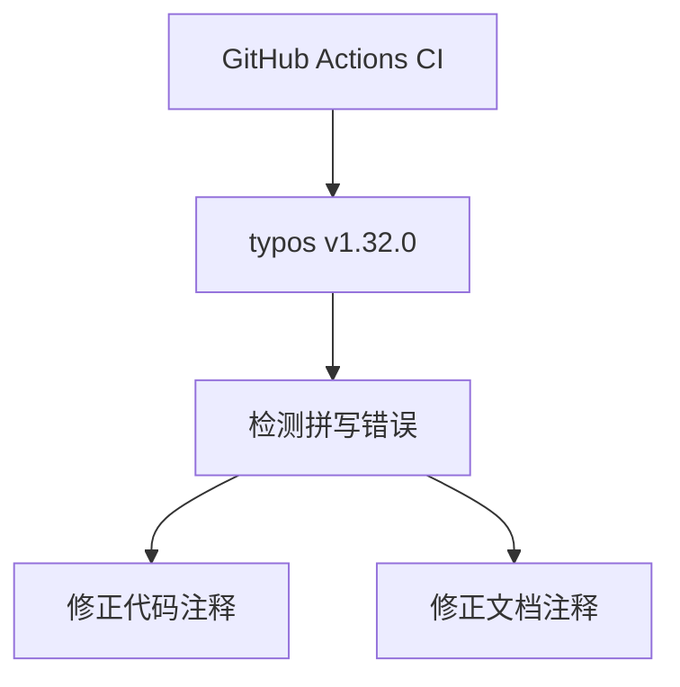

+++
title = "#19072 Bump crate-ci/typos from 1.31.1 to 1.32.0"
date = "2025-05-05T00:00:00"
draft = false
template = "pull_request_page.html"
in_search_index = false

[extra]
current_language = "zh-cn"
available_languages = {"en" = { name = "English", url = "/pull_request/bevy/2025-05/pr-19072-en-20250505" }, "zh-cn" = { name = "中文", url = "/pull_request/bevy/2025-05/pr-19072-zh-cn-20250505" }}
labels = ["A-Build-System"]
+++

# Bump crate-ci/typos from 1.31.1 to 1.32.0

## Basic Information
- **Title**: Bump crate-ci/typos from 1.31.1 to 1.32.0
- **PR Link**: https://github.com/bevyengine/bevy/pull/19072
- **Author**: greeble-dev
- **Status**: MERGED
- **Labels**: A-Build-System, S-Ready-For-Final-Review
- **Created**: 2025-05-05T12:45:45Z
- **Merged**: 2025-05-05T17:47:48Z
- **Merged By**: mockersf

## Description Translation
该PR采用了#19066的修改，将[crate-ci/typos](https://github.com/crate-ci/typos)从1.31.1版本升级至1.32.0版本。

## The Story of This Pull Request

### 问题背景与上下文
在持续集成（CI）流程中，Bevy项目使用crate-ci/typos工具进行拼写检查。该工具的1.32.0版本包含了新的拼写规则和错误修复，能更有效地检测代码中的拼写错误。维护依赖项的最新版本是保证代码质量的重要实践，同时新版本可能修复了之前版本存在的误报或漏报问题。

### 解决方案与实施
PR的核心操作包含两个部分：
1. **更新CI配置**：修改GitHub Actions工作流文件`.github/workflows/ci.yml`，将typos版本号从`v1.31.1`更新为`v1.32.0`
2. **修复检测到的拼写错误**：根据新版typos的检测结果，修正代码中的四个拼写错误

```yaml
# .github/workflows/ci.yml 修改示例
-        uses: crate-ci/typos@v1.31.1
+        uses: crate-ci/typos@v1.32.0
```

### 技术细节与影响
拼写错误的修正主要集中在文档注释和代码注释：
1. **单复数修正**：将`vertice`改为正确的单数形式`vertex`
```rust
// benches/benches/bevy_picking/ray_mesh_intersection.rs
-        // Push a new vertice to the mesh...
+        // Push a new vertex to the mesh...
```
2. **拼写错误修正**：修复`regisered`为`registered`，`obserer`为`observer`
```rust
// crates/bevy_ecs/src/component.rs
-    /// This will return `None` only if the id is neither regisered nor queued...
+    /// This will return `None` only if the id is neither registered nor queued...

// crates/bevy_ecs/src/observer/mod.rs
-    /// The location of the source code that triggered the obserer.
+    /// The location of the source code that triggered the observer.
```

这些修改虽小但重要：
- 提升代码可读性：正确的术语使用有助于开发者准确理解代码意图
- 保持专业形象：避免文档中的拼写错误影响项目专业性
- 自动化预防：更新后的typos版本能在CI流程中捕获更多潜在问题

## Visual Representation



## Key Files Changed

### 1. `.github/workflows/ci.yml`
```yaml
# 修改前
uses: crate-ci/typos@v1.31.1

# 修改后
uses: crate-ci/typos@v1.32.0
```
- **原因**：保持CI工具链的最新状态
- **影响**：启用新版拼写检查规则

### 2. `benches/bevy_picking/ray_mesh_intersection.rs`
```rust
// 修改前
// Push a new vertice to the mesh...

// 修改后
// Push a new vertex to the mesh...
```
- **技术说明**：修正几何术语的单复数使用

### 3. `crates/bevy_ecs/src/component.rs`
```rust
// 两处修改
- neither regisered nor queued...
+ neither registered nor queued...
```
- **影响**：修正核心ECS模块的文档准确性

### 4. `crates/bevy_ecs/src/observer/mod.rs`
```rust
- triggered the obserer
+ triggered the observer
```
- **重要性**：修正观察者模式实现中的关键术语

## Further Reading
1. [crate-ci/typos官方文档](https://github.com/crate-ci/typos) - 了解拼写检查工具的高级配置
2. [Rust API Guidelines - 文档规范](https://rust-lang.github.io/api-guidelines/documentation.html) - 代码注释的最佳实践
3. [Semantic Versioning规范](https://semver.org/) - 依赖版本管理原则

# Full Code Diff
（完整代码差异请参考原始PR链接）