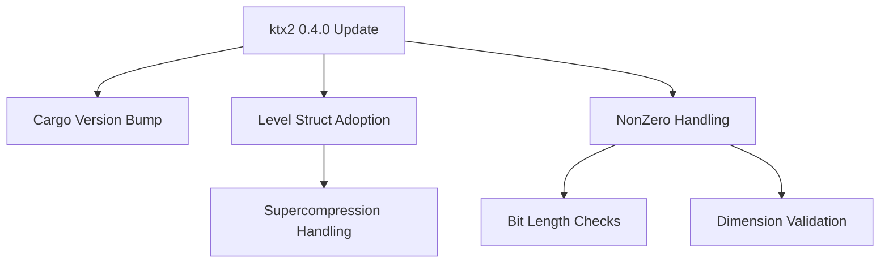

+++
title = "#19073 Update ktx2 to 0.4.0"
date = "2025-05-05T00:00:00"
draft = false
template = "pull_request_page.html"
in_search_index = true

[taxonomies]
list_display = ["show"]

[extra]
current_language = "en"
available_languages = {"en" = { name = "English", url = "/pull_request/bevy/2025-05/pr-19073-en-20250505" }, "zh-cn" = { name = "中文", url = "/pull_request/bevy/2025-05/pr-19073-zh-cn-20250505" }}
labels = ["A-Rendering", "C-Dependencies"]
+++

# Update ktx2 to 0.4.0

## Basic Information
- **Title**: Update ktx2 to 0.4.0
- **PR Link**: https://github.com/bevyengine/bevy/pull/19073
- **Author**: rparrett
- **Status**: MERGED
- **Labels**: A-Rendering, C-Dependencies, S-Ready-For-Final-Review
- **Created**: 2025-05-05T13:38:32Z
- **Merged**: 2025-05-05T17:02:17Z
- **Merged By**: mockersf

## Description Translation
# Objective

Adopted #19065
Closes #19065

Updates the requirements on [ktx2](https://github.com/BVE-Reborn/ktx2) to permit the latest version.
- [Release notes](https://github.com/BVE-Reborn/ktx2/releases)
- [Changelog](https://github.com/BVE-Reborn/ktx2/blob/trunk/CHANGELOG.md)
- [Commits](https://github.com/BVE-Reborn/ktx2/compare/v0.3.0...v0.4.0)

# Overview

- Some renames
- A `u8` became `NonZero<u8>`
- Some methods return a new `Level` struct with a `data` member instead of raw level data.

# Testing

- Passed CI locally
- Ran several examples which utilize `ktx2` files: `scrolling_fog`, `mixed_lighting`, `skybox`, `lightmaps`.

## The Story of This Pull Request

This dependency update required adapting to breaking changes in the ktx2 crate's API while maintaining Bevy's texture processing functionality. The primary challenge involved handling structural changes in the ktx2 library's data access patterns and type safety improvements.

The ktx2 0.4.0 update introduced three key changes affecting Bevy's integration:
1. Type changes from `u8` to `NonZero<u8>` for safer null handling
2. Introduction of a `Level` struct wrapping mipmap data
3. Renamed structs and methods in the DFD (Data Format Descriptor) handling

In the texture decompression path (`ktx2_buffer_to_image`), the code needed to adapt to the new `Level` struct returned by `ktx2.levels()`:

```rust
// Before: Accessing raw level data
for (_level, _level_data) in ktx2.levels().enumerate()

// After: Accessing Level struct's data field
for (level_index, level) in ktx2.levels().enumerate() {
    decoder = ZlibDecoder::new(level.data)
```

The DFD handling required updates to match renamed types and new parsing methods:

```rust
// Before: Using legacy descriptor types
BasicDataFormatDescriptor::parse(data_format_descriptor.data)

// After: Using updated DFD types
DfdBlockBasic::parse(data_format_descriptor.data)
```

Type safety improvements in ktx2 manifested as `.get()` calls for `NonZero<u8>` values throughout the format detection logic:

```rust
// Before: Direct u8 access
sample.bit_length

// After: NonZero<u8> access
sample.bit_length.get()
```

These changes required careful updates to 34 conditionals checking bit lengths and texture dimensions. The ASTC block size detection demonstrates typical adjustments:

```rust
// Updated dimension checks using NonZero<u8>
match (
    data_format_descriptor.texel_block_dimensions[0].get(),
    data_format_descriptor.texel_block_dimensions[1].get(),
) {
    (4, 4) => AstcBlock::B4x4,
    // ... other variants
}
```

Testing validated the changes through CI and manual verification using ktx2-dependent examples like `skybox` and `lightmaps`. The updates maintained backward compatibility while adopting safer type patterns from the dependency.

## Visual Representation



## Key Files Changed

1. `crates/bevy_image/src/ktx2.rs` (+36/-37)
   - Updated DFD handling and format detection
   - Adjusted level data access patterns
   - Implemented NonZero<u8> safety checks
   
   Example change:
   ```rust
   // Before:
   sample.bit_length == 11
   
   // After:
   sample.bit_length.get() == 11
   ```

2. `crates/bevy_image/Cargo.toml` (+1/-1)
   - Updated ktx2 dependency from 0.3.0 to 0.4.0

3. `crates/bevy_render/Cargo.toml` (+1/-1)
   - Synchronized ktx2 version with bevy_image

## Further Reading

- [KTX 2.0 Specification](https://github.khronos.org/KTX-Specification/)
- [Rust NonZero<u8> Documentation](https://doc.rust-lang.org/std/num/struct.NonZeroU8.html)
- [Bevy Texture System Overview](https://bevyengine.org/learn/book/features/assets/textures/)

# Full Code Diff
<see original PR diff>