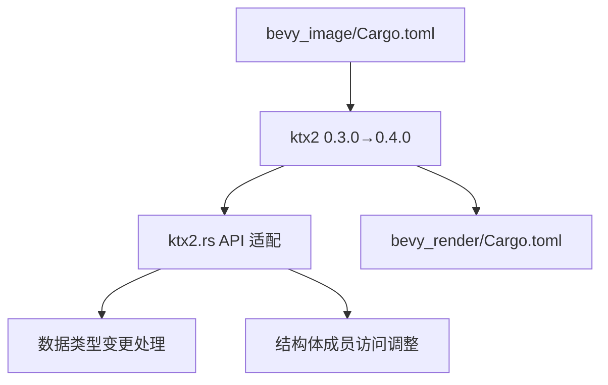

+++
title = "#19073 Update ktx2 to 0.4.0"
date = "2025-05-05T00:00:00"
draft = false
template = "pull_request_page.html"
in_search_index = false

[extra]
current_language = "zh-cn"
available_languages = {"en" = { name = "English", url = "/pull_request/bevy/2025-05/pr-19073-en-20250505" }, "zh-cn" = { name = "中文", url = "/pull_request/bevy/2025-05/pr-19073-zh-cn-20250505" }}
labels = ["A-Rendering", "C-Dependencies"]
+++

# Update ktx2 to 0.4.0

## Basic Information
- **Title**: Update ktx2 to 0.4.0
- **PR Link**: https://github.com/bevyengine/bevy/pull/19073
- **Author**: rparrett
- **Status**: MERGED
- **Labels**: A-Rendering, C-Dependencies, S-Ready-For-Final-Review
- **Created**: 2025-05-05T13:38:32Z
- **Merged**: 2025-05-05T17:02:17Z
- **Merged By**: mockersf

## Description Translation
### 目标
适配 #19065
关闭 #19065

更新 [ktx2](https://github.com/BVE-Reborn/ktx2) 依赖至最新版本。
- [发布说明](https://github.com/BVE-Reborn/ktx2/releases)
- [变更日志](https://github.com/BVE-Reborn/ktx2/blob/trunk/CHANGELOG.md)
- [提交记录](https://github.com/BVE-Reborn/ktx2/compare/v0.3.0...v0.4.0)

### 概要
- 部分重命名
- `u8` 类型改为 `NonZero<u8>`
- 部分方法返回带有 `data` 成员的新 `Level` 结构体，代替原始层级数据

### 测试
- 本地通过 CI
- 运行多个使用 `ktx2` 文件的示例：`scrolling_fog`, `mixed_lighting`, `skybox`, `lightmaps`

## The Story of This Pull Request

本次 PR 的核心任务是升级 ktx2 纹理编解码库至 0.4.0 版本，主要涉及 API 变更适配和类型安全改进。ktx2 是 Bevy 引擎处理 KTX2 纹理格式的关键依赖，其 0.4.0 版本引入了三个主要变化：

1. **类型安全增强**：将表示位长度的 `u8` 改为 `NonZero<u8>`，强制要求开发者处理零值问题。例如在解析采样信息时：
```rust
// 旧版本
match sample.bit_length { ... }

// 新版本
match sample.bit_length.get() { ... }
```

2. **数据结构重构**：新增 `Level` 结构体封装层级数据。这影响了纹理数据的获取方式：
```rust
// 旧版本：直接获取字节切片
ktx2.levels().map(|data| data.to_vec())

// 新版本：通过结构体成员访问
ktx2.levels().map(|level| level.data.to_vec())
```

3. **API 命名规范化**：多个关键类型进行了重命名以提升可读性：
- `BasicDataFormatDescriptor` → `DfdBlockBasic`
- `DataFormatDescriptorHeader` → `DfdHeader`
- `data_format_descriptors()` → `dfd_blocks()`

在实现层面，主要修改集中在 `ktx2.rs` 的格式解析逻辑。例如处理 ASTC 纹理块尺寸时，需要适配新的类型访问方式：
```rust
// 旧版本直接访问 u8 值
data_format_descriptor.texel_block_dimensions[0]

// 新版本通过 NonZero<u8> 的 get() 方法
data_format_descriptor.texel_block_dimensions[0].get()
```

测试策略保持了 Bevy 的务实风格：直接运行依赖 ktx2 的核心示例（如 `skybox` 和 `lightmaps`），通过实际渲染结果验证兼容性。这种黑盒测试方式在图形编程中尤其有效，可以快速验证纹理加载和显存上传的正确性。

## Visual Representation



## Key Files Changed

### `crates/bevy_image/src/ktx2.rs` (+36/-37)
- 主要适配 ktx2 0.4.0 的 API 变更：
```rust
// 数据格式描述符处理
// Before:
for data_format_descriptor in ktx2.data_format_descriptors() {
    if data_format_descriptor.header == DataFormatDescriptorHeader::BASIC {
        BasicDataFormatDescriptor::parse(...)

// After:
for data_format_descriptor in ktx2.dfd_blocks() {
    if data_format_descriptor.header == DfdHeader::BASIC {
        DfdBlockBasic::parse(...)
```

### `crates/bevy_image/Cargo.toml` (+1/-1)
```toml
# 依赖版本升级
ktx2 = { version = "0.3.0", optional = true } → "0.4.0"
```

### `crates/bevy_render/Cargo.toml` (+1/-1)
```toml
# 保持渲染模块依赖同步
ktx2 = { version = "0.3.0", optional = true } → "0.4.0"
```

## Further Reading
- [KTX 2.0 规范](https://github.khronos.org/KTX-Specification/)
- [Rust 的 NonZero 类型文档](https://doc.rust-lang.org/std/num/struct.NonZeroU8.html)
- [Bevy 纹理系统架构](https://bevyengine.org/learn/book/assets/textures/)