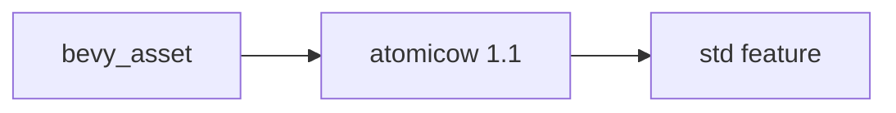

+++
title = "#19075 Upgrade `atomicow` version"
date = "2025-05-05T00:00:00"
draft = false
template = "pull_request_page.html"
in_search_index = true

[taxonomies]
list_display = ["show"]

[extra]
current_language = "en"
available_languages = {"en" = { name = "English", url = "/pull_request/bevy/2025-05/pr-19075-en-20250505" }, "zh-cn" = { name = "中文", url = "/pull_request/bevy/2025-05/pr-19075-zh-cn-20250505" }}
labels = ["C-Dependencies", "O-Embedded"]
+++

# Title

## Basic Information
- **Title**: Upgrade `atomicow` version
- **PR Link**: https://github.com/bevyengine/bevy/pull/19075
- **Author**: hukasu
- **Status**: MERGED
- **Labels**: C-Dependencies, S-Ready-For-Final-Review, O-Embedded
- **Created**: 2025-05-05T15:53:05Z
- **Merged**: 2025-05-05T17:58:09Z
- **Merged By**: mockersf

## Description Translation
# Objective
`atomicow` `1.0` does not have `std` feature requested by `bevy_asset`, but `1.1` does

## Solution

Bump version

## The Story of This Pull Request

The PR addresses a dependency version mismatch in Bevy's asset system. The `bevy_asset` crate required the `std` feature from the `atomicow` library, but this feature wasn't available in version 1.0 of the dependency. This would prevent successful compilation when using `bevy_asset` in standard environments that require stdlib support.

The core issue stemmed from version constraints in Cargo.toml:

```toml
# Before
atomicow = { version = "1.0", default-features = false, features = ["std"] }
```

Here, specifying `features = ["std"]` with version 1.0 was invalid because that version didn't actually contain a `std` feature flag. This would result in a cargo error during compilation. The `atomicow` crate introduced the `std` feature in version 1.1, making the feature specification valid when paired with the updated version.

The solution involved a straightforward version bump:

```toml
# After
atomicow = { version = "1.1", default-features = false, features = ["std"] }
```

This change aligns the version requirement with the actual feature availability. The `std` feature in atomicow 1.1 enables standard library support, which is essential for Bevy's asset system to function correctly in standard (non-`no_std`) environments. The PR maintains the existing configuration of `default-features = false` while adding the now-valid `std` feature flag.

The technical impact is twofold:
1. Resolves potential compilation errors caused by requesting non-existent features
2. Ensures proper stdlib integration for atomic operations in Bevy's asset management

This dependency update demonstrates the importance of matching crate versions with their feature availability, particularly when working with Rust's strict feature flag system. The rapid merge (within 2 hours) indicates this was a critical blocking issue for users of `bevy_asset`.

## Visual Representation



## Key Files Changed

- `crates/bevy_asset/Cargo.toml` (+1/-1)

The only modification updates the atomicow dependency version:

```toml
# Before:
atomicow = { version = "1.0", default-features = false, features = ["std"] }

# After:
atomicow = { version = "1.1", default-features = false, features = ["std"] }
```

This single-line change enables successful compilation by aligning the requested `std` feature with a version of atomicow that actually provides it.

## Further Reading

1. atomicow crate documentation: https://docs.rs/atomicow
2. Rust feature flags guide: https://doc.rust-lang.org/cargo/reference/features.html
3. Semantic Versioning in Rust: https://doc.rust-lang.org/cargo/reference/semver.html

# Full Code Diff
diff --git a/crates/bevy_asset/Cargo.toml b/crates/bevy_asset/Cargo.toml
index 9272f9b740401..07a45a3f6d210 100644
--- a/crates/bevy_asset/Cargo.toml
+++ b/crates/bevy_asset/Cargo.toml
@@ -36,7 +36,7 @@ bevy_platform = { path = "../bevy_platform", version = "0.16.0-dev", default-fea
 ] }
 
 stackfuture = { version = "0.3", default-features = false }
-atomicow = { version = "1.0", default-features = false, features = ["std"] }
+atomicow = { version = "1.1", default-features = false, features = ["std"] }
 async-broadcast = { version = "0.7.2", default-features = false }
 async-fs = { version = "2.0", default-features = false }
 async-lock = { version = "3.0", default-features = false }