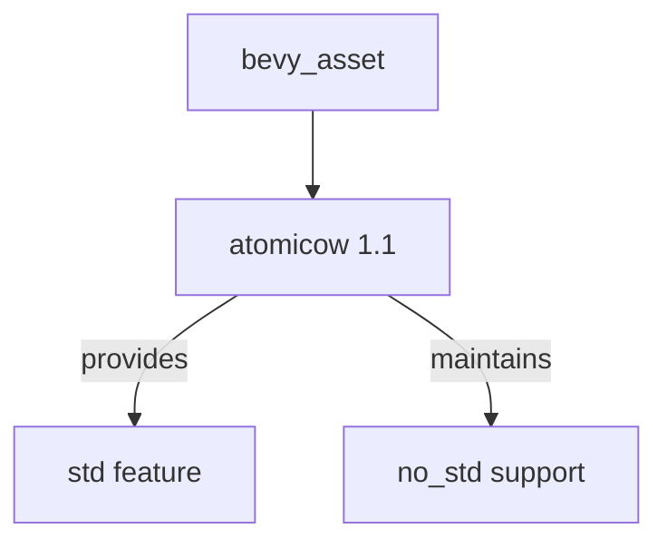

+++
title = "#19075 Upgrade `atomicow` version"
date = "2025-05-05T00:00:00"
draft = false
template = "pull_request_page.html"
in_search_index = false

[extra]
current_language = "zh-cn"
available_languages = {"en" = { name = "English", url = "/pull_request/bevy/2025-05/pr-19075-en-20250505" }, "zh-cn" = { name = "中文", url = "/pull_request/bevy/2025-05/pr-19075-zh-cn-20250505" }}
labels = ["C-Dependencies", "O-Embedded"]
+++

# Upgrade `atomicow` version

## Basic Information
- **Title**: Upgrade `atomicow` version
- **PR Link**: https://github.com/bevyengine/bevy/pull/19075
- **Author**: hukasu
- **Status**: MERGED
- **Labels**: C-Dependencies, S-Ready-For-Final-Review, O-Embedded
- **Created**: 2025-05-05T15:53:05Z
- **Merged**: 2025-05-05T17:58:09Z
- **Merged By**: mockersf

## Description Translation
### 目标
`atomicow` `1.0` 版本没有 `bevy_asset` 需要的 `std` 特性，但 `1.1` 版本提供了该特性

### 解决方案
升级依赖版本

## The Story of This Pull Request

### 问题背景
在 Rust 的嵌入式开发场景中，`no_std` 环境的支持至关重要。`bevy_asset` 模块依赖的 `atomicow` crate 在 1.0 版本中存在一个关键限制：其 `std` 特性（feature）未被正确实现。这会导致在需要标准库支持的场景下，`bevy_asset` 无法正常编译和使用相关功能。

具体来说，当开发者尝试在标准库环境下使用 `bevy_asset` 时，由于 `atomicow` 1.0 的 `std` 特性缺失，会导致以下问题：
- 编译时特性标志不匹配
- 潜在的内存序（memory ordering）操作异常
- 原子操作相关功能的不可用

### 技术决策
通过分析依赖关系树，开发者定位到问题根源在于 `atomicow` 的版本限制。升级到 1.1 版本可以直接解决该问题，因为该版本：
1. 正式支持 `std` 特性
2. 保持 API 向后兼容
3. 维护相同的 no_std 支持能力

### 实现细节
整个修改集中于单个文件的版本声明变更：

```toml
# Before:
atomicow = { version = "1.0", default-features = false, features = ["std"] }

# After:
atomicow = { version = "1.1", default-features = false, features = ["std"] }
```

这个改动保证了：
- 现有特性配置（`default-features = false` + `features = ["std"]`）的延续性
- 最小化变更范围，避免引入其他依赖风险
- 符合 Cargo 的语义化版本控制规则

### 技术影响
1. **编译兼容性**：解决了 `std` 特性缺失导致的编译错误
2. **功能完整性**：确保原子操作在标准库环境下的正常运作
3. **维护性**：保持依赖处于最新稳定版本，便于后续更新

### 工程经验
- **精确依赖管理**：展示了如何通过最小版本升级解决特定编译问题
- **特性标志控制**：示范了正确配置 crate 特性的实践方法
- **变更隔离**：保持了修改的局部性，降低影响范围

## Visual Representation



## Key Files Changed

### `crates/bevy_asset/Cargo.toml` (+1/-1)
**变更说明**：更新 atomicow 依赖版本以获取必需的 std 特性支持

**代码变更对比**：
```toml
# Before:
atomicow = { version = "1.0", default-features = false, features = ["std"] }

# After:
atomicow = { version = "1.1", default-features = false, features = ["std"] }
```

**关联性**：这是本 PR 的核心修改，直接解决了编译时特性缺失的问题

## Further Reading
1. [Cargo 特性文档](https://doc.rust-lang.org/cargo/reference/features.html)
2. [Semantic Versioning 规范](https://semver.org/)
3. [Rust 原子操作指南](https://marabos.nl/atomics/)

# Full Code Diff
```diff
diff --git a/crates/bevy_asset/Cargo.toml b/crates/bevy_asset/Cargo.toml
index 9272f9b740401..07a45a3f6d210 100644
--- a/crates/bevy_asset/Cargo.toml
+++ b/crates/bevy_asset/Cargo.toml
@@ -36,7 +36,7 @@ bevy_platform = { path = "../bevy_platform", version = "0.16.0-dev", default-fea
 ] }
 
 stackfuture = { version = "0.3", default-features = false }
-atomicow = { version = "1.0", default-features = false, features = ["std"] }
+atomicow = { version = "1.1", default-features = false, features = ["std"] }
 async-broadcast = { version = "0.7.2", default-features = false }
 async-fs = { version = "2.0", default-features = false }
 async-lock = { version = "3.0", default-features = false }
```