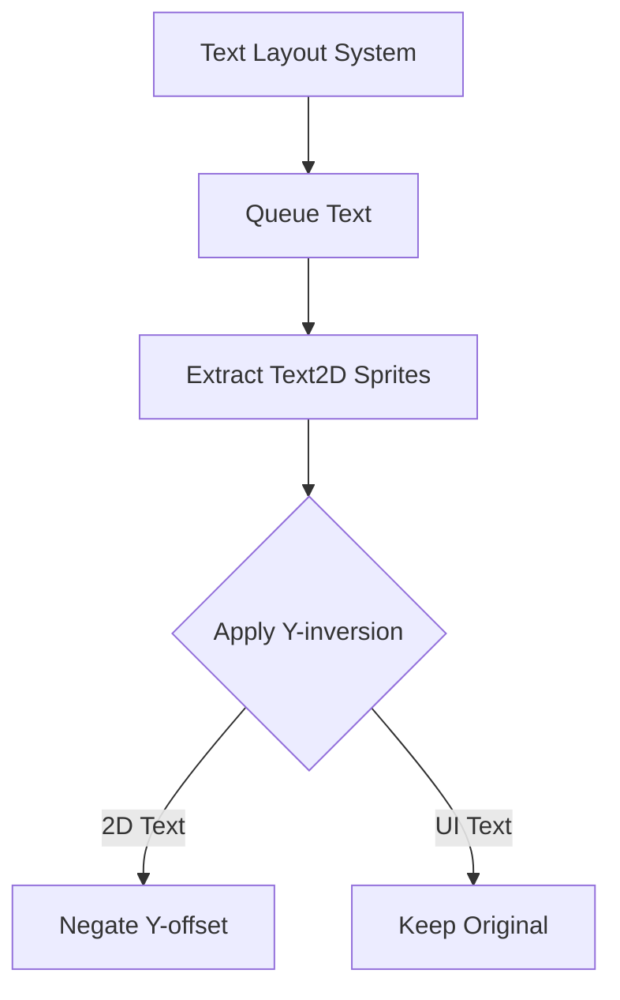

+++
title = "#19077 Remove `YAxisOrientation` from `bevy_text`"
date = "2025-05-19T00:00:00"
draft = false
template = "pull_request_page.html"
in_search_index = true

[taxonomies]
list_display = ["show"]

[extra]
current_language = "en"
available_languages = {"en" = { name = "English", url = "/pull_request/bevy/2025-05/pr-19077-en-20250519" }, "zh-cn" = { name = "中文", url = "/pull_request/bevy/2025-05/pr-19077-zh-cn-20250519" }}
labels = ["A-Rendering", "C-Code-Quality", "A-Text", "D-Straightforward"]
+++

# Title: Remove `YAxisOrientation` from `bevy_text`

## Basic Information
- **Title**: Remove `YAxisOrientation` from `bevy_text`
- **PR Link**: https://github.com/bevyengine/bevy/pull/19077
- **Author**: ickshonpe
- **Status**: MERGED
- **Labels**: A-Rendering, C-Code-Quality, S-Ready-For-Final-Review, A-Text, X-Uncontroversial, D-Straightforward
- **Created**: 2025-05-05T16:32:10Z
- **Merged**: 2025-05-19T19:35:49Z
- **Merged By**: alice-i-cecile

## Description Translation
# Objective

Been looking for simplifications in the text systems as part of the text input changes.

This enum isn't very helpful I think. We can remove it and the associated parameters and instead just negate the glyph's y-offsets in `extract_text2d_sprite`.

## Solution

Remove the `YAxisOrientation` enum and parameters. 
Queue text sprites relative to the top-left in `extract_text2d_sprite` and negate the glyph's y-offset.

## Testing

The `text2d` example can be used for testing:
```
cargo run --example text2d
```

## The Story of This Pull Request

The text rendering system previously maintained two coordinate system orientations through the `YAxisOrientation` enum. This abstraction handled differences between UI text (top-to-bottom Y-axis) and 2D world space text (bottom-to-top). However, this approach introduced unnecessary complexity in the text pipeline.

The core issue stemmed from handling vertical positioning in two distinct coordinate systems. While UI text considers (0,0) as top-left, 2D text uses bottom-left origins. The original implementation propagated this distinction through multiple layers via the `YAxisOrientation` parameter, requiring conditional logic in glyph positioning.

The solution simplifies the system by:
1. Removing the `YAxisOrientation` enum entirely
2. Standardizing text queueing to use top-left origins
3. Applying Y-axis inversion at the final extraction stage for 2D text

In `text2d.rs`, the key change appears in position calculation:
```rust
// Before: Bottom-left based positioning
let bottom_left = -(anchor.as_vec() + 0.5) * size + (size.y - text_layout_info.size.y) * Vec2::Y;

// After: Top-left based positioning with Y inversion
let top_left = (Anchor::TOP_LEFT.0 - anchor.as_vec()) * size;
let transform = *global_transform * GlobalTransform::from_translation(top_left.extend(0.)) * scaling;
```

Glyph Y-offset inversion happens during sprite extraction:
```rust
// Negate Y offset when creating ExtractedSlice
ExtractedSlice {
    offset: Vec2::new(position.x, -position.y),
    ...
}
```

This approach centralizes coordinate system handling rather than scattering it through the pipeline. The text layout system now consistently works with top-left origins, while 2D rendering applies a single negation operation. This eliminates 12 lines of enum definitions and simplifies multiple method signatures.

The changes maintain visual correctness through strategic inversion rather than procedural branching. This reduces cognitive load when modifying text systems and decreases the surface area for potential bugs. Testing with the `text2d` example verified that text positioning remains correct despite the underlying changes.

## Visual Representation



## Key Files Changed

1. `crates/bevy_text/src/lib.rs` (+0/-12)
- Removed `YAxisOrientation` enum definition
- Eliminated documentation about coordinate system differences

2. `crates/bevy_text/src/text2d.rs` (+5/-6)
```rust
// Before positioning calculation
let bottom_left = ... // Complex bottom-left calculation

// After simplified top-left approach
let top_left = (Anchor::TOP_LEFT.0 - anchor.as_vec()) * size;
let transform = ...top_left...;

// Glyph Y-offset inversion
offset: Vec2::new(position.x, -position.y)
```

3. `crates/bevy_text/src/pipeline.rs` (+1/-6)
- Removed `y_axis_orientation` parameter from `queue` method
- Deleted coordinate transformation branch using the enum

4. `crates/bevy_ui/src/widget/text.rs` (+1/-2)
- Removed `YAxisOrientation::TopToBottom` parameter passing
- Simplified UI text queueing calls

## Further Reading
- Bevy Text Rendering Architecture: https://bevyengine.org/learn/book/features/text/
- Coordinate Systems in Game Development: https://en.wikipedia.org/wiki/Coordinate_system#In_video_games
- Glyph Positioning Fundamentals: https://freetype.org/freetype2/docs/glyphs/glyphs-3.html

# Full Code Diff
[Provided in original PR]