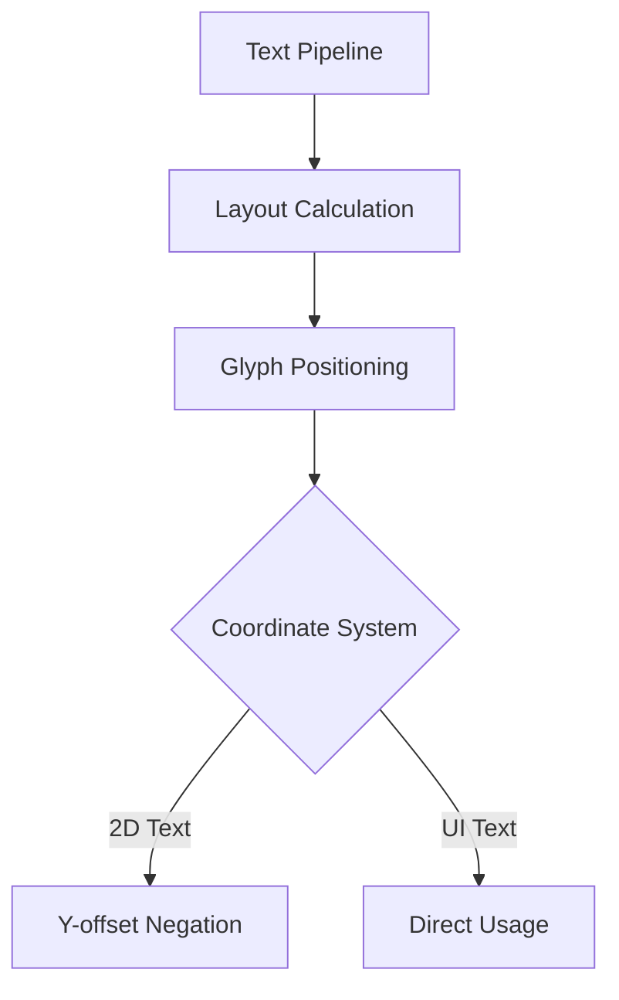

+++
title = "#19077 Remove `YAxisOrientation` from `bevy_text`"
date = "2025-05-19T00:00:00"
draft = false
template = "pull_request_page.html"
in_search_index = false

[extra]
current_language = "zh-cn"
available_languages = {"en" = { name = "English", url = "/pull_request/bevy/2025-05/pr-19077-en-20250519" }, "zh-cn" = { name = "中文", url = "/pull_request/bevy/2025-05/pr-19077-zh-cn-20250519" }}
labels = ["A-Rendering", "C-Code-Quality", "A-Text", "D-Straightforward"]
+++

# Remove `YAxisOrientation` from `bevy_text`

## Basic Information
- **Title**: Remove `YAxisOrientation` from `bevy_text`
- **PR Link**: https://github.com/bevyengine/bevy/pull/19077
- **Author**: ickshonpe
- **Status**: MERGED
- **Labels**: A-Rendering, C-Code-Quality, S-Ready-For-Final-Review, A-Text, X-Uncontroversial, D-Straightforward
- **Created**: 2025-05-05T16:32:10Z
- **Merged**: 2025-05-19T19:35:49Z
- **Merged By**: alice-i-cecile

## Description Translation
该PR的目标是简化文本系统。开发者认为现有的`YAxisOrientation`枚举并不实用，可以通过在`extract_text2d_sprite`中对字形y轴偏移取反来替代其功能。解决方案包括移除该枚举及相关参数，并调整文本精灵的队列逻辑。

主要修改：
- 删除`YAxisOrientation`枚举
- 在`extract_text2d_sprite`中处理坐标转换
- 使用`text2d`示例进行测试

## The Story of This Pull Request

### 问题背景与动机
在Bevy的文本渲染系统中，存在一个`YAxisOrientation`枚举用于处理不同坐标系下的文本布局方向。该枚举有两个变体：
- `TopToBottom`：用于UI系统（0坐标在顶部）
- `BottomToTop`：用于2D世界空间（0坐标在底部）

随着文本输入系统的改进需求，开发者发现该枚举带来了不必要的复杂性。具体问题表现为：
1. 需要在文本处理流水线中传递该参数
2. 在布局计算时需要进行条件分支判断
3. 增加了API的复杂度

### 解决方案与技术实现
核心思路是将坐标系转换逻辑集中到最终的精灵提取阶段，而不是分散在布局计算过程中。具体实现分为三个关键步骤：

1. **移除枚举定义**  
   直接删除`YAxisOrientation`枚举类型及其相关文档注释：
   ```rust
   // Before in lib.rs
   pub enum YAxisOrientation {
       TopToBottom,
       BottomToTop,
   }
   
   // After: 完全移除该枚举定义
   ```

2. **调整文本布局逻辑**  
   在`text2d.rs`的精灵提取阶段，通过取反y轴偏移量实现坐标系转换：
   ```rust
   // Before: 直接使用原始位置
   extracted_slices.slices.push(ExtractedSlice {
       offset: *position,
       // ...
   });
   
   // After: 对y分量取反
   extracted_slices.slices.push(ExtractedSlice {
       offset: Vec2::new(position.x, -position.y),
       // ...
   });
   ```

3. **重构变换计算**  
   将2D文本的锚点计算从基于底部对齐改为基于顶部对齐：
   ```rust
   // Before: 计算底部左对齐位置
   let bottom_left = -(anchor.as_vec() + 0.5) * size + (size.y - text_layout_info.size.y) * Vec2::Y;
   
   // After: 直接计算顶部左对齐
   let top_left = (Anchor::TOP_LEFT.0 - anchor.as_vec()) * size;
   ```

### 技术洞察与影响
这种重构带来了以下改进：
1. **简化API**：移除4个文件中的相关参数传递，减少接口复杂度
2. **性能优化**：消除布局计算时的条件分支判断
3. **逻辑集中化**：将坐标系转换集中在渲染前的最后阶段，符合数据驱动范式
4. **代码精简**：净删除23行代码（+8/-31）

潜在的技术考量：
- 保持UI系统的原有行为不变（仍使用TopToBottom方向）
- 通过矩阵变换替代条件分支，利用GPU加速坐标转换
- 保持与现有锚点系统的兼容性

## Visual Representation



## Key Files Changed

### 1. `crates/bevy_text/src/lib.rs`
- **修改内容**：移除`YAxisOrientation`枚举定义
- **影响**：消除公共API中的冗余类型
```rust
// 删除的枚举定义
pub enum YAxisOrientation {
    TopToBottom,
    BottomToTop,
}
```

### 2. `crates/bevy_text/src/text2d.rs`
- **核心修改**：坐标转换逻辑重构
```rust
// 锚点计算修改
let top_left = (Anchor::TOP_LEFT.0 - anchor.as_vec()) * size;

// 偏移量处理
offset: Vec2::new(position.x, -position.y)
```

### 3. `crates/bevy_text/src/pipeline.rs`
- **参数清理**：移除`y_axis_orientation`参数
```rust
// 函数签名变更
pub fn queue(
    /* 移除 y_axis_orientation 参数 */
)

// 删除条件判断逻辑
// 原包含匹配YAxisOrientation变体的代码段被移除
```

### 4. `crates/bevy_ui/src/widget/text.rs`
- **调用方适配**：更新文本队列调用
```rust
// 调用queue时不再传递YAxisOrientation参数
TextPipeline::queue(
    /* 其他参数保持不变 */
    // 移除 YAxisOrientation::TopToBottom 参数
)
```

## Further Reading
1. [Bevy坐标系统文档](https://bevyengine.org/learn/book/features/coords/)
2. [ECS数据驱动设计模式](https://www.rust-gamedev.github.io/ecs/)
3. [性能优化中的分支消除技术](https://doc.rust-lang.org/1.67.1/core/arch/x86_64/function_attribute.html#branch-prediction)