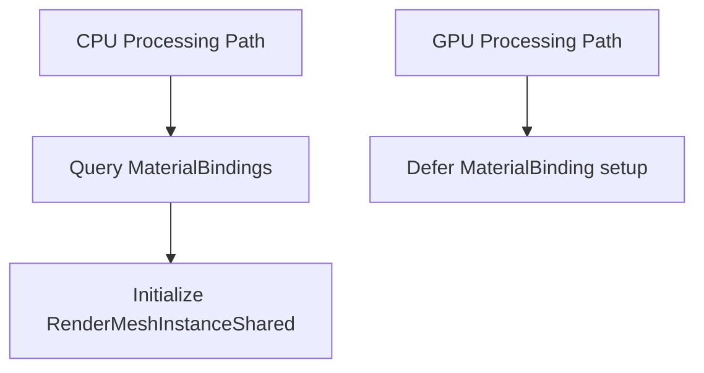

+++
title = "#19083 Fix: Provide CPU mesh processing with MaterialBindingId"
date = "2025-05-12T00:00:00"
draft = false
template = "pull_request_page.html"
in_search_index = true

[taxonomies]
list_display = ["show"]

[extra]
current_language = "en"
available_languages = {"en" = { name = "English", url = "/pull_request/bevy/2025-05/pr-19083-en-20250512" }, "zh-cn" = { name = "中文", url = "/pull_request/bevy/2025-05/pr-19083-zh-cn-20250512" }}
labels = ["C-Bug", "A-Rendering", "P-High", "O-WebGL2"]
+++

# Title: Fix: Provide CPU mesh processing with MaterialBindingId

## Basic Information
- **Title**: Fix: Provide CPU mesh processing with MaterialBindingId
- **PR Link**: https://github.com/bevyengine/bevy/pull/19083
- **Author**: dsgallups
- **Status**: MERGED
- **Labels**: C-Bug, A-Rendering, P-High, O-WebGL2, S-Needs-Review
- **Created**: 2025-05-05T19:12:17Z
- **Merged**: 2025-05-12T18:30:07Z
- **Merged By**: superdump

## Description Translation
# Objective
Fixes #19027

## Solution
Query for the material binding id if using fallback CPU processing

## Testing
I've honestly no clue how to test for this, and I imagine that this isn't entirely failsafe :( but would highly appreciate a suggestion!

To verify this works, please run the the texture.rs example using WebGL 2.

Additionally, I'm extremely naive about the nuances of pbr. This PR is essentially to kinda *get the ball rolling* of sorts. Thanks :)

## The Story of This Pull Request

The PR addresses a critical rendering issue in WebGL2 environments where CPU-processed meshes lacked proper material binding information. The root cause was identified in the mesh processing pipeline's handling of MaterialBindingId for CPU-based processing paths.

In Bevy's rendering system, `RenderMeshInstanceShared` requires a `material_bindings_index` to correctly associate materials with meshes. While the GPU processing path populated this value later in the pipeline through `RenderMeshGpuBuilder::update`, the CPU processing path had no mechanism to set this value. This led to rendering failures in WebGL2 contexts that relied on CPU processing fallbacks.

The solution involved two key changes:

1. **API Refactoring**:
```rust
// Split original from_components into two specialized constructors
impl RenderMeshInstanceShared {
    fn for_gpu_building(...) { /* uses default material binding */ }
    
    fn for_cpu_building(
        ...,
        material_bindings_index: MaterialBindingId  // New parameter
    ) {
        // Uses provided material binding immediately
    }
}
```
This separation enforced proper material binding initialization at construction time for CPU-processed meshes, while maintaining the existing deferred setup for GPU processing.

2. **Material Binding Lookup**:
```rust
// In extract_meshes_for_cpu_building:
let mesh_material = mesh_material_ids.mesh_material(MainEntity::from(entity));
let material_bindings_index = render_material_bindings
    .get(&mesh_material)
    .copied()
    .unwrap_or_default();
```
The CPU processing path now actively queries material bindings during extraction, ensuring correct material associations before any processing occurs.

The implementation maintains backward compatibility by preserving the GPU path's existing behavior while adding required initialization for the CPU path. This approach avoids unnecessary overhead for GPU-accelerated contexts while fixing WebGL2 compatibility.

## Visual Representation



## Key Files Changed

### `crates/bevy_pbr/src/render/mesh.rs` (+35/-5)
1. **Constructor Refactoring**:
```rust
// Before:
fn from_components(...) {
    // Material binding initialized to default
}

// After:
fn for_gpu_building(...) { /* default material */ }
fn for_cpu_building(..., material_bindings_index: MaterialBindingId) { /* explicit init */ }
```

2. **Material Binding Lookup**:
```rust
// Added to CPU processing path:
let mesh_material = mesh_material_ids.mesh_material(...);
let material_bindings_index = render_material_bindings.get(...);
```

These changes ensure CPU-processed meshes properly initialize material bindings during extraction, while maintaining existing GPU processing behavior.

## Further Reading
- Bevy Material System: https://bevyengine.org/learn/book/features/pbr/#materials
- WebGL2 Rendering Pipeline: https://bevyengine.org/learn/book/platform-specifics/web/#webgl2
- Entity Component System Basics: https://bevyengine.org/learn/book/programming/ecs/