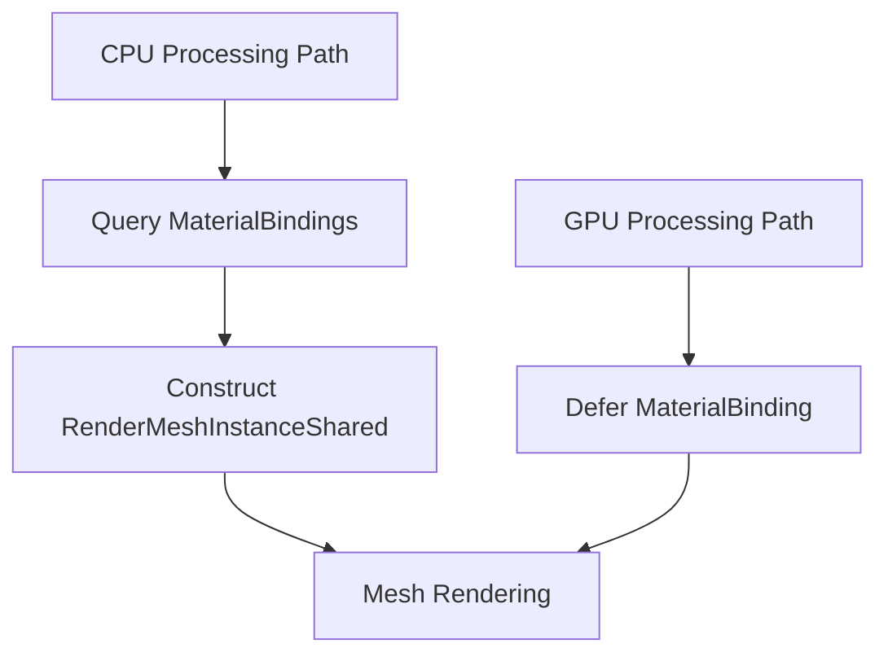

+++
title = "#19083 Fix: Provide CPU mesh processing with MaterialBindingId"
date = "2025-05-12T00:00:00"
draft = false
template = "pull_request_page.html"
in_search_index = false

[extra]
current_language = "zh-cn"
available_languages = {"en" = { name = "English", url = "/pull_request/bevy/2025-05/pr-19083-en-20250512" }, "zh-cn" = { name = "中文", url = "/pull_request/bevy/2025-05/pr-19083-zh-cn-20250512" }}
labels = ["C-Bug", "A-Rendering", "P-High", "O-WebGL2"]
+++

# Fix: Provide CPU mesh processing with MaterialBindingId

## Basic Information
- **Title**: Fix: Provide CPU mesh processing with MaterialBindingId
- **PR Link**: https://github.com/bevyengine/bevy/pull/19083
- **Author**: dsgallups
- **Status**: MERGED
- **Labels**: C-Bug, A-Rendering, P-High, O-WebGL2, S-Needs-Review
- **Created**: 2025-05-05T19:12:17Z
- **Merged**: 2025-05-12T18:30:07Z
- **Merged By**: superdump

## Description Translation
### 目标
修复 #19027

### 解决方案
在使用回退的 CPU 处理时查询材质绑定 ID

### 测试
开发者表示不确定如何有效测试此修复，建议通过 WebGL 2 运行 texture.rs 示例进行验证。该 PR 主要作为 PBR 系统改进的初步尝试。

## The Story of This Pull Request

### 问题背景与挑战
在 Bevy 的渲染系统中，当使用 WebGL2 等不支持 GPU 处理的环境时，系统会回退到 CPU 网格处理流程。原实现中，`RenderMeshInstanceShared` 结构体的 `material_bindings_index` 字段在 CPU 处理路径中未正确初始化，导致材质绑定信息丢失。这个缺陷具体表现为 issue #19027 中报告的渲染异常。

问题的核心在于：
1. GPU 处理路径通过 `RenderMeshGpuBuilder::update` 后续填充 material_bindings_index
2. CPU 处理路径缺少等效的初始化机制
3. 现有代码使用默认值初始化该字段，无法反映实际材质绑定

### 解决方案与技术实现
PR 通过以下结构调整实现修复：

1. **方法拆分与职责划分**
将原有的 `from_components` 方法拆分为两个专用方法：
```rust
// GPU 路径构造器
fn for_gpu_building(...) -> Self {
    Self::for_cpu_building(
        ...,
        default(), // 保留默认值，等待后续 GPU builder 更新
        ...,
    )
}

// CPU 路径构造器
fn for_cpu_building(
    ...,
    material_bindings_index: MaterialBindingId, // 新增参数
    ...,
) -> Self
```
这种拆分明确区分了不同处理路径的初始化逻辑，保持类型系统的约束力。

2. **材质绑定查询**
在 CPU 处理流程中新增材质绑定查询：
```rust
let mesh_material = mesh_material_ids.mesh_material(MainEntity::from(entity));
let material_bindings_index = render_material_bindings
    .get(&mesh_material)
    .copied()
    .unwrap_or_default();
```
这段代码：
- 通过 `mesh_material_ids` 解析实体对应的材质
- 从 `render_material_bindings` 资源中获取绑定索引
- 提供默认值作为降级处理

3. **处理路径适配**
更新 CPU 处理路径的调用方式：
```rust
let shared = RenderMeshInstanceShared::for_cpu_building(
    ...,
    material_bindings_index, // 传入查询结果
    ...,
);
```

### 技术考量与影响
1. **兼容性处理**
- 保留 GPU 路径的原有初始化逻辑，通过 `for_gpu_building` 维持向后兼容
- 新增 `for_cpu_building` 显式要求传入 material_bindings_index

2. **错误处理策略**
使用 `unwrap_or_default()` 处理材质绑定缺失情况，保证系统稳定性，但可能隐藏潜在配置错误。未来可考虑添加诊断日志。

3. **架构改进**
- 分离构造逻辑降低代码耦合度
- 通过参数显式化关键依赖，提升代码可维护性
- 为后续 PBR 系统改进奠定结构基础

### 验证与影响
主要验证方式：
1. 在 WebGL2 环境下运行 texture.rs 示例，确认材质显示正常
2. 确保 GPU 处理路径不受影响，保持原有性能特征

该修复直接影响：
- WebGL2 等依赖 CPU 处理路径的渲染后端
- 所有使用材质绑定的 CPU 侧网格处理逻辑
- 材质系统的错误恢复能力

## Visual Representation



## Key Files Changed

### `crates/bevy_pbr/src/render/mesh.rs` (+35/-5)
1. **方法重构**
```rust
// Before:
fn from_components(...) -> Self {
    // 通用初始化逻辑
}

// After:
fn for_gpu_building(...) -> Self {
    Self::for_cpu_building(..., default(), ...)
}

fn for_cpu_building(..., material_bindings_index: MaterialBindingId, ...) -> Self {
    // 包含显式材质绑定初始化
}
```

2. **CPU 处理路径增强**
```rust
// 新增材质绑定查询
let mesh_material = mesh_material_ids.mesh_material(...);
let material_bindings_index = render_material_bindings.get(...);

// 更新构造调用
RenderMeshInstanceShared::for_cpu_building(..., material_bindings_index, ...);
```

## Further Reading
1. [Bevy 材质系统文档](https://bevyengine.org/learn/book/implementation/materials/)
2. [WebGL2 渲染后端实现细节](https://bevyengine.org/learn/book/platforms/web/)
3. [实体组件系统模式](https://en.wikipedia.org/wiki/Entity_component_system)