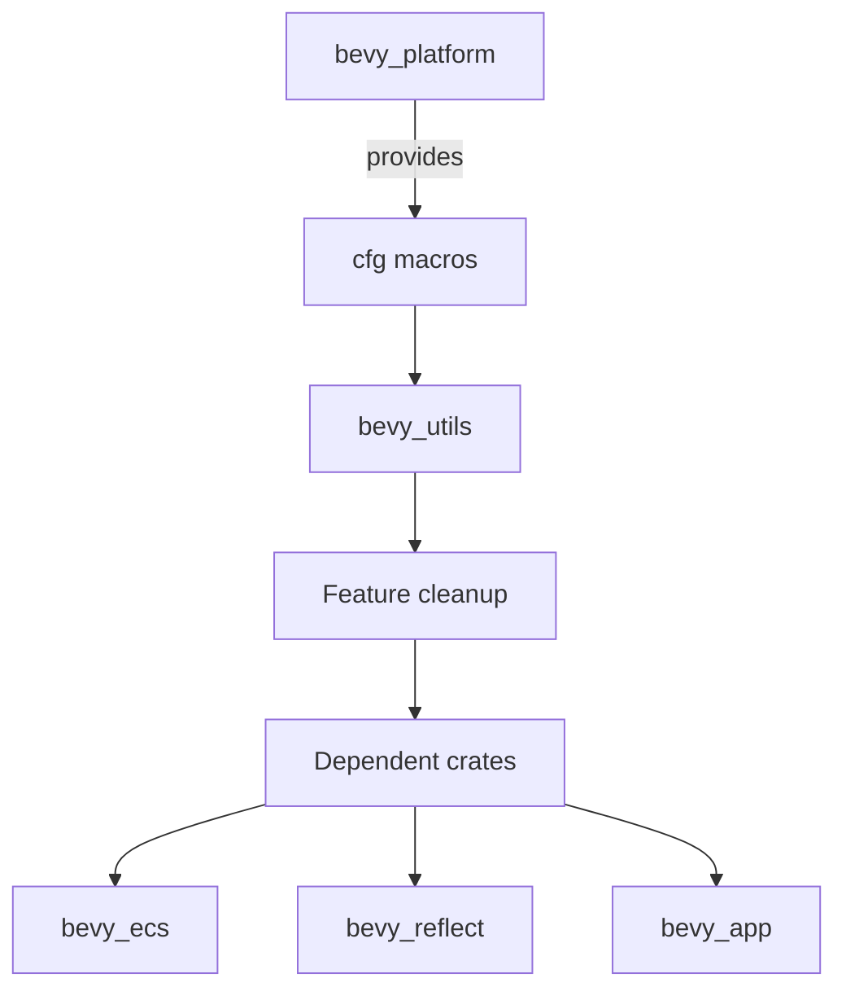

+++
title = "#19090 Simplify `bevy_utils` Features"
date = "2025-05-24T00:00:00"
draft = false
template = "pull_request_page.html"
in_search_index = true

[taxonomies]
list_display = ["show"]

[extra]
current_language = "en"
available_languages = {"en" = { name = "English", url = "/pull_request/bevy/2025-05/pr-19090-en-20250524" }, "zh-cn" = { name = "中文", url = "/pull_request/bevy/2025-05/pr-19090-zh-cn-20250524" }}
labels = ["C-Code-Quality", "A-Utils", "X-Blessed", "D-Straightforward"]
+++

# Title

## Basic Information
- **Title**: Simplify `bevy_utils` Features
- **PR Link**: https://github.com/bevyengine/bevy/pull/19090
- **Author**: bushrat011899
- **Status**: MERGED
- **Labels**: C-Code-Quality, A-Utils, X-Blessed, D-Straightforward, S-Needs-Review
- **Created**: 2025-05-06T04:24:45Z
- **Merged**: 2025-05-24T02:05:39Z
- **Merged By**: mockersf

## Description Translation
The original description is in English and remains unchanged:

# Objective

Now that `bevy_platform::cfg` is merged, we can start tidying up features. This PR starts with `bevy_utils`.

## Solution

- Removed `serde` and `critical-section` features (they were just re-exports of `bevy_platform` anyway)
- Removed `std`, `alloc` features, relying on `bevy_platform::cfg` to check for availability.
- Added `parallel` feature to provide access to the `Parallel` type.
- Moved the `HashMap` type aliases into `map.rs` for better organisation.

## Testing

- CI


## The Story of This Pull Request

This PR addresses technical debt in Bevy's utility module by streamlining feature management after the introduction of `bevy_platform::cfg`. The core problem was redundant feature declarations in `bevy_utils` that duplicated functionality already provided by `bevy_platform`. This duplication complicated dependency management and increased maintenance overhead.

The solution involved three key technical decisions:
1. **Feature Consolidation**: Removed proxy features (`serde`, `critical-section`, `std`, `alloc`) that simply re-exported `bevy_platform` equivalents
2. **New Feature Definition**: Introduced a dedicated `parallel` feature to expose the `Parallel` type without relying on broader std features
3. **Code Reorganization**: Moved hash map type aliases (`PreHashMap`, `TypeIdMap`) and related tests to a dedicated `map.rs` module

Implementation details reveal careful use of Rust's conditional compilation:
```rust
// New cfg module leveraging bevy_platform's configuration
pub mod cfg {
    pub(crate) use bevy_platform::cfg::*;
    pub use bevy_platform::cfg::{alloc, std};
    
    define_alias! {
        #[cfg(feature = "parallel")] => {
            parallel
        }
    }
}
```

This restructuring allowed removal of 98 lines from `lib.rs` while maintaining equivalent functionality. The changes cascade through dependent crates like `bevy_ecs` and `bevy_reflect`, which now reference `bevy_platform` features directly rather than through `bevy_utils` proxies.

A key technical insight is the use of `bevy_platform::cfg` macros to manage platform-specific code paths. This approach centralizes feature management while preserving `no_std` compatibility. For example:
```rust
cfg::std! {
    extern crate std;
}
```

The PR demonstrates effective technical debt management by:
1. Eliminating duplicate feature declarations
2. Improving code organization through module separation
3. Simplifying cross-crate dependency graphs
4. Maintaining backward compatibility through careful feature reimplementation

## Visual Representation



## Key Files Changed

1. **crates/bevy_utils/src/lib.rs** (+28/-98)
```rust
// Before:
#[cfg(feature = "std")]
extern crate std;

// After:
cfg::std! {
    extern crate std;
}
```
Centralized conditional compilation using `bevy_platform::cfg` macros.

2. **crates/bevy_utils/src/map.rs** (+83/-0)
```rust
// New module containing hash map types
pub type PreHashMap<K, V> = HashMap<Hashed<K>, V, PassHash>;
pub type TypeIdMap<V> = HashMap<TypeId, V, NoOpHash>;
```
Improved code organization by moving type aliases to dedicated module.

3. **crates/bevy_utils/Cargo.toml** (+3/-19)
```toml
# Before:
[features]
std = ["alloc", "bevy_platform/std", "dep:thread_local"]

# After:
[features]
parallel = ["bevy_platform/std", "dep:thread_local"]
```
Simplified feature definitions by removing redundant declarations.

4. **crates/bevy_ecs/Cargo.toml** (+3/-10)
```toml
# Before:
std = [
    "bevy_utils/std",
]

# After:
std = [
    "bevy_utils/parallel",
]
```
Updated dependencies to use new feature structure.

## Further Reading

1. [Rust Feature Flags Documentation](https://doc.rust-lang.org/cargo/reference/features.html)
2. [Bevy's Module Organization Guidelines](https://bevyengine.org/learn/book/next/cargo/features/)
3. [Conditional Compilation in Rust](https://doc.rust-lang.org/reference/conditional-compilation.html)