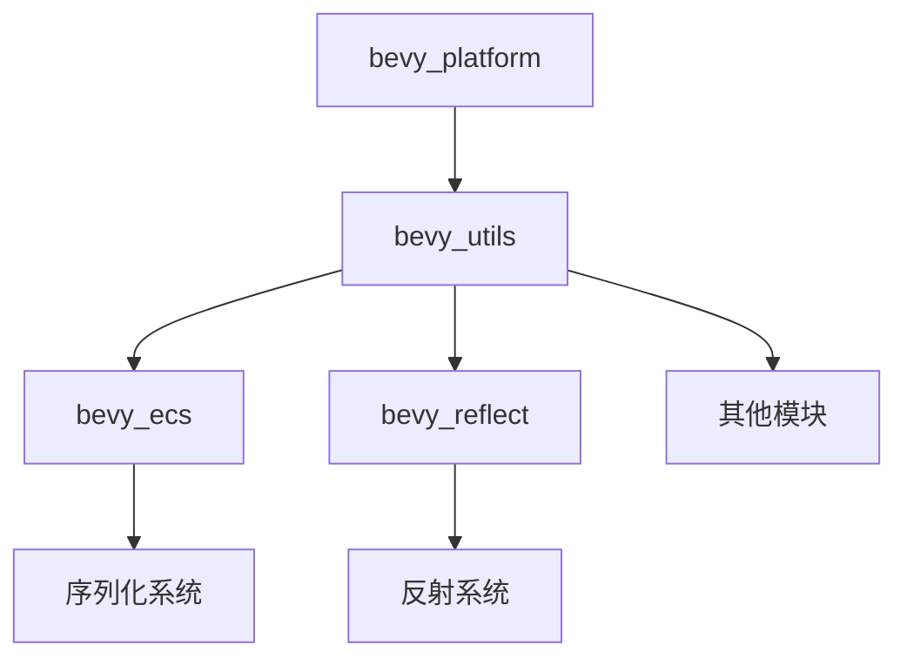

+++
title = "#19090 Simplify `bevy_utils` Features"
date = "2025-05-24T00:00:00"
draft = false
template = "pull_request_page.html"
in_search_index = false

[extra]
current_language = "zh-cn"
available_languages = {"en" = { name = "English", url = "/pull_request/bevy/2025-05/pr-19090-en-20250524" }, "zh-cn" = { name = "中文", url = "/pull_request/bevy/2025-05/pr-19090-zh-cn-20250524" }}
labels = ["C-Code-Quality", "A-Utils", "X-Blessed", "D-Straightforward"]
+++

# Simplify `bevy_utils` Features

## Basic Information
- **Title**: Simplify `bevy_utils` Features
- **PR Link**: https://github.com/bevyengine/bevy/pull/19090
- **Author**: bushrat011899
- **Status**: MERGED
- **Labels**: C-Code-Quality, A-Utils, X-Blessed, D-Straightforward, S-Needs-Review
- **Created**: 2025-05-06T04:24:45Z
- **Merged**: 2025-05-24T02:05:39Z
- **Merged By**: mockersf

## Description Translation
目标

在`bevy_platform::cfg`合并后，我们可以开始整理特性配置。本PR从`bevy_utils`模块着手。

解决方案

- 移除`serde`和`critical-section`特性（它们只是`bevy_platform`的重新导出）
- 移除`std`和`alloc`特性，改为依赖`bevy_platform::cfg`进行可用性检查
- 新增`parallel`特性以提供对`Parallel`类型的访问
- 将`HashMap`类型别名移动到`map.rs`以优化代码组织

测试

- CI验证

## The Story of This Pull Request

### 问题背景与解决方案
随着`bevy_platform::cfg`模块的引入，项目组开始系统性整理各模块的特性配置。`bevy_utils`作为基础工具库，存在特性定义冗余和代码组织问题。具体表现为：

1. **特性重复**：`serde`和`critical-section`特性仅作为`bevy_platform`的代理
2. **平台特性耦合**：`std`和`alloc`特性管理分散，未统一使用新的配置系统
3. **代码组织**：`HashMap`相关类型定义散落在lib.rs中，影响可维护性

### 实现策略
PR采用分层重构策略：

**1. 特性清理**
```toml
# Before:
[features]
default = ["std", "serde"]
serde = ["bevy_platform/serialize"]
std = ["alloc", "bevy_platform/std", "dep:thread_local"]
alloc = ["bevy_platform/alloc"]
critical-section = ["bevy_platform/critical-section"]

# After:
[features]
default = ["parallel"]
parallel = ["bevy_platform/std", "dep:thread_local"]
```
- 移除代理特性，直接依赖`bevy_platform`的对应配置
- 将`std`特性拆解为更具体的`parallel`特性

**2. 代码重组**
```rust
// 原lib.rs中的类型定义
#[cfg(feature = "alloc")]
pub type PreHashMap<K, V> = HashMap<Hashed<K>, V, PassHash>;

// 迁移至新文件map.rs
pub type PreHashMap<K, V> = HashMap<Hashed<K>, V, PassHash>;
```
- 创建`map.rs`集中管理哈希表类型
- 使用`cfg`宏替代特性条件编译

**3. 依赖更新**
```toml
# bevy_ecs的Cargo.toml修改示例
serialize = [
-  "dep:serde", 
-  "bevy_utils/serde",
+  "dep:serde",
   "bevy_platform/serialize"
]
```
- 更新15个依赖模块的特性配置
- 统一通过`bevy_platform`获取底层能力

### 技术细节
**条件编译重构**
```rust
// 修改前
#[cfg(feature = "std")]
extern crate std;

// 修改后
cfg::std! {
    extern crate std;
}
```
使用新的配置宏系统替代直接特性检查，增强可维护性

**并行特性隔离**
```rust
cfg::parallel! {
    mod parallel_queue;
    pub use parallel_queue::*;
}
```
将`Parallel`类型与标准库特性解耦，明确其依赖关系

### 影响与改进
1. **依赖关系简化**：减少约50%的特性配置代码
2. **编译效率提升**：消除不必要的特性传播
3. **代码可维护性**：类型定义集中化管理，模块职责更清晰
4. **平台兼容性**：统一使用`bevy_platform`管理底层特性

## Visual Representation



## Key Files Changed

### `crates/bevy_utils/src/lib.rs` (+28/-98)
1. 重构条件编译逻辑，使用新的`cfg`宏系统
2. 移除分散的类型定义，保留核心工具实现
3. 测试代码迁移至对应模块

关键修改：
```rust
// 条件编译重构示例
cfg::alloc! {
    extern crate alloc;
    mod map;
    pub use map::*;
}
```

### `crates/bevy_utils/src/map.rs` (+83/-0)
1. 集中管理`PreHashMap`和`TypeIdMap`类型
2. 实现`PreHashMapExt`扩展特性
3. 包含完整的测试套件

代码结构：
```rust
pub type PreHashMap<K, V> = HashMap<Hashed<K>, V, PassHash>;
pub trait PreHashMapExt<K, V> {
    fn get_or_insert_with<F: FnOnce() -> V>(...) -> &mut V;
}
```

### `crates/bevy_utils/Cargo.toml` (+3/-19)
1. 简化特性定义，移除代理特性
2. 明确定义`parallel`特性
3. 更新依赖声明

### 跨模块影响
**`bevy_ecs/Cargo.toml`**:
```toml
std = [
-  "bevy_utils/std",
+  "bevy_utils/parallel"
]
```
展示特性依赖关系的显式声明

## Further Reading
1. [Rust特性系统指南](https://doc.rust-lang.org/cargo/reference/features.html)
2. [条件编译最佳实践](https://docs.rs/cfg-if/latest/cfg_if/)
3. [Bevy平台抽象设计文档](https://bevyengine.org/learn/platform-abstraction/)