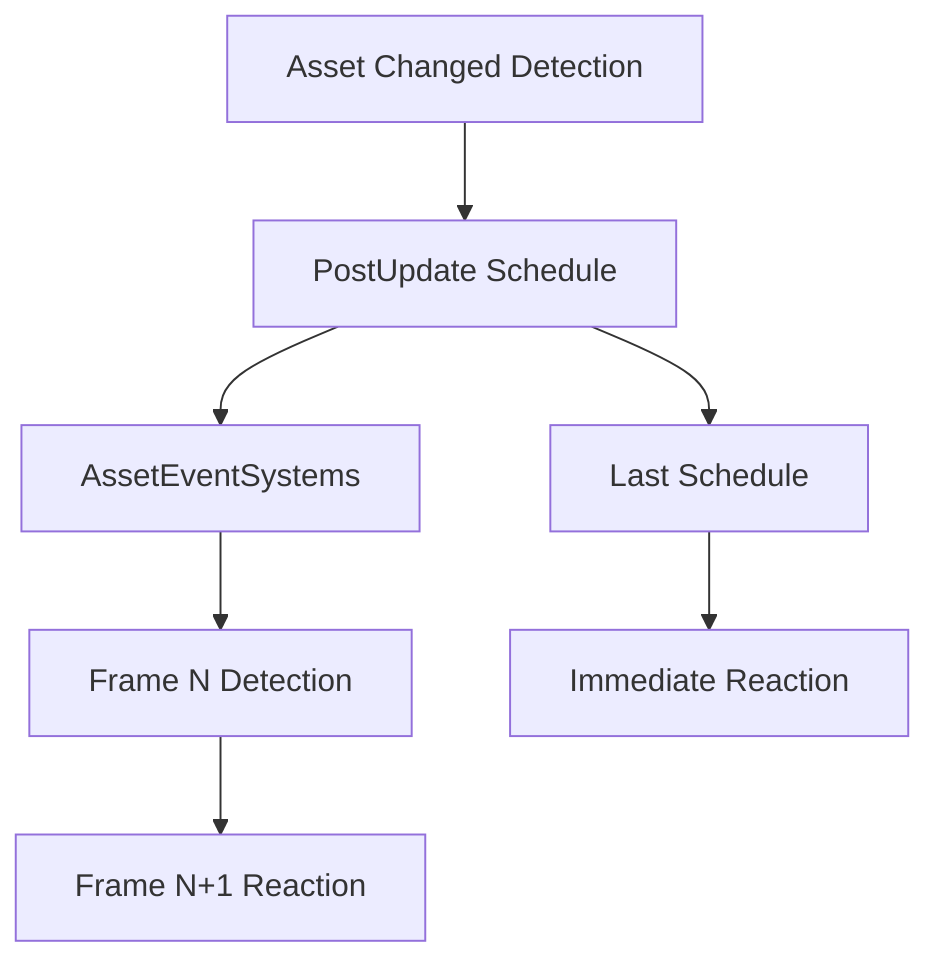

+++
title = "#19093 Fix `AssetChanged` code documentation to mention the `PostUpdate` schedule"
date = "2025-05-26T00:00:00"
draft = false
template = "pull_request_page.html"
in_search_index = true

[taxonomies]
list_display = ["show"]

[extra]
current_language = "en"
available_languages = {"en" = { name = "English", url = "/pull_request/bevy/2025-05/pr-19093-en-20250526" }, "zh-cn" = { name = "中文", url = "/pull_request/bevy/2025-05/pr-19093-zh-cn-20250526" }}
labels = ["C-Docs", "D-Trivial", "A-Assets"]
+++

# Title

## Basic Information
- **Title**: Fix `AssetChanged` code documentation to mention the `PostUpdate` schedule
- **PR Link**: https://github.com/bevyengine/bevy/pull/19093
- **Author**: Henauxg
- **Status**: MERGED
- **Labels**: C-Docs, D-Trivial, A-Assets, S-Ready-For-Final-Review
- **Created**: 2025-05-06T11:39:13Z
- **Merged**: 2025-05-26T17:53:37Z
- **Merged By**: alice-i-cecile

## Description Translation
# Objective

- Fix `AssetChanged` code documentation to mention the `PostUpdate` schedule instead of the `Last` schedule

## Testing

- Trivial (code doc). Check `bevy_asset/src/lib.rs` in function `init_asset` to see where this is scheduled:
```rust
           .add_systems(
                PostUpdate,
                Assets::<A>::asset_events
                    .run_if(Assets::<A>::asset_events_condition)
                    .in_set(AssetEvents),
            )
```

## The Story of This Pull Request

The PR addresses a documentation mismatch in Bevy's asset system. The core issue stemmed from outdated comments in the `AssetChanged` implementation that referenced an incorrect schedule phase. Specifically, the documentation claimed asset change detection occurred in the `Last` schedule, while the actual implementation used `PostUpdate`.

This discrepancy originated from Bevy's schedule reorganization in previous versions. The asset event system (`AssetEvents`) had been moved to `PostUpdate` to align with Bevy's updated execution model, but the corresponding documentation wasn't updated. This created potential confusion for developers relying on the comments to understand when asset changes become detectable.

The fix involved a single-line correction in the code comments:
```rust
-/// which runs in `Last`. Therefore, `AssetChanged` will only pick up asset changes in schedules
+/// which runs in `PostUpdate`. Therefore, `AssetChanged` will only pick up asset changes in schedules
```
This change brings the documentation in line with the actual system registration seen in `init_asset`, where the asset event system is explicitly added to `PostUpdate`:
```rust
.add_systems(
    PostUpdate,
    Assets::<A>::asset_events
        .run_if(Assets::<A>::asset_events_condition)
        .in_set(AssetEvents),
)
```

The PR maintains the existing advice about using `Last` schedule for immediate reaction to changes, but now correctly positions it as a workaround for when developers need to respond to asset changes without frame delay. This preserves the original intent while fixing the schedule reference.

## Visual Representation



## Key Files Changed

- `crates/bevy_asset/src/asset_changed.rs` (+1/-1)

**Change Description:**
Updated code comment to reflect correct schedule for asset change detection

**Code Diff:**
```rust
// Before:
/// which runs in `Last`. Therefore, `AssetChanged` will only pick up asset changes in schedules

// After:
/// which runs in `PostUpdate`. Therefore, `AssetChanged` will only pick up asset changes in schedules
```

**Relation to PR:**
This single-line documentation fix ensures developers referencing the code comments receive accurate information about when asset change detection occurs in Bevy's execution flow.

## Further Reading

1. Bevy Schedule Documentation: https://bevyengine.org/learn/book/next/programming/schedules
2. Asset System Guide: https://bevyengine.org/learn/book/next/assets
3. System Ordering in Bevy: https://bevyengine.org/learn/book/next/programming/system-order

# Full Code Diff
diff --git a/crates/bevy_asset/src/asset_changed.rs b/crates/bevy_asset/src/asset_changed.rs
index 10f298c9689be..d314fa3fd6576 100644
--- a/crates/bevy_asset/src/asset_changed.rs
+++ b/crates/bevy_asset/src/asset_changed.rs
@@ -106,7 +106,7 @@ impl<'w, A: AsAssetId> AssetChangeCheck<'w, A> {
 /// - Removed assets are not detected.
 ///
 /// The list of changed assets only gets updated in the [`AssetEventSystems`] system set,
-/// which runs in `Last`. Therefore, `AssetChanged` will only pick up asset changes in schedules
+/// which runs in `PostUpdate`. Therefore, `AssetChanged` will only pick up asset changes in schedules
 /// following [`AssetEventSystems`] or the next frame. Consider adding the system in the `Last` schedule
 /// after [`AssetEventSystems`] if you need to react without frame delay to asset changes.
 ///