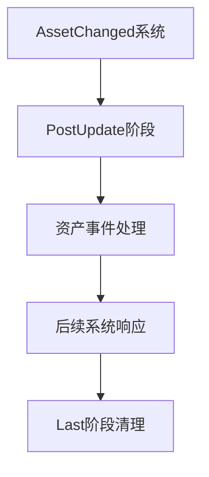

+++
title = "#19093 Fix `AssetChanged` code documentation to mention the `PostUpdate` schedule"
date = "2025-05-26T00:00:00"
draft = false
template = "pull_request_page.html"
in_search_index = false

[extra]
current_language = "zh-cn"
available_languages = {"en" = { name = "English", url = "/pull_request/bevy/2025-05/pr-19093-en-20250526" }, "zh-cn" = { name = "中文", url = "/pull_request/bevy/2025-05/pr-19093-zh-cn-20250526" }}
labels = ["C-Docs", "D-Trivial", "A-Assets"]
+++

# Fix `AssetChanged` code documentation to mention the `PostUpdate` schedule

## Basic Information
- **Title**: Fix `AssetChanged` code documentation to mention the `PostUpdate` schedule
- **PR Link**: https://github.com/bevyengine/bevy/pull/19093
- **Author**: Henauxg
- **Status**: MERGED
- **Labels**: C-Docs, D-Trivial, A-Assets, S-Ready-For-Final-Review
- **Created**: 2025-05-06T11:39:13Z
- **Merged**: 2025-05-26T17:53:37Z
- **Merged By**: alice-i-cecile

## Description Translation
### 目标
- 修复`AssetChanged`代码文档，将提到的调度计划从`Last`改为`PostUpdate`

### 测试
- 简单文档修改。检查`bevy_asset/src/lib.rs`中的`init_asset`函数可以看到具体的调度位置：
```rust
           .add_systems(
                PostUpdate,
                Assets::<A>::asset_events
                    .run_if(Assets::<A>::asset_events_condition)
                    .in_set(AssetEvents),
            )
```

## The Story of This Pull Request

### 问题背景
在Bevy引擎的资产系统中，`AssetChanged`组件用于检测资产状态变化。原始文档错误地指出相关系统运行在`Last`调度阶段，而实际上从代码实现可见，`AssetEventSystems`系统组被注册到`PostUpdate`阶段。这种文档与实现的不一致可能导致开发者误解事件处理时机，进而在错误阶段安排系统执行顺序。

### 解决方案
通过直接修改文档注释，将调度阶段的描述从`Last`更正为`PostUpdate`。这种修正基于对现有代码的验证：
```rust
.add_systems(
    PostUpdate,  // 明确显示系统注册到PostUpdate阶段
    Assets::<A>::asset_events
        .run_if(...)
        .in_set(AssetEvents),
)
```

### 技术细节
1. **调度阶段定位**：
   - `PostUpdate`是Bevy标准调度阶段中的核心阶段，主要用于处理状态更新后的逻辑
   - `Last`阶段在调度顺序中位于`PostUpdate`之后，用于最终清理操作

2. **事件处理流程**：
   - 资产变更事件在`PostUpdate`阶段被处理并生成
   - 依赖这些事件的系统需要安排在`PostUpdate`之后才能正确响应

3. **文档修正影响**：
   - 避免开发者将系统错误地安排在`Last`阶段之前
   - 确保对资产变更敏感的系统的正确执行顺序

### 关键修改分析
```diff
# File: crates/bevy_asset/src/asset_changed.rs
# Before:
/// which runs in `Last`. Therefore, `AssetChanged` will only pick up asset changes in schedules

# After:
/// which runs in `PostUpdate`. Therefore, `AssetChanged` will only pick up asset changes in schedules
```
这个单行修改直接修复了文档与代码实现的不一致。原始描述中`Last`的提法会误导开发者对系统执行顺序的理解，修正后的`PostUpdate`准确反映了实际的系统注册位置。

### 最佳实践建议
- 当文档涉及调度阶段描述时，应直接参考对应系统的注册代码
- 对于时序敏感的系统，建议在代码中添加注释说明其依赖的调度阶段
- 使用`cargo doc --open`命令验证文档生成结果是否符合预期

## Visual Representation



## Key Files Changed
- `crates/bevy_asset/src/asset_changed.rs` (+1/-1)

### 修改说明
1. **文件作用**：
   - 定义资产变更检测的核心逻辑和文档说明

2. **关键修改**：
   ```diff
   -/// which runs in `Last`. Therefore, `AssetChanged` will only pick up asset changes in schedules
   +/// which runs in `PostUpdate`. Therefore, `AssetChanged` will only pick up asset changes in schedules
   ```
   直接修正调度阶段描述，保持文档与代码实现的一致性

## Further Reading
1. [Bevy调度系统文档](https://bevyengine.org/learn/book/getting-started/scheduling/)
2. [ECS系统执行顺序指南](https://bevy-cheatbook.github.io/programming/system-order.html)
3. [资产系统工作原理](https://bevyengine.org/learn/book/assets/)