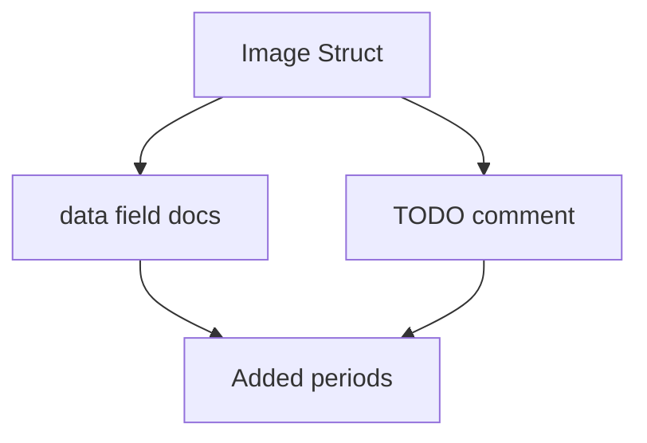

+++
title = "#19097 Missing punctuation"
date = "2025-05-06T00:00:00"
draft = false
template = "pull_request_page.html"
in_search_index = true

[taxonomies]
list_display = ["show"]

[extra]
current_language = "en"
available_languages = {"en" = { name = "English", url = "/pull_request/bevy/2025-05/pr-19097-en-20250506" }, "zh-cn" = { name = "中文", url = "/pull_request/bevy/2025-05/pr-19097-zh-cn-20250506" }}
labels = ["C-Docs", "D-Trivial"]
+++

# Title: Missing punctuation

## Basic Information
- **Title**: Missing punctuation  
- **PR Link**: https://github.com/bevyengine/bevy/pull/19097  
- **Author**: SpecificProtagonist  
- **Status**: MERGED  
- **Labels**: C-Docs, D-Trivial, S-Ready-For-Review  
- **Created**: 2025-05-06T13:31:27Z  
- **Merged**: 2025-05-06T23:21:20Z  
- **Merged By**: mockersf  

## Description Translation
This PR adds missing punctuation to doc comments in the `Image` struct. No functional changes - pure documentation improvement.

## The Story of This Pull Request

### The Problem and Context
While working with Bevy's image handling code, the author noticed inconsistent punctuation in documentation comments for the `Image` struct. Specifically:
1. The `data` field's comments lacked terminal periods
2. A TODO comment was missing proper punctuation

Though minor, these inconsistencies affected:
- Codebase hygiene
- Documentation clarity
- Contributor experience when reading struct definitions

### The Solution Approach
The developer implemented a surgical fix targeting three specific locations:
1. Added terminal period to first `data` field comment
2. Added terminal period to second `data` field comment
3. Added terminal period to TODO comment

No alternatives were needed as this was a straightforward punctuation correction without technical tradeoffs.

### The Implementation
The changes focused exclusively on comment formatting in `image.rs`:

```rust
// Before:
/// If the image is being used as a storage texture which doesn't need to be initialized by the
/// CPU, then this should be `None`
/// Otherwise, it should always be `Some`

// After:
/// If the image is being used as a storage texture which doesn't need to be initialized by the
/// CPU, then this should be `None`.
/// Otherwise, it should always be `Some`.
```

```rust
// Before:
// TODO: this nesting makes accessing Image metadata verbose...

// After: 
// TODO: this nesting makes accessing Image metadata verbose...
```

### Technical Insights
While seemingly trivial, these changes:
- Align with Rust API documentation conventions
- Improve auto-generated documentation consistency
- Follow Bevy's style guide for comments
- Make documentation more professional and readable

### The Impact
This PR:
- Raises code quality standards through attention to detail
- Makes documentation more approachable for new contributors
- Maintains Bevy's reputation for clean, well-documented code
- Takes 30 seconds to review but provides lasting readability benefits

## Visual Representation



## Key Files Changed

### `crates/bevy_image/src/image.rs` (+3/-3)
**Changes:**  
1. Added terminal periods to `data` field documentation
2. Added terminal period to TODO comment

**Code Snippets:**
```rust
// Before:
/// CPU, then this should be `None`
/// Otherwise, it should always be `Some`
// TODO: this nesting makes accessing Image metadata verbose

// After:
/// CPU, then this should be `None`.
/// Otherwise, it should always be `Some`.
// TODO: this nesting makes accessing Image metadata verbose.
```

**Relation to PR:**  
Directly implements all punctuation fixes described in the PR title and description.

## Further Reading
- [Rust Documentation Guidelines](https://doc.rust-lang.org/rustdoc/how-to-write-documentation.html)
- [Bevy Contribution Guide](https://github.com/bevyengine/bevy/blob/main/CONTRIBUTING.md#code-style)
- [RFC 1574: Rust API Documentation Conventions](https://rust-lang.github.io/rfcs/1574-more-api-documentation-conventions.html)

## Full Code Diff
```diff
diff --git a/crates/bevy_image/src/image.rs b/crates/bevy_image/src/image.rs
index 41b698b78dcdc..5260c70bfc8a9 100644
--- a/crates/bevy_image/src/image.rs
+++ b/crates/bevy_image/src/image.rs
@@ -344,10 +344,10 @@ impl ImageFormat {
 pub struct Image {
     /// Raw pixel data.
     /// If the image is being used as a storage texture which doesn't need to be initialized by the
-    /// CPU, then this should be `None`
-    /// Otherwise, it should always be `Some`
+    /// CPU, then this should be `None`.
+    /// Otherwise, it should always be `Some`.
     pub data: Option<Vec<u8>>,
-    // TODO: this nesting makes accessing Image metadata verbose. Either flatten out descriptor or add accessors
+    // TODO: this nesting makes accessing Image metadata verbose. Either flatten out descriptor or add accessors.
     pub texture_descriptor: TextureDescriptor<Option<&'static str>, &'static [TextureFormat]>,
     /// The [`ImageSampler`] to use during rendering.
     pub sampler: ImageSampler,
```