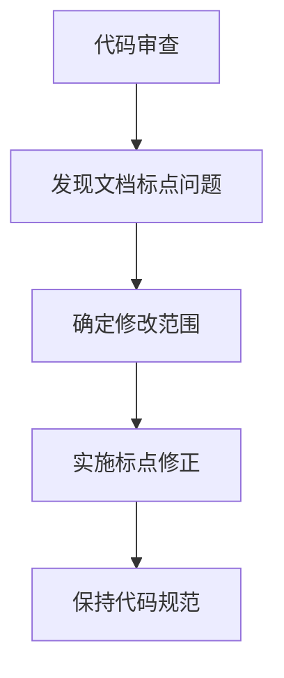

+++
title = "#19097 Missing punctuation"
date = "2025-05-06T00:00:00"
draft = false
template = "pull_request_page.html"
in_search_index = false

[extra]
current_language = "zh-cn"
available_languages = {"en" = { name = "English", url = "/pull_request/bevy/2025-05/pr-19097-en-20250506" }, "zh-cn" = { name = "中文", url = "/pull_request/bevy/2025-05/pr-19097-zh-cn-20250506" }}
labels = ["C-Docs", "D-Trivial"]
+++

# Missing punctuation

## Basic Information
- **Title**: Missing punctuation  
- **PR Link**: https://github.com/bevyengine/bevy/pull/19097  
- **Author**: SpecificProtagonist  
- **Status**: MERGED  
- **Labels**: C-Docs, D-Trivial, S-Ready-For-Final-Review  
- **Created**: 2025-05-06T13:31:27Z  
- **Merged**: 2025-05-06T23:21:20Z  
- **Merged By**: mockersf  

## Description Translation
为图像结构中的文档注释添加缺少的句号

## The Story of This Pull Request

### 问题背景与发现
在审查`Image`结构体的API文档时，SpecificProtagonist注意到`crates/bevy_image/src/image.rs`文件中存在文档注释标点不统一的问题。具体表现为部分代码注释结尾缺少英文句号，这种细节问题虽然不影响代码执行，但会降低文档的专业性和可读性。

### 解决方案与实施
开发者采用最小修改原则，对三处文档注释进行标点修正：

1. **`data`字段注释**：原注释两处结尾缺少句号
```rust
// 修改前
/// If the image is being used as a storage texture which doesn't need to be initialized by the
/// CPU, then this should be `None`
/// Otherwise, it should always be `Some`

// 修改后
/// If the image is being used as a storage texture which doesn't need to be initialized by the
/// CPU, then this should be `None`.
/// Otherwise, it should always be `Some`.
```

2. **TODO注释标准化**：开发者注意到现有技术债务标记的注释格式不一致
```rust
// 修改前
// TODO: this nesting makes accessing Image metadata verbose. Either flatten out descriptor or add accessors

// 修改后
// TODO: this nesting makes accessing Image metadata verbose. Either flatten out descriptor or add accessors.
```

### 技术考量
- **代码规范**：遵循Rust文档注释标准RFC 1574，要求文档注释使用完整句子并正确结尾
- **可维护性**：统一标点风格有利于后续自动化文档生成工具的处理
- **开发体验**：规范的文档格式能提升贡献者阅读代码时的体验

### 影响与价值
这个看似简单的修改体现了开源项目维护中容易被忽视但重要的细节：
1. 提升API文档的规范性和专业性
2. 保持代码风格统一，降低认知负荷
3. 为后续贡献者建立良好的代码规范示例
4. 通过微小改进持续提升代码库质量

## Visual Representation



## Key Files Changed

### `crates/bevy_image/src/image.rs` (+3/-3)
1. **修改说明**：规范文档注释的标点使用
2. **关键代码对比**：
```rust
// 修改前：
/// If the image is being used as a storage texture which doesn't need to be initialized by the
/// CPU, then this should be `None`
/// Otherwise, it should always be `Some`
pub data: Option<Vec<u8>>,
// TODO: this nesting makes accessing Image metadata verbose. Either flatten out descriptor or add accessors

// 修改后：
/// If the image is being used as a storage texture which doesn't need to be initialized by the
/// CPU, then this should be `None`.
/// Otherwise, it should always be `Some`.
pub data: Option<Vec<u8>>,
// TODO: this nesting makes accessing Image metadata verbose. Either flatten out descriptor or add accessors.
```

## Further Reading
1. [Rust文档注释规范](https://doc.rust-lang.org/rustdoc/how-to-write-documentation.html)
2. [RFC 1574 - API文档惯例](https://rust-lang.github.io/rfcs/1574-more-api-documentation-conventions.html)
3. [Bevy代码风格指南](https://github.com/bevyengine/bevy/blob/main/docs/CODE_STYLE.md)