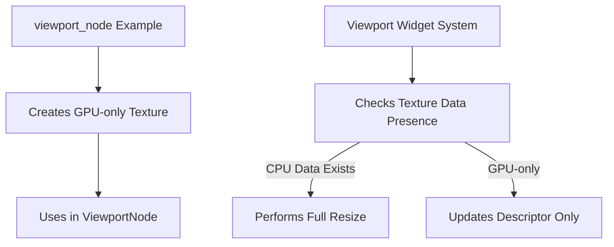

+++
title = "#19098 Optimizing Viewport Texture Handling in Bevy UI"
date = "2025-05-26T00:00:00"
draft = false
template = "pull_request_page.html"
in_search_index = true

[taxonomies]
list_display = ["show"]

[extra]
current_language = "en"
available_languages = {"en" = { name = "English", url = "/pull_request/bevy/2025-05/pr-19098-en-20250526" }, "zh-cn" = { name = "中文", url = "/pull_request/bevy/2025-05/pr-19098-zh-cn-20250526" }}
labels = ["C-Examples", "D-Straightforward"]
+++

# Title: Optimizing Viewport Texture Handling in Bevy UI

## Basic Information  
- **Title**: viewport_node example: Remove main world image initialization  
- **PR Link**: https://github.com/bevyengine/bevy/pull/19098  
- **Author**: SpecificProtagonist  
- **Status**: MERGED  
- **Labels**: C-Examples, S-Ready-For-Final-Review, D-Straightforward  
- **Created**: 2025-05-06T14:10:50Z  
- **Merged**: 2025-05-26T17:40:31Z  
- **Merged By**: alice-i-cecile  

## Description Translation  
# Objective  

The new viewport example allocates a texture in main memory, even though it's only needed on the GPU. Also fix an unnecessary warning when a viewport's texture doesn't exist CPU-side.  

## Testing  

Run the `viewport_node` example.  

## The Story of This Pull Request  

The PR addresses two connected issues in Bevy's viewport handling. First, the `viewport_node` example unnecessarily allocated CPU-side memory for a GPU-exclusive texture. Second, the viewport system generated warnings when resizing textures without CPU presence.  

**The Core Problem**:  
When creating render targets for viewports, the original implementation:  
1. Initialized a full zero-filled CPU-side buffer for GPU-only textures  
2. Attempted resizing operations assuming CPU data existence  

This led to:  
- Wasted memory allocation (size × format.pixel_size() bytes)  
- Potential warning spam in resize operations  

**Solution Architecture**:  
1. **GPU-Only Texture Creation**:  
   Use `Image::new_uninit` to create textures without CPU-side data allocation  
   ```rust  
   let mut image = Image::new_uninit(
       default(),
       TextureDimension::D2,
       TextureFormat::Bgra8UnormSrgb,
       RenderAssetUsages::all(),
   );
   ```  
   The `RenderAssetUsages::all()` parameter ensures proper asset lifecycle management.

2. **Safe Texture Resizing**:  
   Modify resize logic to handle GPU-only textures gracefully:  
   ```rust  
   if image.data.is_some() {
       image.resize(size);
   } else {
       image.texture_descriptor.size = size;
   }
   ```  
   This conditional prevents attempts to resize non-existent CPU data while maintaining descriptor accuracy.

**Performance Impact**:  
- Eliminates redundant memory allocation for viewport textures  
- Reduces CPU memory pressure in UI-heavy applications  
- Removes false-positive warnings during viewport operations  

**Engineering Tradeoffs**:  
- Explicit texture usage flags ensure correct pipeline behavior  
- Maintains backward compatibility through conditional resize logic  
- Requires understanding of GPU resource lifecycle management  

## Visual Representation  



## Key Files Changed  

1. **examples/ui/viewport_node.rs**  
   - Removed window query and CPU-side texture initialization  
   - Simplified texture creation using GPU-optimized path  
   
   Before:  
   ```rust
   let image = Image {
       data: Some(vec![0; size.volume() * format.pixel_size()]),
       texture_descriptor: TextureDescriptor {
           // ... manual descriptor setup
       },
       ..default()
   };
   ```
   
   After:  
   ```rust
   let mut image = Image::new_uninit(
       default(),
       TextureDimension::D2,
       TextureFormat::Bgra8UnormSrgb,
       RenderAssetUsages::all(),
   );
   image.texture_descriptor.usage = /* ... */;
   ```

2. **crates/bevy_ui/src/widget/viewport.rs**  
   - Added conditional texture resize logic  
   - Fixed warning about missing CPU texture data  

   Key Change:  
   ```rust
   let image = images.get_mut(image_handle).unwrap();
   if image.data.is_some() {
       image.resize(size);
   } else {
       image.texture_descriptor.size = size;
   }
   ```

## Further Reading  
1. [Bevy Render Asset Usages Documentation](https://bevyengine.org/learn/book/assets/render-assets/)  
2. [WGPU Texture Descriptor Best Practices](https://wgpu.rs/guide/texture-creation/)  
3. [Bevy UI Viewport Architecture](https://bevyengine.org/learn/book/ui/viewport-nodes/)