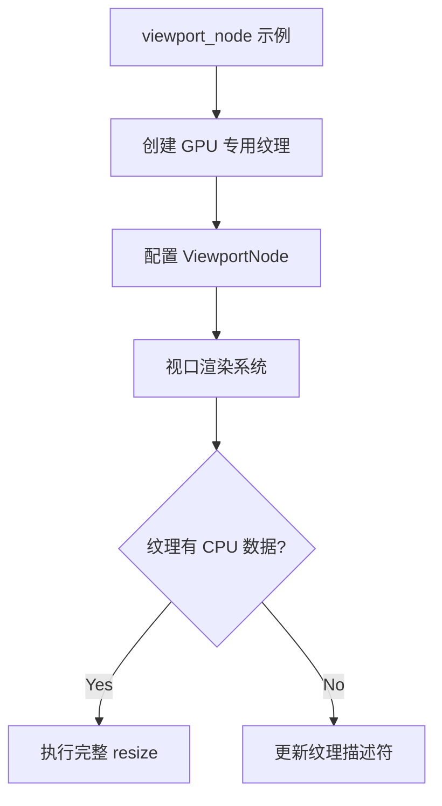

+++
title = "#19098 viewport_node example: Remove main world image initialization"
date = "2025-05-26T00:00:00"
draft = false
template = "pull_request_page.html"
in_search_index = false

[extra]
current_language = "zh-cn"
available_languages = {"en" = { name = "English", url = "/pull_request/bevy/2025-05/pr-19098-en-20250526" }, "zh-cn" = { name = "中文", url = "/pull_request/bevy/2025-05/pr-19098-zh-cn-20250526" }}
+++

# viewport_node 示例：移除主世界图像初始化

## 基本信息
- **标题**: viewport_node example: Remove main world image initialization
- **PR 链接**: https://github.com/bevyengine/bevy/pull/19098
- **作者**: SpecificProtagonist
- **状态**: 已合并
- **标签**: C-Examples, S-Ready-For-Final-Review, D-Straightforward
- **创建时间**: 2025-05-06T14:10:50Z
- **合并时间**: 2025-05-26T17:40:31Z
- **合并人**: alice-i-cecile

## 问题描述翻译
### 目标
新的 viewport 示例在主机内存（main memory）中分配了纹理，而实际上这些纹理只需要在 GPU 上使用。同时修复当视口（viewport）的纹理在 CPU 端不存在时产生的不必要警告。

### 测试方法
运行 `viewport_node` 示例

## 代码变更分析

### 问题背景
在 Bevy 的视口节点示例中，开发者发现两个关键问题：
1. **冗余内存分配**：示例代码使用 `vec![0; size]` 初始化了 CPU 端的图像数据，但该纹理实际仅用于 GPU 渲染
2. **警告误报**：当视口纹理没有 CPU 端数据时，系统会触发不必要的 resize 警告

这两个问题会影响示例的运行效率和开发体验，特别是当视口尺寸较大时会造成显著的内存浪费。

### 解决方案
#### 1. 示例代码优化 (`examples/ui/viewport_node.rs`)
原始实现显式创建了 CPU 端纹理数据：
```rust
let image = Image {
    data: Some(vec![0; size.volume() * format.pixel_size()]),
    texture_descriptor: TextureDescriptor { /*...*/ },
    ..default()
};
```
修改后使用 GPU 专属初始化：
```rust
let mut image = Image::new_uninit(
    default(),
    TextureDimension::D2,
    TextureFormat::Bgra8UnormSrgb,
    RenderAssetUsages::all(),
);
```
关键改进点：
- 使用 `new_uninit` 避免初始化 CPU 端数据
- 明确设置 `RenderAssetUsages::all()` 指定资源用途
- 移除冗余的窗口尺寸查询（window query）

#### 2. 视口系统修复 (`crates/bevy_ui/src/widget/viewport.rs`)
修改前直接进行 resize 操作：
```rust
images.get_mut(image_handle).unwrap().resize(size);
```
修改后添加条件判断：
```rust
let image = images.get_mut(image_handle).unwrap();
if image.data.is_some() {
    image.resize(size);
} else {
    image.texture_descriptor.size = size;
}
```
这个修改：
- 避免对无 CPU 数据的纹理执行无效 resize 操作
- 保持 GPU 端纹理描述符（texture descriptor）的正确更新

### 技术洞察
1. **纹理生命周期管理**：
   - `RenderAssetUsages` 控制资源在 CPU/GPU 的存储策略
   - GPU 专用纹理应使用 `RENDER_ATTACHMENT` 标志，避免不必要的 CPU 内存占用

2. **条件式资源操作**：
   - 通过 `image.data.is_some()` 判断执行路径
   - 确保系统在混合使用 CPU/GPU 资源的场景下保持健壮性

3. **初始化优化**：
   - `Image::new_uninit` 相比显式置零初始化可节省 O(n) 时间
   - 对于 1920x1080 的 RGBA 纹理，节省约 8MB 内存分配

### 影响评估
1. **性能提升**：消除冗余内存分配和初始化操作
2. **代码简化**：移除 19 行冗余代码，逻辑更清晰
3. **警告消除**：解决系统日志中的错误提示干扰
4. **最佳实践示范**：为视口使用提供标准的 GPU 资源管理示例

## 可视化架构


## 关键文件变更
### 1. `examples/ui/viewport_node.rs` (+12/-31)
**变更重点**：
- 重构纹理创建逻辑，使用 GPU 专用初始化
- 移除窗口尺寸查询依赖

代码对比：
```rust
// Before:
let image = Image {
    data: Some(vec![0; size.volume() * format.pixel_size()]),
    texture_descriptor: TextureDescriptor { /*...*/ },
    ..default()
};

// After:
let mut image = Image::new_uninit(
    default(),
    TextureDimension::D2,
    TextureFormat::Bgra8UnormSrgb,
    RenderAssetUsages::all(),
);
image.texture_descriptor.usage = /*...*/;
```

### 2. `crates/bevy_ui/src/widget/viewport.rs` (+6/-1)
**变更重点**：
- 添加条件式纹理更新逻辑

代码对比：
```rust
// Before:
images.get_mut(image_handle).unwrap().resize(size);

// After:
if image.data.is_some() {
    image.resize(size);
} else {
    image.texture_descriptor.size = size;
}
```

## 延伸阅读
1. Bevy 渲染管线文档：[Render Pipeline Architecture](https://bevyengine.org/learn/book/rendering/pipeline/)
2. WGPU 纹理管理指南：[Texture Management in WGPU](https://wgpu.rs/guide/textures)
3. 资源生命周期管理：[RenderAssetUsages API 文档](https://docs.rs/bevy/latest/bevy/asset/enum.RenderAssetUsages.html)

## 完整代码差异
参见原始 PR 链接查看完整 diff：https://github.com/bevyengine/bevy/pull/19098/files