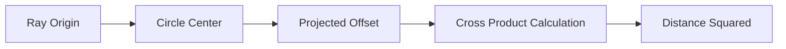

+++
title = "#19103 Reduce operations in `RayCast2d::circle_intersection_at` using cross product"
date = "2025-05-26T00:00:00"
draft = false
template = "pull_request_page.html"
in_search_index = true

[taxonomies]
list_display = ["show"]

[extra]
current_language = "en"
available_languages = {"en" = { name = "English", url = "/pull_request/bevy/2025-05/pr-19103-en-20250526" }, "zh-cn" = { name = "中文", url = "/pull_request/bevy/2025-05/pr-19103-zh-cn-20250526" }}
labels = ["A-Math", "D-Straightforward"]
+++

# Title: Reduce operations in `RayCast2d::circle_intersection_at` using cross product

## Basic Information
- **Title**: Reduce operations in `RayCast2d::circle_intersection_at` using cross product
- **PR Link**: https://github.com/bevyengine/bevy/pull/19103
- **Author**: kumikaya
- **Status**: MERGED
- **Labels**: S-Ready-For-Final-Review, A-Math, D-Straightforward
- **Created**: 2025-05-06T16:42:34Z
- **Merged**: 2025-05-26T17:41:25Z
- **Merged By**: alice-i-cecile

## Description Translation
# Objective

- Using the cross product to compute the perpendicular distance reduces one multiplication and two additions.

## The Story of This Pull Request

The PR addresses an optimization opportunity in Bevy's 2D raycasting logic, specifically in the circle intersection calculation. The original implementation in `RayCast2d::circle_intersection_at` computed the closest point on the ray to the circle center using vector subtraction and multiplication operations. While mathematically correct, this approach required more arithmetic operations than necessary for the collision detection use case.

The key insight came from recognizing that the perpendicular distance between the ray and circle center could be computed more efficiently using the 2D cross product (implemented as `perp_dot` in Bevy's math utilities). This vector operation directly calculates the area of the parallelogram formed by two vectors, which in this context corresponds to the squared distance needed for intersection testing.

By replacing:
```rust
let closest_point = offset - projected * *self.ray.direction;
let distance_squared = circle.radius().squared() - closest_point.length_squared();
```
with:
```rust
let cross = offset.perp_dot(*self.ray.direction);
let distance_squared = circle.radius().squared() - cross.squared();
```
the implementation eliminates:
1. One vector-scalar multiplication (`projected * direction`)
2. One vector subtraction (`offset - ...`)
3. A length calculation requiring two squaring operations and one addition

This optimization maintains identical mathematical behavior while reducing computational overhead. The cross product approach is particularly advantageous in 2D collision detection systems where this calculation might be executed millions of times per frame, making even small optimizations valuable for overall engine performance.

## Visual Representation



## Key Files Changed

- `crates/bevy_math/src/bounding/raycast2d.rs` (+2/-2)

```rust
// Before:
let closest_point = offset - projected * *self.ray.direction;
let distance_squared = circle.radius().squared() - closest_point.length_squared();

// After:
let cross = offset.perp_dot(*self.ray.direction);
let distance_squared = circle.radius().squared() - cross.squared();
```

The changes streamline the distance calculation by leveraging vector algebra properties, replacing multiple vector operations with a single cross product calculation followed by a squaring operation. This directly supports the PR's objective of reducing arithmetic operations while maintaining mathematical equivalence.

## Further Reading

1. [Bevy's `perp_dot` documentation](https://docs.rs/bevy-math/latest/bevy_math/struct.Vec2.html#method.perp_dot)
2. [Geometric interpretation of cross products](https://en.wikipedia.org/wiki/Cross_product#Computational_geometry)
3. [2D collision detection optimizations](https://www.toptal.com/game/video-game-physics-part-ii-collision-detection-for-solid-objects)

# Full Code Diff
```diff
diff --git a/crates/bevy_math/src/bounding/raycast2d.rs b/crates/bevy_math/src/bounding/raycast2d.rs
index e1def01936735..c767c6e3fd05c 100644
--- a/crates/bevy_math/src/bounding/raycast2d.rs
+++ b/crates/bevy_math/src/bounding/raycast2d.rs
@@ -78,8 +78,8 @@ impl RayCast2d {
     pub fn circle_intersection_at(&self, circle: &BoundingCircle) -> Option<f32> {
         let offset = self.ray.origin - circle.center;
         let projected = offset.dot(*self.ray.direction);
-        let closest_point = offset - projected * *self.ray.direction;
-        let distance_squared = circle.radius().squared() - closest_point.length_squared();
+        let cross = offset.perp_dot(*self.ray.direction);
+        let distance_squared = circle.radius().squared() - cross.squared();
         if distance_squared < 0.
             || ops::copysign(projected.squared(), -projected) < -distance_squared
         {
```