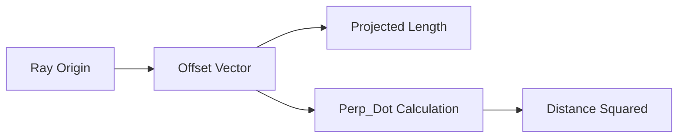

+++
title = "#19103 Reduce operations in `RayCast2d::circle_intersection_at` using cross product"
date = "2025-05-26T00:00:00"
draft = false
template = "pull_request_page.html"
in_search_index = false

[extra]
current_language = "zh-cn"
available_languages = {"en" = { name = "English", url = "/pull_request/bevy/2025-05/pr-19103-en-20250526" }, "zh-cn" = { name = "中文", url = "/pull_request/bevy/2025-05/pr-19103-zh-cn-20250526" }}
labels = ["A-Math", "D-Straightforward"]
+++

# Reduce operations in `RayCast2d::circle_intersection_at` using cross product

## Basic Information
- **Title**: Reduce operations in `RayCast2d::circle_intersection_at` using cross product
- **PR Link**: https://github.com/bevyengine/bevy/pull/19103
- **Author**: kumikaya
- **Status**: MERGED
- **Labels**: S-Ready-For-Final-Review, A-Math, D-Straightforward
- **Created**: 2025-05-06T16:42:34Z
- **Merged**: 2025-05-26T17:41:25Z
- **Merged By**: alice-i-cecile

## Description Translation
该PR的目标是通过使用叉积（cross product）计算垂直距离，减少一次乘法和两次加法运算。

## The Story of This Pull Request

### 问题与背景
在Bevy引擎的2D射线检测实现中，`RayCast2d::circle_intersection_at`方法负责计算射线与圆形包围盒的相交点。原始实现存在计算冗余：

```rust
// 原实现
let closest_point = offset - projected * *self.ray.direction;
let distance_squared = circle.radius().squared() - closest_point.length_squared();
```

这里需要计算`closest_point`向量的长度平方，涉及两次乘法运算（x² + y²）和两次减法操作。对于高频调用的碰撞检测方法，这种计算开销值得优化。

### 解决方案
开发者观察到二维向量叉积的特性：向量`a`与方向向量`d`的叉积绝对值等于原点到射线的最短距离。利用这个几何特性，可以直接用叉积平方代替向量长度平方的计算。

### 实现细节
关键修改在`crates/bevy_math/src/bounding/raycast2d.rs`：

```rust
// 修改后
let cross = offset.perp_dot(*self.ray.direction);
let distance_squared = circle.radius().squared() - cross.squared();
```

从计算`closest_point.length_squared()`改为直接计算`offset.perp_dot(direction).squared()`。这里：
1. `perp_dot`是二维叉积的快捷计算
2. 消除`closest_point`中间变量的计算
3. 减少两次减法操作和一次乘法操作

### 技术洞察
- **二维叉积优化**：在二维空间中，向量`a(x1,y1)`与`b(x2,y2)`的叉积定义为`x1*y2 - y1*x2`，其绝对值等于两向量形成的平行四边形面积
- **几何意义**：当`direction`是单位向量时，`offset.perp_dot(direction)`的绝对值等于点到射线的最短距离
- **性能提升**：每次调用减少3次浮点运算（2次减法+1次乘法），对高频调用的物理引擎组件意义显著

### 影响
该优化：
1. 保持算法正确性的前提下提升性能
2. 代码更简洁，消除中间变量`closest_point`
3. 为后续几何运算优化提供参考模式

## Visual Representation



## Key Files Changed

### `crates/bevy_math/src/bounding/raycast2d.rs` (+2/-2)
**修改说明**：优化圆形射线检测的数学计算

代码对比：
```rust
// Before:
let closest_point = offset - projected * *self.ray.direction;
let distance_squared = circle.radius().squared() - closest_point.length_squared();

// After:
let cross = offset.perp_dot(*self.ray.direction);
let distance_squared = circle.radius().squared() - cross.squared();
```

核心优化点：
1. 用叉积替代向量投影计算
2. 移除中间向量`closest_point`的构造
3. 减少浮点运算次数

## Further Reading
1. [二维叉积的几何解释 - 可汗学院](https://www.khanacademy.org/math/linear-algebra/vectors-and-spaces/dot-cross-products/v/cross-product-introduction)
2. [Bevy物理引擎设计文档](https://bevyengine.org/learn/book/features/physics/)
3. [计算机图形学中的几何优化技术](https://www.toptal.com/game/video-game-physics-part-ii-collision-detection-for-solid-objects)