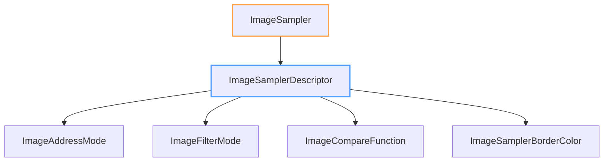

+++
title = "#19105 Derive `PartialEq` for `ImageSampler`"
date = "2025-05-26T00:00:00"
draft = false
template = "pull_request_page.html"
in_search_index = true

[taxonomies]
list_display = ["show"]

[extra]
current_language = "en"
available_languages = {"en" = { name = "English", url = "/pull_request/bevy/2025-05/pr-19105-en-20250526" }, "zh-cn" = { name = "中文", url = "/pull_request/bevy/2025-05/pr-19105-zh-cn-20250526" }}
labels = ["D-Trivial", "A-Rendering"]
+++

# Derive `PartialEq` for `ImageSampler`

## Basic Information
- **Title**: Derive `PartialEq` for `ImageSampler`
- **PR Link**: https://github.com/bevyengine/bevy/pull/19105
- **Author**: Noxmore
- **Status**: MERGED
- **Labels**: D-Trivial, A-Rendering, S-Ready-For-Final-Review
- **Created**: 2025-05-06T23:27:06Z
- **Merged**: 2025-05-26T17:51:17Z
- **Merged By**: alice-i-cecile

## Description Translation
# Objective

Ran into a situation where I need to compare two image samplers. My current workaround is to compare the `Debug` outputs

## Solution

Derive `PartialEq` on `ImageSampler` and structs in its fields.

## Testing

Full CI passed.

## The Story of This Pull Request

The PR addresses a practical need for comparing `ImageSampler` instances directly in Bevy's rendering system. Before this change, developers working with image samplers had to rely on comparing debug-formatted string outputs as a workaround for equality checks. This approach was fragile and inefficient, as string comparisons are slower than value comparisons and could break with formatting changes.

The core issue stemmed from missing `PartialEq` implementations on several sampler-related types:
- `ImageSampler` enum
- `ImageAddressMode` enum
- `ImageFilterMode` enum 
- `ImageCompareFunction` enum
- `ImageSamplerBorderColor` enum
- `ImageSamplerDescriptor` struct

The solution involved systematically adding `PartialEq` to the derive macros for these types. This approach leverages Rust's automatic derivation of equality checks when all constituent fields implement `PartialEq` themselves. Since all field types in these sampler configurations (primitives, standard enums, and strings) already supported equality checks, no manual implementation was required.

The implementation demonstrates good practice in Rust type design:
1. Derived traits maintain consistency with existing derivations (Debug, Clone, etc.)
2. Preserved serialization/deserialization capabilities (Serialize/Deserialize)
3. Maintained backward compatibility through additive changes

Key code changes appear in the derive lists:
```rust
// Before:
#[derive(Debug, Default, Clone, Serialize, Deserialize)]
pub enum ImageSampler { ... }

// After: 
#[derive(Debug, Default, Clone, PartialEq, Serialize, Deserialize)]
pub enum ImageSampler { ... }
```

This change enables direct comparisons in game logic and test assertions:
```rust
let sampler1 = ImageSampler::Default;
let sampler2 = ImageSampler::Descriptor(ImageSamplerDescriptor::default());
assert_ne!(sampler1, sampler2);
```

The CI pipeline's successful run confirms that:
1. Existing serialization/deserialization behavior remains intact
2. No breaking changes were introduced
3. New equality checks work as expected

## Visual Representation



## Key Files Changed

**crates/bevy_image/src/image.rs** (+6/-6)
- Added `PartialEq` derivation to 6 sampler-related types
- Maintained existing trait derivations (Clone, Debug, etc.)
- Preserved all serialization attributes

Before/After comparison for `ImageSamplerDescriptor`:
```rust
// Before:
#[derive(Clone, Debug, Serialize, Deserialize)]
pub struct ImageSamplerDescriptor { ... }

// After:
#[derive(Clone, Debug, PartialEq, Serialize, Deserialize)]
pub struct ImageSamplerDescriptor { ... }
```

## Further Reading
- [Rust PartialEq Documentation](https://doc.rust-lang.org/std/cmp/trait.PartialEq.html)
- [Bevy Image Component Documentation](https://docs.rs/bevy_image/latest/bevy_image/)
- [Derivable Traits in Rust](https://doc.rust-lang.org/book/appendix-03-derivable-traits.html)

# Full Code Diff
```diff
diff --git a/crates/bevy_image/src/image.rs b/crates/bevy_image/src/image.rs
index 41b698b78dcdc..884e2ea234331 100644
--- a/crates/bevy_image/src/image.rs
+++ b/crates/bevy_image/src/image.rs
@@ -358,7 +358,7 @@ pub struct Image {
 /// Used in [`Image`], this determines what image sampler to use when rendering. The default setting,
 /// [`ImageSampler::Default`], will read the sampler from the `ImagePlugin` at setup.
 /// Setting this to [`ImageSampler::Descriptor`] will override the global default descriptor for this [`Image`].
-#[derive(Debug, Default, Clone, Serialize, Deserialize)]
+#[derive(Debug, Default, Clone, PartialEq, Serialize, Deserialize)]
 pub enum ImageSampler {
     /// Default image sampler, derived from the `ImagePlugin` setup.
     #[default]
@@ -403,7 +403,7 @@ impl ImageSampler {
 /// See [`ImageSamplerDescriptor`] for information how to configure this.
 ///
 /// This type mirrors [`AddressMode`].
-#[derive(Clone, Copy, Debug, Default, Serialize, Deserialize)]
+#[derive(Clone, Copy, Debug, Default, PartialEq, Serialize, Deserialize)]
 pub enum ImageAddressMode {
     /// Clamp the value to the edge of the texture.
     ///
@@ -432,7 +432,7 @@ pub enum ImageAddressMode {
 /// Texel mixing mode when sampling between texels.
 ///
 /// This type mirrors [`FilterMode`].
-#[derive(Clone, Copy, Debug, Default, Serialize, Deserialize)]
+#[derive(Clone, Copy, Debug, Default, PartialEq, Serialize, Deserialize)]
 pub enum ImageFilterMode {
     /// Nearest neighbor sampling.
     ///
@@ -448,7 +448,7 @@ pub enum ImageFilterMode {
 /// Comparison function used for depth and stencil operations.
 ///
 /// This type mirrors [`CompareFunction`].
-#[derive(Clone, Copy, Debug, Serialize, Deserialize)]
+#[derive(Clone, Copy, Debug, PartialEq, Serialize, Deserialize)]
 pub enum ImageCompareFunction {
     /// Function never passes
     Never,
@@ -475,7 +475,7 @@ pub enum ImageCompareFunction {
 /// Color variation to use when the sampler addressing mode is [`ImageAddressMode::ClampToBorder`].
 ///
 /// This type mirrors [`SamplerBorderColor`].
-#[derive(Clone, Copy, Debug, Serialize, Deserialize)]
+#[derive(Clone, Copy, Debug, PartialEq, Serialize, Deserialize)]
 pub enum ImageSamplerBorderColor {
     /// RGBA color `[0, 0, 0, 0]`.
     TransparentBlack,
@@ -498,7 +498,7 @@ pub enum ImageSamplerBorderColor {
 /// a breaking change.
 ///
 /// This types mirrors [`SamplerDescriptor`], but that might change in future versions.
-#[derive(Clone, Debug, Serialize, Deserialize)]
+#[derive(Clone, Debug, PartialEq, Serialize, Deserialize)]
 pub struct ImageSamplerDescriptor {
     pub label: Option<String>,
     /// How to deal with out of bounds accesses in the u (i.e. x) direction.
```