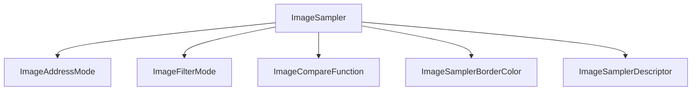

+++
title = "#19105 Derive `PartialEq` for `ImageSampler`"
date = "2025-05-26T00:00:00"
draft = false
template = "pull_request_page.html"
in_search_index = false

[extra]
current_language = "zh-cn"
available_languages = {"en" = { name = "English", url = "/pull_request/bevy/2025-05/pr-19105-en-20250526" }, "zh-cn" = { name = "中文", url = "/pull_request/bevy/2025-05/pr-19105-zh-cn-20250526" }}
labels = ["D-Trivial", "A-Rendering"]
+++

# Derive `PartialEq` for `ImageSampler` 技术分析报告

## Basic Information
- **Title**: Derive `PartialEq` for `ImageSampler`
- **PR Link**: https://github.com/bevyengine/bevy/pull/19105
- **Author**: Noxmore
- **Status**: MERGED
- **Labels**: D-Trivial, A-Rendering, S-Ready-For-Final-Review
- **Created**: 2025-05-06T23:27:06Z
- **Merged**: 2025-05-26T17:51:17Z
- **Merged By**: alice-i-cecile

## Description Translation
### 目标

遇到需要比较两个图像采样器（image sampler）的场景，目前只能通过比较`Debug`输出的临时解决方案

### 解决方案

为`ImageSampler`及其字段中的结构体派生`PartialEq` trait

### 测试

完整CI测试通过

## The Story of This Pull Request

### 问题背景与需求
在Bevy引擎的图像处理模块中，`ImageSampler`及其相关类型（如`ImageAddressMode`、`ImageFilterMode`等）缺乏直接比较的能力。开发者在实际使用中发现需要对比两个采样器配置是否相同，但现有实现只能通过比较`Debug`输出的字符串实现，这种方式存在以下问题：

1. **可靠性问题**：Debug输出格式可能随编译器版本或实现细节改变
2. **性能损耗**：字符串生成和比较需要额外计算资源
3. **代码可读性**：非惯用Rust代码模式，增加维护成本

### 技术方案选择
核心思路是通过为相关类型实现`PartialEq` trait来支持直接比较。具体决策点包括：

1. **trait选择**：使用`PartialEq`而非`Eq`，因为某些结构体字段（如浮点数）可能包含不可比较的NaN值
2. **派生策略**：对嵌套结构体统一应用`PartialEq`派生，确保比较语义一致性
3. **兼容性考虑**：保持现有`Serialize`/`Deserialize`等trait的继承关系不变

### 具体实现分析
修改集中在`image.rs`文件中，涉及6个类型定义的修改：

```rust
// 修改前示例
#[derive(Debug, Default, Clone, Serialize, Deserialize)]
pub enum ImageSampler {
    // ...
}

// 修改后
#[derive(Debug, Default, Clone, PartialEq, Serialize, Deserialize)]
pub enum ImageSampler {
    // ...
}
```

关键修改点：
1. 为`ImageSampler`枚举添加`PartialEq`派生
2. 对其依赖的配置类型（`ImageAddressMode`、`ImageFilterMode`等）同步添加`PartialEq`
3. 保持原有trait（`Serialize`/`Deserialize`）不变以确保兼容性

### 技术验证
通过CI全量测试验证以下方面：
1. **类型安全**：派生实现不会破坏现有类型系统
2. **序列化兼容**：新增trait不影响原有的序列化/反序列化逻辑
3. **比较语义**：自动派生的比较逻辑符合字段的实际语义

### 潜在影响与改进
1. **API增强**：用户可以直接使用`==`操作符比较采样器配置
2. **测试优化**：简化单元测试中的断言逻辑
3. **未来扩展**：为可能的哈希实现（`Hash` trait）奠定基础

## Visual Representation



## Key Files Changed

### `crates/bevy_image/src/image.rs` (+6/-6)
1. **修改内容**：为6个图像采样相关类型添加`PartialEq` trait派生
2. **代码示例**：
```rust
// 修改前
#[derive(Debug, Default, Clone, Serialize, Deserialize)]
pub enum ImageSampler {
    // ...
}

// 修改后 
#[derive(Debug, Default, Clone, PartialEq, Serialize, Deserialize)]
pub enum ImageSampler {
    // ...
}
```
3. **关联性**：确保整个图像采样配置体系支持值比较操作

## Further Reading
1. Rust官方文档 - [PartialEq trait](https://doc.rust-lang.org/std/cmp/trait.PartialEq.html)
2. Bevy引擎 - [ECS中的组件比较](https://bevy-cheatbook.github.io/programming/components.html#component-requirements)
3. WGPU文档 - [Sampler配置](https://docs.rs/wgpu/latest/wgpu/struct.SamplerDescriptor.html)