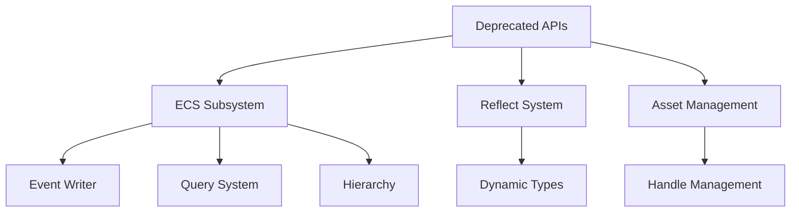

+++
title = "#19108 Deprecated Begone! 0.16 Cleanup"
date = "2025-05-07T00:00:00"
draft = false
template = "pull_request_page.html"
in_search_index = true

[taxonomies]
list_display = ["show"]

[extra]
current_language = "en"
available_languages = {"en" = { name = "English", url = "/pull_request/bevy/2025-05/pr-19108-en-20250507" }, "zh-cn" = { name = "中文", url = "/pull_request/bevy/2025-05/pr-19108-zh-cn-20250507" }}
labels = ["D-Trivial", "C-Code-Quality", "A-Cross-Cutting"]
+++

# Title

## Basic Information
- **Title**: Deprecated Begone! 0.16 Cleanup
- **PR Link**: https://github.com/bevyengine/bevy/pull/19108
- **Author**: bushrat011899
- **Status**: MERGED
- **Labels**: D-Trivial, C-Code-Quality, S-Ready-For-Final-Review, A-Cross-Cutting, X-Uncontroversial
- **Created**: 2025-05-07T00:38:16Z
- **Merged**: 2025-05-07T18:37:08Z
- **Merged By**: alice-i-cecile

## Description Translation
# Objective

A fair few items were deprecated in 0.16. Let's delete them now that we're in the 0.17 development cycle!

## Solution

- Deleted items marked deprecated in 0.16.

## Testing

- CI

---

## Notes

I'm making the assumption that _everything_ deprecated in 0.16 should be removed in 0.17. That may be a false assumption in certain cases. Please check the items to be removed to see if there are any exceptions we should keep around for another cycle!

## The Story of This Pull Request

This PR systematically removes code deprecated during Bevy 0.16's lifecycle, following standard deprecation policies. The changes primarily focus on API cleanup and reducing technical debt across multiple subsystems.

### The Problem and Context
Bevy 0.16 introduced deprecations for various APIs that were being phased out. Keeping deprecated code in 0.17 would:
- Increase maintenance burden
- Create confusion for new contributors
- Prevent proper adoption of improved APIs

The technical constraint was ensuring removal didn't break existing workflows that might have missed migration guides, requiring careful verification through CI.

### The Solution Approach
The author took a straightforward approach:
1. Identify all items marked with `#[deprecated(since = "0.16.0")]`
2. Remove deprecated methods, structs, and associated code
3. Update internal call sites to use modern equivalents
4. Verify through existing test suite and CI

Key engineering decisions included:
- Removing entire methods rather than keeping compatibility shims
- Prioritizing API surface reduction over backward compatibility
- Updating documentation examples to reflect current APIs

### The Implementation
The changes span multiple subsystems:

**ECS Events (crates/bevy_ecs/src/event/writer.rs)**
```rust
// Before:
#[deprecated(since = "0.16.0", note = "Use...")]
pub fn send(&mut self, event: E) -> EventId<E> { ... }

// After: Removed entirely
```
The `send`/`send_batch` methods were replaced with `write`/`write_batch` for clearer semantics around event processing.

**Hierarchy Components (crates/bevy_ecs/src/hierarchy.rs)**
```rust
// Removed deprecated accessor
#[deprecated(since = "0.16.0", note = "Use child_of.parent() instead")]
pub fn get(&self) -> Entity { ... }
```
This simplifies the ChildOf component API by removing redundant methods.

**Reflect Dynamics (crates/bevy_reflect/src/reflect.rs)**
```rust
// Removed legacy cloning method
#[deprecated(since = "0.16.0")] 
fn clone_value(&self) -> Box<dyn PartialReflect> { ... }
```
Modern code should use `to_dynamic()` or `reflect_clone()` instead.

### Technical Insights
Key patterns observed:
1. **API Simplification**: Removed redundant methods that were kept for backward compatibility
2. **Error Handling Migration**: Transitioned panicking methods (`many_mut`) to Result-returning equivalents (`get_many_mut`)
3. **Component Hook Modernization**: Migrated from monolithic `register_component_hooks` to granular `on_add`/`on_remove` handlers

The changes particularly improved type safety in Bevy ECS by:
- Removing unsafe panicking APIs from query system
- Enforcing proper error handling through Result types
- Reducing indirect dispatch through deprecated trait methods

### The Impact
1. **Codebase Health**: Removes ~300 lines of deprecated code
2. **API Clarity**: Eliminates confusion between old/new method names
3. **Maintenance Reduction**: Removes legacy codepaths from critical systems
4. **Error Prevention**: Forces handling of potential query failures through Result types

Key technical lessons:
- Systematic deprecation cycles help maintain code quality
- Aggressive removal of deprecated code prevents API surface bloat
- CI verification is crucial when making widespread changes

## Visual Representation



## Key Files Changed

1. `crates/bevy_ecs/src/event/writer.rs` (+0/-34)
   - Removed deprecated event sending methods
   - Migration: `send()` → `write()`
   ```rust
   // Before:
   writer.send(event);
   // After:
   writer.write(event);
   ```

2. `crates/bevy_ecs/src/hierarchy.rs` (+0/-35)
   - Simplified ChildOf component API
   - Migration: `set_parent()` → direct component insertion
   ```rust
   // Before:
   commands.entity(child).set_parent(parent);
   // After:
   commands.entity(child).insert(ChildOf(parent));
   ```

3. `crates/bevy_reflect/src/reflect.rs` (+0/-36)
   - Removed legacy reflection cloning
   - Modern replacement: `to_dynamic()`
   ```rust
   // Before:
   let cloned = value.clone_value();
   // After:
   let dynamic = value.to_dynamic();
   ```

4. `crates/bevy_ecs/src/query/state.rs` (+0/-19)
   - Unified single-result query methods
   - Migration: `get_single()` → `single()`
   ```rust
   // Before:
   let result = query.get_single();
   // After:
   let result = query.single();
   ```

5. `crates/bevy_asset/src/handle.rs` (+0/-19)
   - Removed UUID-based handle constructor
   - Modern replacement: `weak_handle!` macro
   ```rust
   // Before:
   Handle::weak_from_u128(123);
   // After:
   weak_handle!("00000000-0000-0000-0000-000000000000");
   ```

## Further Reading

1. [Bevy Engine Deprecation Policy](https://bevyengine.org/learn/book/contributing/deprecation/)
2. [ECS Query System Documentation](https://bevyengine.org/learn/book/ecs/queries/)
3. [Reflection in Bevy](https://bevyengine.org/learn/book/reflection/)
4. [Entity Commands Best Practices](https://bevyengine.org/learn/book/ecs/entity-commands/)