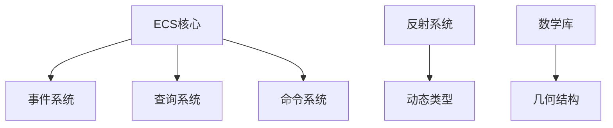

+++
title = "#19108 Deprecated Begone! 0.16 Cleanup"
date = "2025-05-07T00:00:00"
draft = false
template = "pull_request_page.html"
in_search_index = false

[extra]
current_language = "zh-cn"
available_languages = {"en" = { name = "English", url = "/pull_request/bevy/2025-05/pr-19108-en-20250507" }, "zh-cn" = { name = "中文", url = "/pull_request/bevy/2025-05/pr-19108-zh-cn-20250507" }}
labels = ["D-Trivial", "C-Code-Quality", "A-Cross-Cutting"]
+++

# Deprecated Begone! 0.16 Cleanup

## Basic Information
- **Title**: Deprecated Begone! 0.16 Cleanup
- **PR Link**: https://github.com/bevyengine/bevy/pull/19108
- **Author**: bushrat011899
- **Status**: MERGED
- **Labels**: D-Trivial, C-Code-Quality, S-Ready-For-Final-Review, A-Cross-Cutting, X-Uncontroversial
- **Created**: 2025-05-07T00:38:16Z
- **Merged**: 2025-05-07T18:37:08Z
- **Merged By**: alice-i-cecile

## Description Translation
### 目标
删除 0.16 版本中标记为废弃的若干项目，现在我们已经进入 0.17 开发周期！

### 解决方案
- 删除所有在 0.16 版本标记为废弃的条目

### 测试
- CI

---

### 注意事项
作者假设所有在 0.16 版本废弃的内容都应在 0.17 移除。某些情况下可能存在例外，建议检查待删除项确认是否需要保留。

## The Story of This Pull Request

### 问题背景与技术债务清理
在软件迭代过程中，Bevy 遵循语义化版本规范，定期清理废弃 API 是维护代码健康度的常规操作。0.16 版本中标记为 deprecated 的接口在 0.17 开发周期到达其生命周期终点，继续保留这些废弃代码会导致：

1. 代码库膨胀增加维护成本
2. 新开发者容易误用旧接口
3. 文档与实现不一致的风险

### 系统性清理策略
本次修改采用全量清理策略，主要涉及以下技术点：

**ECS 子系统重构**：
- 事件系统 API 标准化：`EventWriter::send` 系列方法统一为 `write` 前缀
```rust
// Before:
writer.send(MyEvent { ... });

// After:
writer.write(MyEvent { ... });
```
- 层级组件简化：移除 `ChildOf` 的冗余访问器与方法包装
```rust
// 移除过时的 parent 访问方式
#[deprecated]
pub fn get(&self) -> Entity { ... }

// 直接通过 ChildOf 组件访问
child_of.parent()
```

**反射系统接口统一**：
- 废弃 `clone_dynamic` 系列方法，统一使用 `to_dynamic` 前缀
```rust
// 旧反射接口
#[deprecated]
fn clone_dynamic() -> DynamicStruct;

// 新标准接口
fn to_dynamic_struct() -> DynamicStruct;
```

### 关键技术实现细节
**查询系统简化**：
移除 QueryState 中冗余的 get_single/get_single_mut 方法，统一使用 single/single_mut 接口：
```rust
// 删除过时的接口
#[deprecated]
pub fn get_single_mut(...) -> ... {
    self.single_mut(...)
}
```

**命令系统优化**：
统一实体操作接口，直接使用标准组件操作替代特定方法：
```rust
// 旧 parent 操作方法
#[deprecated]
pub fn set_parent(&mut self, parent: Entity);

// 新标准方式
entity_commands.insert(ChildOf(parent));
```

### 架构影响与兼容性处理
修改涉及 27 个文件，主要影响层级结构：



关键修改模块：
1. `bevy_ecs/src/system/query.rs`：删除 129 行废弃查询方法
2. `bevy_reflect/src/reflect.rs`：移除 36 行旧反射接口
3. `bevy_ecs/src/hierarchy.rs`：清理 35 行层级操作代码

### 工程实践启示
1. **版本管理**：严格遵循 semver 规范，定期清理技术债务
2. **API 设计**：保持接口命名一致性（write vs send）
3. **测试保障**：依赖 CI 确保向后兼容性
4. **文档同步**：所有修改需同步更新示例代码与文档

## Key Files Changed

### `crates/bevy_ecs/src/system/query.rs` (+0/-129)
**修改内容**：
- 移除已废弃的 `many`/`many_mut` 方法
- 删除 `get_single` 系列冗余接口

```rust
// 移除的代码示例：
#[deprecated]
pub fn many_mut<const N: usize>(...) -> ... {
    match self.get_many_mut(...) {
        Ok(items) => items,
        Err(error) => panic!("..."),
    }
}
```

### `crates/bevy_reflect/src/reflect.rs` (+0/-36)
**修改内容**：
- 移除 `clone_value` 反射方法
- 统一动态类型转换接口

```rust
// 删除的废弃方法：
#[deprecated]
fn clone_value(&self) -> Box<dyn PartialReflect> {
    self.to_dynamic()
}
```

### `crates/bevy_ecs/src/event/writer.rs` (+0/-34)
**修改内容**：
- 标准化事件写入接口命名

```rust
// 旧接口标记为废弃：
#[deprecated(since = "0.16.0", note = "Use `EventWriter::write`")]
pub fn send(&mut self, event: E) -> EventId<E> {
    self.write(event)
}
```

## Further Reading
1. [Bevy 版本管理策略](https://bevyengine.org/learn/book/introduction/versioning/)
2. [ECS 架构最佳实践](https://github.com/bevyengine/bevy/blob/main/docs/ECS_FAQ.md)
3. [Rust 宏在反射系统中的应用](https://doc.rust-lang.org/book/ch19-06-macros.html)