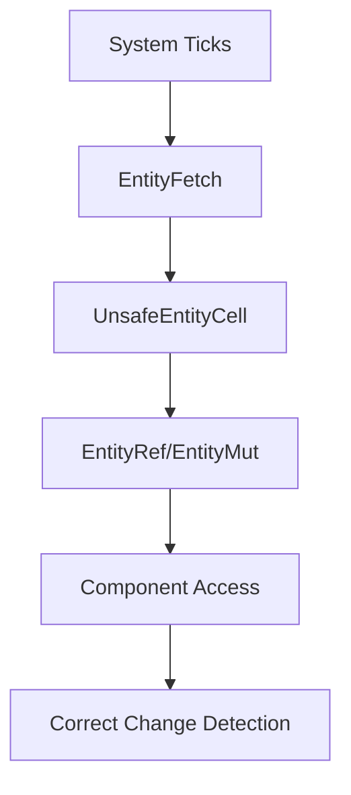

+++
title = "#19115 Add system ticks to EntityRef/Mut WorldQuery"
date = "2025-05-07T00:00:00"
draft = false
template = "pull_request_page.html"
in_search_index = true

[taxonomies]
list_display = ["show"]

[extra]
current_language = "en"
available_languages = {"en" = { name = "English", url = "/pull_request/bevy/2025-05/pr-19115-en-20250507" }, "zh-cn" = { name = "中文", url = "/pull_request/bevy/2025-05/pr-19115-zh-cn-20250507" }}
labels = ["C-Bug", "A-ECS"]
+++

# Title: Add system ticks to EntityRef/Mut WorldQuery

## Basic Information
- **Title**: Add system ticks to EntityRef/Mut WorldQuery
- **PR Link**: https://github.com/bevyengine/bevy/pull/19115
- **Author**: cBournhonesque
- **Status**: MERGED
- **Labels**: C-Bug, A-ECS, S-Ready-For-Final-Review
- **Created**: 2025-05-07T14:09:44Z
- **Merged**: 2025-05-07T18:39:46Z
- **Merged By**: alice-i-cecile

## Description Translation
# Objective

- Fixes a subset of https://github.com/bevyengine/bevy/issues/13735 by making `EntityRef`, `EntityMut` + similar WorldQueries use the system's change ticks when being created from within a system.
In particular, this means that `entity_ref.get_ref::<T>()` will use the correct change ticks (the ones from the system), which matches the behaviour of querying for `Ref<T>` directly in the system parameters.

## Solution

- Implements the solution described by https://github.com/bevyengine/bevy/issues/13735#issuecomment-2652482918 which is to add change ticks to the `UnsafeEntityCell`

## Testing

- Added a unit test that is close to what users would encounter: before this PR the `Added`/`Changed` filters on `Ref`s created from `EntityRef` are incorrect.

## The Story of This Pull Request

The PR addresses a discrepancy in Bevy's Entity Component System (ECS) where entity references obtained through WorldQueries weren't properly tracking system-specific change ticks. This caused incorrect behavior when checking if components were added or changed within a system's execution context.

**The Core Problem**  
When accessing components through `EntityRef` or `EntityMut` obtained via system queries, the change detection mechanism used the world's global ticks instead of the system's specific ticks. This led to mismatches in `Added`/`Changed` state detection compared to direct component queries. The issue stemmed from `UnsafeEntityCell` not carrying system-specific tick information when created through WorldQuery paths.

**Technical Approach**  
The solution introduces a new `EntityFetch` struct that carries both the world reference and system ticks:

```rust
#[derive(Copy, Clone)]
pub struct EntityFetch<'w> {
    world: UnsafeWorldCell<'w>,
    last_run: Tick,
    this_run: Tick,
}
```

This struct replaces direct `UnsafeWorldCell` usage in WorldQuery implementations for entity references. The ticks are propagated through three key layers:

1. **WorldQuery Definition**:
```rust
unsafe impl<'a> WorldQuery for EntityRef<'a> {
    type Fetch<'w> = EntityFetch<'w>;
    // ...
    unsafe fn init_fetch<'w>(/* ... */) -> Self::Fetch<'w> {
        EntityFetch { world, last_run, this_run }
    }
}
```

2. **Entity Retrieval**:
```rust
unsafe fn fetch<'w>(fetch: &mut Self::Fetch<'w>, entity: Entity) -> Self::Item<'w> {
    fetch.world.get_entity_with_ticks(entity, fetch.last_run, fetch.this_run)
}
```

3. **Tick Propagation to EntityCell**:
```rust
UnsafeEntityCell::new(
    world_cell,
    entity,
    location,
    last_change_tick,  // System's last_run
    change_tick        // System's this_run
)
```

**Implementation Challenges**  
The main complexity lay in threading the tick values through multiple abstraction layers while maintaining safety guarantees. The changes required coordinated updates to:

- WorldQuery trait implementations
- UnsafeEntityCell construction
- EntityRef/Mut creation paths
- Change detection internals

**Testing Strategy**  
A new unit test verifies correct tick propagation by checking `Ref::is_added()` status when accessing components through queried EntityRefs:

```rust
#[test]
fn test_entity_ref_query_with_ticks() {
    // System using EntityRef query
    fn system(query: Query<EntityRef>) {
        for entity_ref in &query {
            if let Some(c) = entity_ref.get_ref::<C>() {
                assert!(c.is_added()); // Fails without fix
            }
        }
    }
    // Test setup and execution...
}
```

## Visual Representation



## Key Files Changed

### crates/bevy_ecs/src/query/fetch.rs (+135/-38)
- Introduced `EntityFetch` struct to carry system ticks
- Updated WorldQuery implementations to use new fetch type
- Modified entity retrieval to use ticks from EntityFetch
```rust
// Before:
type Fetch<'w> = UnsafeWorldCell<'w>;

// After:
type Fetch<'w> = EntityFetch<'w>;
```

### crates/bevy_ecs/src/world/unsafe_world_cell.rs (+38/-27)
- Added tick parameters to `UnsafeEntityCell` construction
- Implemented `get_entity_with_ticks` method
```rust
// Updated constructor
UnsafeEntityCell::new(world, entity, location, last_run, this_run)
```

### crates/bevy_ecs/src/world/entity_ref.rs (+12/-0)
- Propagated ticks when creating UnsafeEntityCell from EntityWorldMut
```rust
// Added tick parameters
UnsafeEntityCell::new(..., last_change_tick, change_tick)
```

### crates/bevy_ecs/src/world/mod.rs (+11/-1)
- Updated entity iteration to pass correct ticks
```rust
// Added tick capture
let last_change_tick = self.last_change_tick;
let change_tick = self.change_tick();
```

## Further Reading
- [Bevy Change Detection Documentation](https://bevyengine.org/learn/book/change-detection/)
- [ECS WorldQuery Trait Deep Dive](https://bevyengine.org/learn/book/ecs/query/)
- [Rust Lifetime Management Patterns](https://doc.rust-lang.org/nomicon/lifetimes.html)